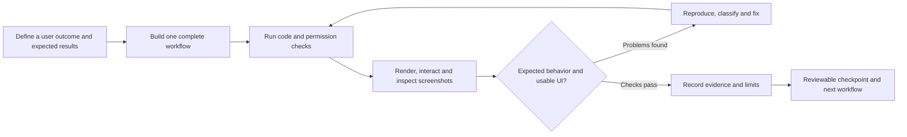

# How we build and verify Society OS

**Recorded:** 4 October 2026. **Last closed local checkpoint:** release `0.6.0-dev`, schema 6: complaints/service requests, private staff history and scoped native reads. Earlier checkpoints cover expanded UI (`0.3.0-dev` / schema 3), manual Entries/Receipts (`0.4.0-dev` / schema 4) and approvals/notices/WebMCP (`0.5.0-dev` / schema 5).

Our approach is to build a complete user workflow, use it in a rendered browser, inspect what actually appears, fix the problems found and preserve the checks for the next change. The user sets the product direction and quality standard; the coding agent implements and investigates within that scope. Screenshots and concrete interactions keep that collaboration grounded in the application people will use.

The closed checkpoints have corrected **32 documented product/operational finding groups**: 19 in the earlier UI review, four in manual Entries/Receipts, six in approvals/notices/WebMCP, two complaint findings and one preview-isolation finding. That is 31 product/UI groups and one operational group. The latest `0.6.0-dev` gate passes **53 Go tests, 48 ordinary Chromium cases and eight actual native Chrome 154 WebMCP cases**. Historical `0.5.0-dev` totals were 29 corrected groups, 46 Go tests, 41 ordinary Chromium cases and six native cases; `0.4.0-dev` had 23 groups, 34 Chromium tests and 39 backend tests. Tests, homes, controls and screenshots are coverage evidence, not additional bug counts. Test/capture/environment corrections are recorded separately from product findings below.

## How the process developed

The initial direction was a society portal with a beautiful interface and useful community information. User feedback refined the overview to distinguish occupied/vacant homes from owners and rental tenants. Later scope clarification established that finance workflows would record manually supplied entries and money already received. The portal would not initiate payments; gateways, automated billing, bank automation and Tally integration would be future decisions.

We delivered the local foundation, scoped registry and account-security workflows in successive checkpoints. That made each slice usable while production hardware, society policy and real-data inputs remained unknown. Fictional data let local work continue without presenting those missing production decisions as settled.

The first rendered UI review passed **14 browser tests**, but its coverage was insufficient. It checked important journeys and viewport behavior without inspecting open dropdown menus or inventorying every control. The user's screenshots showed uneven alignment, heavy and doubled borders, and native grey/blue selection menus that broke the approved visual direction. A passing suite had answered the questions it contained; it had not answered those visual questions.

The response was to strengthen the checkpoint itself. We opened the actual menus, checked selected and hovered options separately, used the keyboard, measured geometry, checked menus inside dialogs and widened the control inventory. The expanded suite reached 26 tests and exposed additional navigation, focus, feedback and pagination problems. The user approved those fixes and asked us to keep this approach for subsequent checkpoints. [Detailed UI review and coverage](ui-review-baseline.md).

## The workflow we repeat



1. **Define the outcome before implementation.** Specify who can perform the action, the inputs, the expected result and relevant failure cases. A registry update must preserve its history and reject a stale edit. A received-money entry must issue one receipt after confirmation, even when a response is lost and the action is retried.
2. **Build the smallest complete workflow.** Connect the UI, API, permissions, persistence and recoverable states needed for that outcome. Avoid a screen that merely looks functional or a placeholder assertion that implies unfinished behavior works.
3. **Run checks appropriate to the change.** `make check` runs formatting, Go vet, race-enabled backend tests and TypeScript. `make build` verifies the production frontend and Go binary. The current `make eval` gate combines those checks/builds with ordinary browser suites and a separate native-WebMCP browser suite. Domain expectations, permission denials, transactions and retries receive meaningful assertions.
4. **Exercise the real interface.** Sign in, navigate, open dialogs, click visible options, type, scroll, dismiss and return. A direct API call can prepare a fixture or prove server behavior; it cannot establish that the corresponding UI control is visible, clickable or understandable.
5. **Inspect rendered states.** Capture the visible viewport, wait for fonts and stable rendering, and inspect the screenshots. Open menus must be captured while open. Check the active, selected, hovered and focused states, plus empty, loading, failure, retry and pending actions.
6. **Classify failures before changing code.** Distinguish a product defect from a wrong test locator, an unstable capture or an incorrect expectation. Fix the actual cause and keep the original user outcome intact.
7. **Verify the repair and the surrounding workflow.** Rerun the affected checks after each change. Run the complete relevant suite before closing the checkpoint, including shared controls used by earlier workflows.
8. **Record what was executed and what remains unknown.** Keep the result, fixture, browser, viewports, observed issues, fixes and evidence locations. Report specific coverage rather than saying every possible click was checked.

The repository's [working agreements](../AGENTS.md) make this routine part of development. The [design system](design-system.md) keeps the approved forest/ivory palette, editorial typography and accessible controls consistent as the product grows.

### Working together

The user steers priorities, scope and visual judgment. The implementation agent turns those decisions into a runnable workflow, investigates failures and reports evidence. For this document, the user explicitly requested a separate agent: it reads the existing milestone reports and tests, reconciles the counts and owns this documentation file while implementation continues. Separate file ownership keeps that evidence work independent of changes to the live preview, migrations and posting logic.

Society representatives still need to approve real registry data, accounting examples, receipt policy and custody procedures. Those decisions stay visible in the backlog so local synthetic progress has a clear handoff to production acceptance.

## Corrected findings at the completed UI checkpoint

The count is **10 findings from the initial review plus nine from the expanded review: 19 issue groups**. Each row below is counted once, even if it affected several viewports or controls. Related styling symptoms are grouped together; repeated checks or screenshots do not increase the count. The earlier milestones do not maintain a complete historical bug ledger, so this is a documented UI-review total, not an estimate of every defect ever corrected in the project.

| ID | Observed problem and user impact | Corrected behavior | Evidence |
|---|---|---|---|
| UI-01 | At 1280×720, the sidebar profile began below the visible screen | The profile remains available while navigation scrolls independently | [Viewport review](../web/tests/ui-review.spec.ts) |
| UI-02 | Phone navigation clipped Account security | A labelled Menu exposes permitted routes and handles Escape and focus | [Viewport review](../web/tests/ui-review.spec.ts), [shell interactions](../web/tests/interactions.spec.ts) |
| UI-03 | Verification inherited the welcome screen's scroll position | Authentication transitions and recovery-code enrollment begin at the top | [UI review](ui-review-baseline.md) |
| UI-04 | Long invitation and home forms hid their actions | Dialog bodies scroll internally, with accessible close and action controls | [Viewport review](../web/tests/ui-review.spec.ts) |
| UI-05 | Background scrolling and interior blank clicks made dialogs behave incorrectly | Background scroll is locked; backdrop dismissal checks the pointer's origin and bounds | [Viewport review](../web/tests/ui-review.spec.ts), [shell interactions](../web/tests/interactions.spec.ts) |
| UI-06 | Identity confirmation and password change shared a current-password value | Each form has independent input state | [Security form checks](../web/tests/ui-review.spec.ts) |
| UI-07 | Changing a person search retained the previously selected identity | Search changes clear the selection and verification; a new selection requires verification again | [Invitation checks](../web/tests/ui-review.spec.ts) |
| UI-08 | Every invitation error offered Account security, even when that route could not resolve it | The reauthentication route appears for the relevant error | [Lookup and invitation error checks](../web/tests/interactions.spec.ts) |
| UI-09 | Recovery-code replacement offered “Continue to workspace” but remained on security | Replacement says “Done, codes saved”; initial enrollment retains its workspace action | [Security interactions](../web/tests/interactions.spec.ts) |
| UI-10 | Narrow desktop navigation compressed an icon to fit a label | Icons retain their width and spacing fits the narrower sidebar | [Viewport review](../web/tests/ui-review.spec.ts) |
| UI-11 | Native menu styling, uneven filter geometry, heavy focus rings and doubled wing borders broke visual consistency | Nine dropdowns share the approved menu treatment; controls align at 48px; selected and hovered states are distinct | [Filter checks](../web/tests/filters.spec.ts), [form menus](../web/tests/form-controls.spec.ts) |
| UI-12 | “See all homes” retained the last explored wing | General homes routes reset that one-time wing intent | [Overview and registry interactions](../web/tests/interactions.spec.ts) |
| UI-13 | Internal dialog completion buttons lost focus on the opening control | Cleanup closes the native modal before restoring opener focus | [Dialog and invitation interactions](../web/tests/interactions.spec.ts) |
| UI-14 | Tab cycling in About could move focus outside the dialog | Tab and Shift+Tab wrap among visible, enabled controls | [Shell interactions](../web/tests/interactions.spec.ts) |
| UI-15 | Failed account loading offered no way to retry | The error state includes a working “Try again” action | [Account failure checks](../web/tests/interactions.spec.ts) |
| UI-16 | A person-lookup error remained after the search changed successfully | Lookup feedback has independent state and clears with a changed search | [Lookup failure checks](../web/tests/interactions.spec.ts) |
| UI-17 | Security feedback appeared far above the submitted form | Each security card displays its own visible confirmation or error, including phone password mismatch | [Phone security interactions](../web/tests/interactions.spec.ts) |
| UI-18 | Voluntary authenticator enrollment promised a workspace transition but returned to security | Embedded enrollment says “Return to account security” and resets scroll | [Optional enrollment checks](../web/tests/interactions.spec.ts) |
| UI-19 | Pagination could label a requested page while showing the previous response | The displayed page number follows the returned page data | [Registry pagination checks](../web/tests/interactions.spec.ts) |

UI-05 covers the original backdrop/background behavior; UI-13 and UI-14 cover separate completion-button and keyboard failures. UI-09 concerns recovery-code replacement; UI-18 concerns optional authenticator enrollment. They are related components, but distinct observed journeys. Replacement dropdown implementation details, such as native form bridging and dialog portals, are not added as extra bugs unless a separate reproduced finding is recorded.

## What the numbers establish

The following table isolates the earlier `0.3.0-dev` UI/account-security evidence. The closed manual-records results follow it; milestone totals are not added together.

| Measure | Completed scope | Interpretation |
|---|---|---|
| Corrected findings | 19 documented UI issue groups | The table above; a bounded, traceable total |
| Browser tests | 26 passing Chromium tests; final recorded run took 1.1 minutes | Automated regression checks for the specified scenarios; elapsed time describes that run |
| Homes opened | All 118 fixture home cards across ten pages | Detail titles and opener-focus return checked for each card |
| Dropdown controls | Nine: wing, occupancy filter, home occupancy, person record, existing person, relationship, relationship to end, invitation person and invitation access | Actual open menus, visible options and applicable keyboard/selection behavior exercised |
| Expanded captures | 36 PNGs in `reports/local/interaction-review/` | Visual evidence generated for review; the count does not imply every image represents a different defect |
| Backend acceptance | 31 tests at the account-security checkpoint | Registry constraints, permissions, sessions, transactions, audit, MFA, invitations and recovery covered; not 31 observed bugs |
| Fixture | 118 homes, 154 people, 155 current/historical memberships | Fictional repeatable input, including joint/multiple-home owners and former relationships |

The UI review includes 2048×1119 comparison captures, 1280×720 desktop, 1024×768 narrow desktop, 768×1024 tablet, 375×812 phone, 320×568 small phone and 375×500 reduced-height layouts. These sizes were used in specific checks; they are not a claim that every interaction ran at every size. Seven form dropdowns were inspected inside dialogs at desktop and phone sizes. Menu hit testing supplemented visibility assertions to detect clipping. [Executed inventory and limits](ui-review-baseline.md).

The historical checkpoint reports are [foundation](foundation-baseline.md), [registry/identity](registry-identity-baseline.md) and [account security](account-security-baseline.md). Their successive browser totals are milestones, not additive independent coverage. The expanded private artifact manifest records the 26-test result, 118 opened cards, nine controls and 36 capture filenames. Generated images and manifests remain ignored by Git; a fresh clone reproduces them through the capture command below rather than containing resident data or local screenshots.

The [manual-records checkpoint](manual-records-baseline.md), release `0.4.0-dev` / schema 4, passes **34 Chromium tests in 1.7 minutes: the original 26 plus eight finance journeys**. `make check` passes **39 backend tests with race detection**, formatting, vet and TypeScript; the production build also passes. After the final PDF-spacing adjustment, document/server race tests and two targeted real-receipt browser journeys passed again; the latter took 7.1 seconds.

Its private `reports/local/records-review/` evidence contains **29 browser screenshots, one receipt raster and one downloaded PDF**. Generated contact sheets are excluded from those original capture counts. Selected desktop entry/form/receipt screens, 320px menu states, phone failure feedback and the receipt raster were visually inspected. The capture count does not claim that every screenshot received the same detailed scrutiny. The new journeys cover draft creation/review/confirmation, download/reversal, lost-response retry, pending-dialog behavior, opened controls and validation, list/download recovery, resident/tenant scope, 13 matching drafts over two pages, failed-PDF retry and draft discard.

## Applying the same approach to manual records and receipts

The manual-records workflow is more than an entry form. An authorized finance operator saves a draft, reviews it and confirms the supplied facts. An optional source/evidence note records the supplied provenance. A draft does not affect the confirmed balance or issue a received-money receipt; discarding it preserves history without a balance or receipt effect. Registry administration alone does not authorize finance posting. A resident's home relationship does not automatically grant financial access.

The completed local checkpoint verifies the following expectations:

| Expected outcome | Why we verify it | Relevant implementation checks |
|---|---|---|
| Amounts are exact paise | ₹0.01 must remain one paise; malformed or overprecise values must not silently change | [Amount and ledger checks](../internal/database/records_test.go) |
| ₹1,000 opening debit and ₹400 confirmed received money produce ₹600 due | The expected result comes from an independent example, not the application's own balance calculation | [Draft, confirmation and reversal checks](../internal/database/records_test.go) |
| Lost responses and concurrent retries produce one draft/receipt | The same operation key must return the original result; changed input under that key must conflict | [Retry checks](../internal/database/records_test.go), [browser retry journey](../web/tests/records.spec.ts) |
| Confirmation preserves the entry, receipt identity, audit and PDF job together | A PDF failure must not undo a saved financial record or issue a new receipt number | [Transactional and job checks](../internal/database/records_test.go) |
| Corrections preserve the original and record a linked reversal | Silent edits/deletion would obscure what was originally confirmed and why it changed | [Immutable correction checks](../internal/database/records_test.go), [HTTP workflow](../internal/server/records_test.go) |
| Expired worker leases cannot publish stale results | A replacement worker must be able to recover work while an old worker is fenced out | [Lease recovery checks](../internal/database/records_test.go) |
| PDFs remain private and current finance scope is rechecked on download | Possessing a receipt identifier must not grant another home's data; revoked access must stop new downloads | [Scoped HTTP downloads](../internal/server/records_test.go), [private-file checks](../internal/documents/receipts_test.go) |
| The rendered PDF is readable and matches the frozen receipt data | A `%PDF-` header or successful generation alone does not prove the amount, wrapping and layout are correct | PDF rendering, text extraction and visual review at checkpoint closure |

These tests are engineering evidence for a fictional local workflow. Society-approved entry examples, receipt format, finance policy and real-world authority remain separate acceptance inputs.

Failure cases have explicit provenance. Browser checks inject failed HTTP responses and lost responses; the PDF-retry journey marks a receipt job `FAILED` in its disposable database, then uses the visible retry action and the real worker to regenerate it. Lease recovery, stale-worker rejection and private-file integrity are checked separately. This proves the specified recovery contracts without representing the fixture as a real disk outage or a production storage exercise.

### Findings corrected in the manual-records checkpoint

The new browser journeys and screenshot review reproduced **four additional product/visual findings**. Their repairs and relevant regression checks pass, bringing the documented closed total to **23 groups: 19 earlier plus four current**. As in the earlier table, related record-filter styling symptoms are counted as one group.

| ID | Reproduced problem | Expected repair and verification | Status |
|---|---|---|---|
| FIN-01 | A cross-home financial entry lookup returned 503 instead of the intended 404 | Map a scoped missing row to 404, without exposing the record or presenting it as a server outage; assert the exact HTTP status | Verified corrected |
| FIN-02 | PDF-download failure feedback appeared below the phone viewport | Place feedback by the submitted action and verify it is visible in the phone dialog; retry must still work | Verified corrected |
| FIN-03 | Later native invalid inputs displaced focus from the required home selector | Keep the first required visible home control focused and accessible when submission is blocked | Verified corrected |
| FIN-04 | Record filters inherited a flex layout despite grid-column rules, and status typography referenced an undefined font variable | Use the intended grid and full-width controls, a shorter all-homes label and the defined body-font token; inspect the resulting layouts | Verified corrected |

The review also found **three test/capture problems**: a search input was located as a textbox although its accessible role is `searchbox`; a screenshot was captured during an entry fade animation; and a pagination check inspected page two before awaiting its response. Correcting the locator, stabilizing capture and waiting for the returned page improve the evidence. These are not counted as application bugs or shipped product fixes.

The first six new browser cases all failed, but six failing tests did not mean six different product bugs: three exposed product defects, while a shared search-role locator affected the other three. After those repairs, five of six passed; the remaining pagination failure was the missing wait described above. Classifying the failure causes prevented changes to working product behavior just to satisfy incorrect test machinery. The final complete regression, including the subsequently added retry and discard journeys, passes.

## Closed checkpoint: approvals, notices and native WebMCP

Documentation continues while implementation and evaluation run. The user explicitly asked us to keep recording the process as we go. This section was updated during development, with partial results labelled as partial, then closed after the final gate and screenshot review passed. [Approvals/notices acceptance](approvals-notices-baseline.md).

### The delivered local user outcomes

Residents can submit maintenance, registry-change, expense and notice proposals. An authorized reviewer completes MFA and fresh identity confirmation and must be a different person for approval, decline or requested changes. Review events preserve actor, reason, version and submitted content; a stale decision must not overwrite another reviewer's completed action. Requested changes can be revised/resubmitted, and an author can withdraw an eligible request. Approval records a decision; maintenance and registry changes still require their relevant follow-up. An approved expense proposal authorizes follow-up within this workflow; it does not post a financial entry or move money. [Review implementation](../internal/database/reviews.go), [domain checks](../internal/database/reviews_test.go).

Notice proposals become visible only after separate approval. The ordinary notice view applies current resident/audience permissions and omits private review history. Owner-only, tenant-only, committee and selected-wing audiences have separate expectations. Archiving removes a notice from the published view. A WhatsApp share control prepares a link for a human to send; it does not send a message automatically. [Rendered review journeys](../web/tests/reviews.spec.ts), [notice HTTP checks](../internal/server/reviews_test.go).

The portal is also registering tools with the browser's real `document.modelContext` API. This advances the earlier global browser-tool installation into an application integration. Native Chrome tests discover and execute the registered tools; a mock registration or an application function called directly would not establish that boundary. Four tools read permitted homes, records, requests and notices; two open an authorized home or workspace screen. Approval, financial posting, publication and permission changes still use the ordinary visible forms. [Application registration](../web/src/webmcp.ts), [native browser journeys](../web/tests/webmcp.spec.ts).

Tool availability follows authentication, completed MFA and permissions. Execution rechecks the current account, validates bounded arguments and uses the ordinary server scopes. Dialogs must remain intact when navigation is rejected. Logout/session revocation must remove advertised tools as well as stop protected data from being returned; cancellation must stop the operation. Native-WebMCP coverage runs separately from ordinary browser coverage, with its own browser configuration and artifact directory. Browsers without the experimental API continue to use the normal screens.

### Findings recorded during this checkpoint

The following **six product/visual groups are corrected and verified**, bringing the recorded total to **29: the historical 23 plus these six**. The later narrow-phone select is a continuation of REV-02, not an additional counted group.

| ID | Observed finding | Repair recorded | Closure |
|---|---|---|---|
| REV-01 | Request dialogs displayed headings without the intended editorial styling | Apply the shared heading treatment and inspect the rendered dialog | Verified corrected |
| REV-02 | Review fields appeared inline or too narrow inside the dialog; a later phone capture exposed a remaining narrow select | Restore full-width, labelled field layout; exclude form selects from mobile filter-specific CSS and recheck narrow-screen controls | Verified corrected |
| REV-03 | Selecting a specific optional home provided no route back to shared/no-home | Add and exercise “Shared area / no specific home” in the same selector | Verified corrected |
| MCP-01 | Revocation stopped protected execution but left tools advertised | Clear the signed-in integration after revocation and assert an empty native tool inventory | Verified corrected |
| REV-04 | The expanded mobile Menu clipped later navigation on short screens | Allow the expanded menu to scroll and exercise all eight links on the short-screen layout | Verified corrected |
| REV-05 | A request error card and its retry action fell below the phone viewport | Center the feedback with immediate scrolling and assert that both the complete alert and retry button are in the viewport | Verified corrected |

The process also uncovered separate QA problems. They are recorded by cause, without being added to the product-defect total:

- Native Chrome masks the application's thrown error text; checks use rejection and resulting state rather than requiring unavailable exception wording.
- Concurrent browser suites shared an artifact location; ordinary and native-WebMCP outputs now have separate destinations.
- Mobile navigation was hidden when a helper chose its route, and keyboard-focus checks needed to await the resulting focus; helper branching and waits were corrected.
- An older assertion expected Community to remain a disabled “Next” item after Community became an implemented route; the expectation was updated to the current product scope.
- The expanded gate's many real logins hit the shared-IP throttle. Each ordinary spec suite now receives its own disposable database/server and real limiter. The production limiter was not weakened to make QA pass. [Isolated runner](../web/tests/run-browser.mjs).

Seven targeted review journeys and six native-WebMCP journeys passed; the first full `make eval` subsequently passed 41 ordinary browser cases across nine isolated suites and six native Chrome cases. Screenshot inspection then found the request retry feedback below the phone viewport and the remaining narrow select described in REV-02. The checkpoint stayed open while those repairs and stronger full-alert/retry visibility assertions were added. The final coherent gate passed after the repairs. This is another concrete example of why a passing test run and a completed visual review are separate conditions.

The final `make eval` passes formatting, Go vet, race-enabled tests covering **46 Go test declarations**, TypeScript and the production build, plus **41 ordinary Chromium cases across nine isolated suites and six native Chrome 154 WebMCP cases**. The final review/UI capture rerun passes **11 cases in 26.0 seconds**. That rerun repeats relevant cases; it is not added to the 41-case inventory. The private final gate log is `reports/local/reviews-eval-final.log`.

The seven review journeys cover separate review, notice revision/publication/audience/archive, decline/withdrawal, responsive opened menus/validation, lost-response retries, errors/stale decisions and pagination. The six native journeys cover actual discovery/execution, invalid inputs/dialog preservation/logout, resident/tenant scope, revocation, MFA/pre-aborted cancellation and reading a real submission-to-publication flow while its approval uses the visible form. Native coverage is tied to the tested experimental API/browser configuration; it does not establish all browsers or in-flight cancellation timings. End-to-end execution from an external Claude/Codex client remains unverified.

All **29 distinct review captures** were inspected through **five regenerated contact sheets**, with full-width phone selects and the complete phone alert/retry action confirmed. The sheets are derived review aids, not five additional independent captures or defects. The private manifest lives at `reports/local/reviews-review/review.json`; the [acceptance baseline](approvals-notices-baseline.md) records public evidence without committing those artifacts.

### Preserved preview and recovery evidence

The existing preview database was upgraded to `0.5.0-dev` / schema 5 and readiness returned HTTP 200. The schema-4 snapshot was retained before upgrade. A new private schema-5 snapshot, `var/snapshots/reviews-20261004`, is **364,544 bytes**, with verified SHA-256 `79459392054128f363c54607b74f3cf9ca376e2a1edb6e9fa6d80da0d059055c`. A fresh restore-check succeeded in **17.918 ms**, preserving three buildings, 118 flats, 154 people and 155 relationships. These are measurements of this local synthetic exercise.

A separate [recovery test](../internal/backup/reviews_test.go) verifies that approved notice content and review decisions survive while sessions are invalidated. The test establishes that workflow expectation; the snapshot size and timing describe the particular retained preview snapshot. A Windows amd64 cross-build also succeeds; target-machine execution remains pending.

### Hardware evidence arriving alongside development

The user supplied a Windows resource photograph: an Intel Core i5-8300H, 8 GB RAM, a 64-bit Windows/x64 system and SSD/HDD capacities in the 256 GB/500 GB classes. [Production hardware](production-hardware.md) records the relevant resources without the photograph or device/product identifiers. This improves the deployment inputs while preserving evidence privacy. Runtime performance, Windows operation, power/reboot behavior, backup recovery and concurrent-use acceptance on that actual machine remain to be demonstrated; development-Mac tests do not settle them.

## Closed checkpoint: complaints and service requests

**Status: local synthetic checkpoint complete, `0.6.0-dev` / schema 6.** This workflow follows [section 16 of the implementation plan](../housing-society-digital-platform-plan.md#16-complaints--service-requests). The final coherent gate and visual review passed after the repairs below. The earlier 29 closed groups plus two complaint findings and one operational preview finding bring the recorded total to 32. [Acceptance evidence](complaints-baseline.md), [workflow expectations](complaints-workflow.md).

The delivered outcome is a private home-linked case that its author can track through authorized handling, resolution and closure. Owning or occupying the same home does not automatically expose another person's case. The state set is `OPEN`, `ACKNOWLEDGED`, `IN_PROGRESS`, `WAITING`, `RESOLVED` and `CLOSED`; the server validates permitted transitions, their actor and required reasons.

| Expected outcome | Required acceptance evidence | Current status |
|---|---|---|
| A current resident creates a case for one of their active homes | Permitted creation succeeds; another home's identity and an ended membership cannot authorize a new case | Checked locally |
| The author sees their own case; a co-owner or other person in that home does not inherit it | List, detail, search and native browser-tool calls preserve the personal boundary, including direct identifier requests | Checked locally |
| MFA-protected administrators/committee handlers assign, prioritize and progress a case | Current role/factor permissions and the allowed transitions are checked on the server; stale versions cannot overwrite a completed change | Checked locally |
| Assignment names an active, role-eligible account | Expired, revoked or otherwise ineligible assignees are rejected; mentioning a vendor does not create an account or grant access | Checked locally |
| Residents add permitted comments, confirm resolved-case closure or request reopening with a reason | Actor, membership, state and reason rules permit the intended action and deny invalid transitions | Checked locally |
| Bounded immutable history preserves handling without exposing private staff notes | `STAFF_ONLY` notes are excluded from resident detail, visible-history counts, search, API responses and WebMCP results; private activity also leaves public metadata unchanged | Checked locally |
| An ended membership retains the author's own read-only history | Existing personal history remains readable under the explicit policy; creation, comments and case changes are denied after membership ends | Checked locally |
| Lost responses and concurrent retries preserve one recorded action | Actor-bound same-key replay returns the original result; changed payload conflicts; authorization is rechecked before replay | Checked locally |
| The complete case workflow remains usable across screen sizes | Actual forms, opened controls, history, feedback, retry, busy dismissal and keyboard behavior are rendered at desktop, tablet, 375px and 320px | Checked locally |

Earlier targeted runs passed seven visible complaint journeys and the expanded eight native WebMCP journeys. The final `SOCIETY_CAPTURE_UI=1 make eval` passes **53 Go tests with race detection and vet, TypeScript/build, 48 ordinary Chromium cases across ten fresh synthetic database suites and eight native Chrome 154 cases**. The native stage took **8.8 seconds**. The private full-gate log is `reports/local/complaints-full-eval.log`. Five complaint domain tests, one HTTP test and a separate recovery test extend the prior checks. [Domain](../internal/database/complaints_test.go), [HTTP/privacy](../internal/server/complaints_test.go), [visible journeys](../web/tests/complaints.spec.ts), [native reads](../web/tests/webmcp.spec.ts), [recovery](../internal/backup/complaints_test.go).

A subsequent capture-only change scrolls the internal dialog body to show the complete staff-note card. The complaint suite passes **seven of seven again in 17.9 seconds**, recorded in `reports/local/complaints-capture-final.log`; production code was unchanged after the full gate. All **32 distinct final screenshots** were reinspected through **six regenerated contact sheets**. Full-size close/error/stale states and the complete private-note card were also inspected. Headers, close controls, menu alignment and resident/staff content passed that review. Capture improvements, derived sheets and repeat test runs do not increase the product-finding or case totals.

API preparation alone does not establish the corresponding UI or native-tool boundary. Disposable synthetic databases, private captures and the complete checkpoint gate remain the working method. Any later attachments must follow the same visibility rules and receive separate document-validation/access evidence.

### Corrected findings and strengthened expectations

| ID | Reproduced finding | Repair/expectation recorded | Closure |
|---|---|---|---|
| CARE-01 | Error feedback's `scrollIntoView` could scroll the hidden-overflow native dialog itself, moving its heading and close control out of view | Scroll only the internal `.dialog-scroll` area; assert the complete close control is in the viewport and the dialog's own `scrollTop` stays zero | Verified corrected |
| CARE-02 | A resident received version 35 while seeing only two public updates, revealing activity in private staff notes | Use separate public version/time and public list ordering; give updates opaque identities; private comments leave resident metadata unchanged while public edits still support stale-write checks and actor-bound retries | Verified corrected |
| OPS-01 | The running verified backend served `build/web` while new frontend builds replaced those assets, allowing a mixed-version preview | Retain verified binary/assets together; the preview was first pinned to `0.5`, then handed over to verified `0.6` under `var/preview-releases/0.6`, preserving its database/MFA key | Verified for the running preview |

CARE-02 came from examining metadata, not just confirming that secret text was absent. The strengthened domain case adds 33 private notes and independently expects the resident's version/time to remain unchanged; after a public update, the resident sees version two and two visible history items, while staff can see all 35. Visibility filtering must occur before history pagination and counts. These distinctions also apply to API and native-tool responses. [Privacy expectations](../internal/database/complaints_test.go).

The QA fixture also initially attempted nonexistent email columns and was corrected to the actual `login`/`created_at` schema. That is a test-fixture correction, not an additional application defect. The staff-note capture adjustment is likewise evidence preparation. OPS-01 is an operational preview-isolation finding: pinning this running instance contains the mismatch; it does not claim that every future preview automatically receives immutable assets. The [pin-preview helper](../scripts/pin-preview.py) retains a binary/assets pair after it has been built and verified, refuses to overwrite an existing named release, and copies neither database nor keys. It does not run the evaluation gate itself.

### Coherent preview and recovery handoff

The live loopback preview now uses the pinned `0.6.0-dev` executable/assets and schema 6; the verified `0.5` release remains retained. The pre-upgrade schema-5 snapshot, `pre-complaints-20261004`, has SHA-256 `79459392054128f363c54607b74f3cf9ca376e2a1edb6e9fa6d80da0d059055c`. The post-upgrade `complaints-20261004` snapshot is **409,600 bytes**, with SHA-256 `283a93c04ec0a30d5bbd50edf6b3f818b7f474dfe9ec76c90fce739d5c25e8f0`; its fresh restore succeeds in **19.487 ms**, retaining three buildings, 118 flats, 154 people and 155 memberships. These private local snapshot exercises do not establish target-host recovery time.

The new recovery test preserves both public and staff-only conversations while invalidating old sessions and keeping the private notes hidden from the restored resident view. Windows amd64 cross-compilation passes; execution on the supplied Windows computer remains pending. Native tools were exercised through the browser API; an external Claude/Codex client end-to-end run remains unverified. The current workflow neither initiates payment nor automatically posts an expense or applies a registry proposal. Private validated documents are the next bounded workflow, with acceptance still pending.

Society emergency/security contacts and expected response-policy guidance still need acceptance. Submission must not claim that a person was notified, that a response deadline is guaranteed or that emergency work was dispatched. Automatic inactivity closure also requires an accepted policy before it can be enabled. These pending operational inputs remain separate from local implementation progress.

## Benefits supported by this work

- **Better visual and interaction coverage.** The user's screenshots exposed a blind spot in a passing suite. Actual open-menu checks now protect alignment, selection, hover, focus and dialog placement that value-only checks missed.
- **More usable recovery.** Account-load retry and feedback near the submitted security form remove documented dead ends. Pending-action checks reduce uncertainty while an operation is in flight.
- **Preserved design quality.** Shared controls let fixes apply consistently across the approved interface. Their replacement also received validation, scrolling, keyboard and dialog checks so visual improvements did not discard expected behavior.
- **Protected data and access boundaries.** Allow/deny cases check both visible permissions and server enforcement. Transaction, concurrency, replay and immutable-history checks protect outcomes that a screenshot cannot establish.
- **Repeatable investigation.** The browser runner creates a temporary synthetic database, uses an ephemeral loopback URL, and removes its server/database afterward. Mutations do not alter the developer's live preview. Private captures can be regenerated.
- **Reviewable progress.** A completed workflow includes code, observable behavior and a record of what was tested. New findings become scenarios for later checkpoints rather than disappearing after a one-time repair.

These are observed or directly supported process benefits. We have not measured development-hours saved, avoided production incidents, financial return, or a Society OS speedup attributable to this method. Local timings in the baseline documents describe different versions and journeys; they cannot be treated as a controlled before/after performance improvement.

## Connection to the supplied articles

The performance article describes choosing important user journeys, measuring from interaction through rendered result, validating benchmarks against user experience and preserving improvements with regression checks. We apply those principles through bounded portal workflows, recorded baselines and rendered checks. Its use of human steering also matches the user's role in setting scope and judging the interface. Its reported speed gains belong to that project. [How we made claude.ai faster](https://claude.dev/blog/how-we-made-claude-ai-faster/).

The evaluation article emphasizes representative tasks, explicit expectations, reliable graders, controlled environments and distinguishing legitimate application failures from flawed evaluation machinery. We apply that discipline to permission cases, independent amounts, disposable fixtures and the separate treatment of locator/capture mistakes. Its model-evaluation headroom and held-out optimization rules concern a different setting; mandatory application correctness still requires a full pass. [Automating eval design and hillclimbing](https://claude.dev/blog/automating-eval-design-and-hillclimbing/).

These articles inform how we develop and evaluate the portal. The documented process does not require the portal to call a Claude API or any runtime language model. Browser tooling supports rendering and inspection; configuring it alone does not establish UI acceptance. The portal's current scope has no runtime LLM dependency.

## Reusable checkpoint checklist

- [ ] Write the user outcome, allowed/denied roles, inputs, expected results and important failure cases.
- [ ] Confirm that implementation covers the complete workflow within the agreed scope.
- [ ] Run relevant backend checks, TypeScript and the production build.
- [ ] Use a disposable synthetic database for browser mutations; preserve the existing preview.
- [ ] Exercise visible controls, navigation, opened menus, selection, hover, focus, keyboard, scrolling and dialog dismissal.
- [ ] Check desktop, tablet and small-phone layouts where the workflow is used.
- [ ] Check meaningful empty, loading, error, retry and pending states; test permissions on the server as well as in the interface.
- [ ] Capture stable viewport screenshots, inspect them and render any generated output such as a receipt PDF.
- [ ] Separate product defects, test defects, environmental failures and unresolved domain-policy questions.
- [ ] For browser-tool integration, prove native registration/discovery/execution, current permissions, cancellation and removal after logout/revocation.
- [ ] Fix reproduced problems, rerun affected checks and finish the relevant regression suite.
- [ ] Record finding counts, executed coverage, artifact locations and practical limits without inflating the totals.
- [ ] Retain verified binary/assets together before handing over a running preview; keep mutable build output separate, snapshot before upgrade and retain the matching MFA key separately.
- [ ] Publish or commit only source and documentation; keep databases, downloads, screenshots, logs, keys and credentials outside Git.

The current full local gate:

```sh
make eval
```

To regenerate the ordinary UI captures:

```sh
make build
SOCIETY_CAPTURE_UI=1 npm run test:browser --prefix web
```

For a targeted repair, append a relevant file such as `filters.spec.ts` or `records.spec.ts`; complete the relevant full run before closure. On this macOS machine, launch Playwright/Chromium through unrestricted or unsandboxed execution and keep it scoped to the local target. The current workspace uses unrestricted execution. [Isolated browser runner](../web/tests/run-browser.mjs).

## What remains outside this evidence

The completed review covers the specified local Chromium journeys and states. It does not establish every input, race timing, browser, assistive technology, physical device or operating-system UI behavior. Reduced-height emulation is not a real mobile-keyboard test. Screenshots support visual review but do not prove financial correctness or authorization.

The available computer's basic resources are now recorded; target-host operation and performance acceptance remain pending. Production HTTPS, approved real-data migration, society finance/receipt policy, custodial identity and recovery, encrypted off-site protection, operational monitoring and a representative pilot need their own evidence. Future workflows add their own acceptance cases. A checkpoint is complete when its stated local conditions are met; its report must keep those broader requirements visible. [Execution backlog](../execution-backlog.md).
