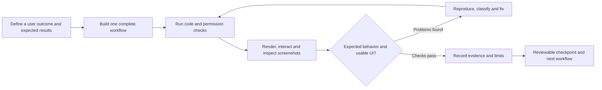

# How we build and verify Society OS

**Recorded:** 4 October 2026; **updated:** 7 October 2026. **Last closed local checkpoint:** release `0.19.0-dev`, schema 18: immutable scoped operational CSV exports with exact money/source links, current authority checks and matching recovery. Earlier checkpoints cover expanded UI (`0.3.0-dev` / schema 3), manual Entries/Receipts (`0.4.0-dev` / schema 4), approvals/notices/WebMCP (`0.5.0-dev` / schema 5), complaints/service requests (`0.6.0-dev` / schema 6), private documents (`0.7.0-dev` / schema 7), changing Overview (`0.8.0-dev` / schema 7), role/account administration (`0.9.0-dev` / schema 8), maintenance cycles/allocations (`0.10.0-dev` / schema 9), upkeep/public snapshots (`0.11.0-dev` / schema 10), campaigns/external-payment reports (`0.12.0-dev` / schema 11), private incidents/rules/notices (`0.13.0-dev` / schema 12), separately reviewed supplied fines (`0.14.0-dev` / schema 13), registered contacts/preferences (`0.15.0-dev` / schema 14), targeted synthetic messaging (`0.16.0-dev` / schema 15), financial originals/publication (`0.17.0-dev` / schema 16) and published statement message sources/scoped attention (`0.18.0-dev` / schema 17).

**Current status:** Scoped finance exports are **locally accepted and publicly published in `0.19` / schema 18**, with matching binary/assets pinned in the continuing preview, all required gates passing and independently verified recovery. Personal public application publication is verified at [commit 0095bc6](https://github.com/flux-i/society-os/commit/0095bc6026ba8d4790818e3d9b1062a02b5d33ca), with an immutable accepted archive bound to that application commit. Earlier `0.18` publication/archive and documentation follow-up remain preserved. Next is the user's requirement for WhatsApp compose/review/approval/Send entirely inside the portal, recorded in a [separate before-code contract](portal-whatsapp-workflow.md). Performance/PWA, production preparation and pilot work continue. Local acceptance does not establish a live provider, actual Windows execution or production acceptance. No real messages, runtime LLM, payment gateway or Tally integration is claimed.

Our approach is to build a complete user workflow, use it in a rendered browser, inspect what actually appears, fix the problems found and preserve the checks for the next change. The user sets the product direction and quality standard; the coding agent implements and investigates within that scope. Screenshots and concrete interactions keep that collaboration grounded in the application people will use.

The closed checkpoints have corrected **77 documented product/operational finding groups**: 19 in the earlier UI review, four in manual Entries/Receipts, six in approvals/notices/WebMCP, two complaint findings, one preview-isolation finding, three document findings, three Overview findings, five account findings, three maintenance findings, two upkeep findings, five collections findings, one suite-isolation finding, seven incident findings, five fine findings, two contact findings, two messaging findings, five statement findings, one statement-message attention finding and one finance-export layout finding. That is **75 product/UI groups and two operational groups**. The latest `0.19.0-dev` full verification stages pass **190 Go test declarations, 176 ordinary Chromium cases across 26 isolated suites and 46 actual native Chrome 154 WebMCP cases across six isolated suites**. Required stages pass separately with reconciled final source/build evidence; no literal green aggregate `make eval` invocation is claimed. Historical `0.18.0-dev` totals were 76 groups and 179/171/44 checks; `0.17.0-dev` had 75 groups, 171 Go declarations, 165 ordinary cases and 42 native cases; `0.16.0-dev` had 70 groups, 160 Go declarations, 157 ordinary cases and 39 native cases; `0.15.0-dev` had 68 groups, 145 Go declarations, 149 ordinary cases and 36 native cases; `0.14.0-dev` had 66 groups, 137 Go declarations, 141 ordinary cases and 33 native cases. These were also verified through separately executed final stages; `0.13.0-dev` had 61 groups, 123 Go declarations, 128 ordinary cases and 29 native cases; `0.12.0-dev` had 54 groups, 113 Go declarations, 115 ordinary cases and 26 native cases; `0.11.0-dev` had 48 groups, 101 Go declarations, 102 ordinary cases and 23 native cases; `0.10.0-dev` had 46 corrected groups, 93 Go declarations, 91 ordinary cases and 20 native cases; `0.9.0-dev` had 43 groups, 83 Go declarations, 81 ordinary cases and 17 native cases; `0.8.0-dev` had 38 groups, 72 Go declarations, 69 ordinary cases and 12 native cases; `0.7.0-dev` had 35 groups, 64 Go declarations, 60 ordinary cases and ten native cases; `0.6.0-dev` had 32 groups, 53 Go tests, 48 ordinary cases and eight native cases; `0.5.0-dev` had 29 groups, 46 Go tests, 41 ordinary cases and six native cases; `0.4.0-dev` had 23 groups, 34 Chromium tests and 39 backend tests. Tests, homes, controls and screenshots are coverage evidence, not additional bug counts. Individual test/capture corrections are recorded separately; the two systemic isolation failures are counted as operational groups.

## How the process developed

The initial direction was a society portal with a beautiful interface and useful community information. User feedback refined the overview to distinguish occupied/vacant homes from owners and rental tenants. Later scope clarification established that finance workflows would record manually supplied entries and money already received. The portal would not initiate payments; gateways, automated billing, bank automation and Tally integration would be future decisions.

We delivered the local foundation, scoped registry and account-security workflows in successive checkpoints. That made each slice usable while production hardware, society policy and real-data inputs remained unknown. Fictional data let local work continue without presenting those missing production decisions as settled.

The first rendered UI review passed **14 browser tests**, but its coverage was insufficient. It checked important journeys and viewport behavior without inspecting open dropdown menus or inventorying every control. The user's screenshots showed uneven alignment, heavy and doubled borders, and native grey/blue selection menus that broke the approved visual direction. A passing suite had answered the questions it contained; it had not answered those visual questions.

The response was to strengthen the checkpoint itself. We opened the actual menus, checked selected and hovered options separately, used the keyboard, measured geometry, checked menus inside dialogs and widened the control inventory. The expanded suite reached 26 tests and exposed additional navigation, focus, feedback and pagination problems. The user approved those fixes and asked us to keep this approach for subsequent checkpoints. [Detailed UI review and coverage](ui-review-baseline.md).

## The workflow we repeat



1. **Define the outcome before implementation.** Specify who can perform the action, the inputs, the expected result and relevant failure cases. A registry update must preserve its history and reject a stale edit. A received-money entry must issue one receipt after confirmation, even when a response is lost and the action is retried.
2. **Build the smallest complete workflow.** Connect the UI, API, permissions, persistence and recoverable states needed for that outcome. Avoid a screen that merely looks functional or a placeholder assertion that implies unfinished behavior works.
3. **Run checks appropriate to the change.** `make check` runs formatting, Go vet, race-enabled backend tests and TypeScript. `make build` verifies the production frontend and Go binary. The current `make eval` gate combines those checks/builds with ordinary browser suites and a separate native-WebMCP browser suite. Domain expectations, permission denials, transactions and retries receive meaningful assertions.
4. **Exercise the real interface.** Sign in, navigate, open dialogs, click visible options, type, scroll, dismiss and return. A direct API call can prepare a fixture or prove server behavior; it cannot establish that the corresponding UI control is visible, clickable or understandable.
5. **Inspect rendered states.** Capture the visible viewport, wait for fonts and stable rendering, and inspect the screenshots. Open menus must be captured while open. Check the active, selected, hovered and focused states, plus empty, loading, failure, retry and pending actions.
6. **Classify failures before changing code.** Distinguish a product defect from a wrong test locator, an unstable capture or an incorrect expectation. Fix the actual cause and keep the original user outcome intact.
7. **Verify the repair and the surrounding workflow.** Rerun the affected checks after each change. Run the complete relevant suite before closing the checkpoint, including shared controls used by earlier workflows.
8. **Record what was executed and what remains unknown.** Keep the result, fixture, browser, viewports, observed issues, fixes and evidence locations. Report specific coverage rather than saying every possible click was checked.

The repository's [working agreements](../AGENTS.md) make this routine part of development. The [design system](design-system.md) keeps the approved forest/ivory palette, editorial typography and accessible controls consistent as the product grows.

### Working together

The user steers priorities, scope and visual judgment. The implementation agent turns those decisions into a runnable workflow, investigates failures and reports evidence. For this document, the user explicitly requested a separate agent: it reads the existing milestone reports and tests, reconciles the counts and owns this documentation file while implementation continues. Separate file ownership keeps that evidence work independent of changes to the live preview, migrations and posting logic.

Society representatives still need to approve real registry data, accounting examples, receipt policy and custody procedures. Those decisions stay visible in the backlog so local synthetic progress has a clear handoff to production acceptance.

### Keeping scope changes durable

While the private-document checkpoint was being verified, the user expanded the product direction: an Overview focused on changing critical information; maintenance and special funds tracking externally sent money; targeted WhatsApp/email to registered contacts, including receipts; photo/flat/rule reports reviewed before fines; and externally prepared income statements/balance sheets uploaded and intentionally shared. The [society operations roadmap](society-operations-roadmap.md) records those requests, priorities, workflow states, permissions and acceptance checks. The main plan, backlog and strategy now reference it and supersede the earlier deferrals it changes, so the new scope survives beyond the conversation.

These are accepted development requirements, with implementation and production activation still pending. Overview follows the now-closed private-document gate, using verified records, approvals, complaints, notices and documents before adding metrics for later modules. Keep finance and audience restrictions on both a count and its destination; preserve the approved visual direction. Subsequent workflows receive the same bounded implementation, rendered interaction, screenshot, native-tool and recovery checkpoints. Writing the roadmap adds no completed feature, test pass or corrected finding. External payment tracking does not authorize platform-initiated transfers; live messaging still depends on configured society-owned channels and accepted recipient policy.

## Corrected findings at the completed UI checkpoint

The count is **10 findings from the initial review plus nine from the expanded review: 19 issue groups**. Each row below is counted once, even if it affected several viewports or controls. Related styling symptoms are grouped together; repeated checks or screenshots do not increase the count. The earlier milestones do not maintain a complete historical bug ledger, so this is a documented UI-review total, not an estimate of every defect ever corrected in the project.

| ID | Observed problem and user impact | Corrected behavior | Evidence |
|---|---|---|---|
| UI-01 | At 1280×720, the sidebar profile began below the visible screen | The profile remains available while navigation scrolls independently | [Viewport review](../web/tests/ui-review.spec.ts) |
| UI-02 | Phone navigation clipped Account security | A labelled Menu exposes permitted routes and handles Escape and focus | [Viewport review](../web/tests/ui-review.spec.ts), [shell interactions](../web/tests/interactions.spec.ts) |
| UI-03 | Verification inherited the welcome screen's scroll position | Authentication transitions and recovery-code enrollment begin at the top | [UI review](ui-review-baseline.md) |
| UI-04 | Long invitation and home forms hid their actions | Dialog bodies scroll internally, with accessible close and action controls | [Viewport review](../web/tests/ui-review.spec.ts) |
| UI-05 | Background scrolling and interior blank clicks made dialogs behave incorrectly | Background scroll is locked; backdrop dismissal checks the pointer's origin and bounds | [Viewport review](../web/tests/ui-review.spec.ts), [shell interactions](../web/tests/interactions.spec.ts) |
| UI-06 | Identity confirmation and password change shared a current-password value | Each form has independent input state | [Security form checks](../web/tests/ui-review.spec.ts) |
| UI-07 | Changing a person search retained the previously selected identity | Search changes clear the selection and verification; a new selection requires verification again | [Invitation checks](../web/tests/ui-review.spec.ts) |
| UI-08 | Every invitation error offered Account security, even when that route could not resolve it | The reauthentication route appears for the relevant error | [Lookup and invitation error checks](../web/tests/interactions.spec.ts) |
| UI-09 | Recovery-code replacement offered “Continue to workspace” but remained on security | Replacement says “Done, codes saved”; initial enrollment retains its workspace action | [Security interactions](../web/tests/interactions.spec.ts) |
| UI-10 | Narrow desktop navigation compressed an icon to fit a label | Icons retain their width and spacing fits the narrower sidebar | [Viewport review](../web/tests/ui-review.spec.ts) |
| UI-11 | Native menu styling, uneven filter geometry, heavy focus rings and doubled wing borders broke visual consistency | Nine dropdowns share the approved menu treatment; controls align at 48px; selected and hovered states are distinct | [Filter checks](../web/tests/filters.spec.ts), [form menus](../web/tests/form-controls.spec.ts) |
| UI-12 | “See all homes” retained the last explored wing | General homes routes reset that one-time wing intent | [Overview and registry interactions](../web/tests/interactions.spec.ts) |
| UI-13 | Internal dialog completion buttons lost focus on the opening control | Cleanup closes the native modal before restoring opener focus | [Dialog and invitation interactions](../web/tests/interactions.spec.ts) |
| UI-14 | Tab cycling in About could move focus outside the dialog | Tab and Shift+Tab wrap among visible, enabled controls | [Shell interactions](../web/tests/interactions.spec.ts) |
| UI-15 | Failed account loading offered no way to retry | The error state includes a working “Try again” action | [Account failure checks](../web/tests/interactions.spec.ts) |
| UI-16 | A person-lookup error remained after the search changed successfully | Lookup feedback has independent state and clears with a changed search | [Lookup failure checks](../web/tests/interactions.spec.ts) |
| UI-17 | Security feedback appeared far above the submitted form | Each security card displays its own visible confirmation or error, including phone password mismatch | [Phone security interactions](../web/tests/interactions.spec.ts) |
| UI-18 | Voluntary authenticator enrollment promised a workspace transition but returned to security | Embedded enrollment says “Return to account security” and resets scroll | [Optional enrollment checks](../web/tests/interactions.spec.ts) |
| UI-19 | Pagination could label a requested page while showing the previous response | The displayed page number follows the returned page data | [Registry pagination checks](../web/tests/interactions.spec.ts) |

UI-05 covers the original backdrop/background behavior; UI-13 and UI-14 cover separate completion-button and keyboard failures. UI-09 concerns recovery-code replacement; UI-18 concerns optional authenticator enrollment. They are related components, but distinct observed journeys. Replacement dropdown implementation details, such as native form bridging and dialog portals, are not added as extra bugs unless a separate reproduced finding is recorded.

## What the numbers establish

The following table isolates the earlier `0.3.0-dev` UI/account-security evidence. The closed manual-records results follow it; milestone totals are not added together.

| Measure | Completed scope | Interpretation |
|---|---|---|
| Corrected findings | 19 documented UI issue groups | The table above; a bounded, traceable total |
| Browser tests | 26 passing Chromium tests; final recorded run took 1.1 minutes | Automated regression checks for the specified scenarios; elapsed time describes that run |
| Homes opened | All 118 fixture home cards across ten pages | Detail titles and opener-focus return checked for each card |
| Dropdown controls | Nine: wing, occupancy filter, home occupancy, person record, existing person, relationship, relationship to end, invitation person and invitation access | Actual open menus, visible options and applicable keyboard/selection behavior exercised |
| Expanded captures | 36 PNGs in `reports/local/interaction-review/` | Visual evidence generated for review; the count does not imply every image represents a different defect |
| Backend acceptance | 31 tests at the account-security checkpoint | Registry constraints, permissions, sessions, transactions, audit, MFA, invitations and recovery covered; not 31 observed bugs |
| Fixture | 118 homes, 154 people, 155 current/historical memberships | Fictional repeatable input, including joint/multiple-home owners and former relationships |

The UI review includes 2048×1119 comparison captures, 1280×720 desktop, 1024×768 narrow desktop, 768×1024 tablet, 375×812 phone, 320×568 small phone and 375×500 reduced-height layouts. These sizes were used in specific checks; they are not a claim that every interaction ran at every size. Seven form dropdowns were inspected inside dialogs at desktop and phone sizes. Menu hit testing supplemented visibility assertions to detect clipping. [Executed inventory and limits](ui-review-baseline.md).

The historical checkpoint reports are [foundation](foundation-baseline.md), [registry/identity](registry-identity-baseline.md) and [account security](account-security-baseline.md). Their successive browser totals are milestones, not additive independent coverage. The expanded private artifact manifest records the 26-test result, 118 opened cards, nine controls and 36 capture filenames. Generated images and manifests remain ignored by Git; a fresh clone reproduces them through the capture command below rather than containing resident data or local screenshots.

The [manual-records checkpoint](manual-records-baseline.md), release `0.4.0-dev` / schema 4, passes **34 Chromium tests in 1.7 minutes: the original 26 plus eight finance journeys**. `make check` passes **39 backend tests with race detection**, formatting, vet and TypeScript; the production build also passes. After the final PDF-spacing adjustment, document/server race tests and two targeted real-receipt browser journeys passed again; the latter took 7.1 seconds.

Its private `reports/local/records-review/` evidence contains **29 browser screenshots, one receipt raster and one downloaded PDF**. Generated contact sheets are excluded from those original capture counts. Selected desktop entry/form/receipt screens, 320px menu states, phone failure feedback and the receipt raster were visually inspected. The capture count does not claim that every screenshot received the same detailed scrutiny. The new journeys cover draft creation/review/confirmation, download/reversal, lost-response retry, pending-dialog behavior, opened controls and validation, list/download recovery, resident/tenant scope, 13 matching drafts over two pages, failed-PDF retry and draft discard.

## Applying the same approach to manual records and receipts

The manual-records workflow is more than an entry form. An authorized finance operator saves a draft, reviews it and confirms the supplied facts. An optional source/evidence note records the supplied provenance. A draft does not affect the confirmed balance or issue a received-money receipt; discarding it preserves history without a balance or receipt effect. Registry administration alone does not authorize finance posting. A resident's home relationship does not automatically grant financial access.

The completed local checkpoint verifies the following expectations:

| Expected outcome | Why we verify it | Relevant implementation checks |
|---|---|---|
| Amounts are exact paise | ₹0.01 must remain one paise; malformed or overprecise values must not silently change | [Amount and ledger checks](../internal/database/records_test.go) |
| ₹1,000 opening debit and ₹400 confirmed received money produce ₹600 due | The expected result comes from an independent example, not the application's own balance calculation | [Draft, confirmation and reversal checks](../internal/database/records_test.go) |
| Lost responses and concurrent retries produce one draft/receipt | The same operation key must return the original result; changed input under that key must conflict | [Retry checks](../internal/database/records_test.go), [browser retry journey](../web/tests/records.spec.ts) |
| Confirmation preserves the entry, receipt identity, audit and PDF job together | A PDF failure must not undo a saved financial record or issue a new receipt number | [Transactional and job checks](../internal/database/records_test.go) |
| Corrections preserve the original and record a linked reversal | Silent edits/deletion would obscure what was originally confirmed and why it changed | [Immutable correction checks](../internal/database/records_test.go), [HTTP workflow](../internal/server/records_test.go) |
| Expired worker leases cannot publish stale results | A replacement worker must be able to recover work while an old worker is fenced out | [Lease recovery checks](../internal/database/records_test.go) |
| PDFs remain private and current finance scope is rechecked on download | Possessing a receipt identifier must not grant another home's data; revoked access must stop new downloads | [Scoped HTTP downloads](../internal/server/records_test.go), [private-file checks](../internal/documents/receipts_test.go) |
| The rendered PDF is readable and matches the frozen receipt data | A `%PDF-` header or successful generation alone does not prove the amount, wrapping and layout are correct | PDF rendering, text extraction and visual review at checkpoint closure |

These tests are engineering evidence for a fictional local workflow. Society-approved entry examples, receipt format, finance policy and real-world authority remain separate acceptance inputs.

Failure cases have explicit provenance. Browser checks inject failed HTTP responses and lost responses; the PDF-retry journey marks a receipt job `FAILED` in its disposable database, then uses the visible retry action and the real worker to regenerate it. Lease recovery, stale-worker rejection and private-file integrity are checked separately. This proves the specified recovery contracts without representing the fixture as a real disk outage or a production storage exercise.

### Findings corrected in the manual-records checkpoint

The new browser journeys and screenshot review reproduced **four additional product/visual findings**. Their repairs and relevant regression checks pass, bringing the documented closed total to **23 groups: 19 earlier plus four current**. As in the earlier table, related record-filter styling symptoms are counted as one group.

| ID | Reproduced problem | Expected repair and verification | Status |
|---|---|---|---|
| FIN-01 | A cross-home financial entry lookup returned 503 instead of the intended 404 | Map a scoped missing row to 404, without exposing the record or presenting it as a server outage; assert the exact HTTP status | Verified corrected |
| FIN-02 | PDF-download failure feedback appeared below the phone viewport | Place feedback by the submitted action and verify it is visible in the phone dialog; retry must still work | Verified corrected |
| FIN-03 | Later native invalid inputs displaced focus from the required home selector | Keep the first required visible home control focused and accessible when submission is blocked | Verified corrected |
| FIN-04 | Record filters inherited a flex layout despite grid-column rules, and status typography referenced an undefined font variable | Use the intended grid and full-width controls, a shorter all-homes label and the defined body-font token; inspect the resulting layouts | Verified corrected |

The review also found **three test/capture problems**: a search input was located as a textbox although its accessible role is `searchbox`; a screenshot was captured during an entry fade animation; and a pagination check inspected page two before awaiting its response. Correcting the locator, stabilizing capture and waiting for the returned page improve the evidence. These are not counted as application bugs or shipped product fixes.

The first six new browser cases all failed, but six failing tests did not mean six different product bugs: three exposed product defects, while a shared search-role locator affected the other three. After those repairs, five of six passed; the remaining pagination failure was the missing wait described above. Classifying the failure causes prevented changes to working product behavior just to satisfy incorrect test machinery. The final complete regression, including the subsequently added retry and discard journeys, passes.

## Closed checkpoint: approvals, notices and native WebMCP

Documentation continues while implementation and evaluation run. The user explicitly asked us to keep recording the process as we go. This section was updated during development, with partial results labelled as partial, then closed after the final gate and screenshot review passed. [Approvals/notices acceptance](approvals-notices-baseline.md).

### The delivered local user outcomes

Residents can submit maintenance, registry-change, expense and notice proposals. An authorized reviewer completes MFA and fresh identity confirmation and must be a different person for approval, decline or requested changes. Review events preserve actor, reason, version and submitted content; a stale decision must not overwrite another reviewer's completed action. Requested changes can be revised/resubmitted, and an author can withdraw an eligible request. Approval records a decision; maintenance and registry changes still require their relevant follow-up. An approved expense proposal authorizes follow-up within this workflow; it does not post a financial entry or move money. [Review implementation](../internal/database/reviews.go), [domain checks](../internal/database/reviews_test.go).

Notice proposals become visible only after separate approval. The ordinary notice view applies current resident/audience permissions and omits private review history. Owner-only, tenant-only, committee and selected-wing audiences have separate expectations. Archiving removes a notice from the published view. A WhatsApp share control prepares a link for a human to send; it does not send a message automatically. [Rendered review journeys](../web/tests/reviews.spec.ts), [notice HTTP checks](../internal/server/reviews_test.go).

The portal is also registering tools with the browser's real `document.modelContext` API. This advances the earlier global browser-tool installation into an application integration. Native Chrome tests discover and execute the registered tools; a mock registration or an application function called directly would not establish that boundary. Four tools read permitted homes, records, requests and notices; two open an authorized home or workspace screen. Approval, financial posting, publication and permission changes still use the ordinary visible forms. [Application registration](../web/src/webmcp.ts), [native browser journeys](../web/tests/webmcp.spec.ts).

Tool availability follows authentication, completed MFA and permissions. Execution rechecks the current account, validates bounded arguments and uses the ordinary server scopes. Dialogs must remain intact when navigation is rejected. Logout/session revocation must remove advertised tools as well as stop protected data from being returned; cancellation must stop the operation. Native-WebMCP coverage runs separately from ordinary browser coverage, with its own browser configuration and artifact directory. Browsers without the experimental API continue to use the normal screens.

### Findings recorded during this checkpoint

The following **six product/visual groups are corrected and verified**, bringing the recorded total to **29: the historical 23 plus these six**. The later narrow-phone select is a continuation of REV-02, not an additional counted group.

| ID | Observed finding | Repair recorded | Closure |
|---|---|---|---|
| REV-01 | Request dialogs displayed headings without the intended editorial styling | Apply the shared heading treatment and inspect the rendered dialog | Verified corrected |
| REV-02 | Review fields appeared inline or too narrow inside the dialog; a later phone capture exposed a remaining narrow select | Restore full-width, labelled field layout; exclude form selects from mobile filter-specific CSS and recheck narrow-screen controls | Verified corrected |
| REV-03 | Selecting a specific optional home provided no route back to shared/no-home | Add and exercise “Shared area / no specific home” in the same selector | Verified corrected |
| MCP-01 | Revocation stopped protected execution but left tools advertised | Clear the signed-in integration after revocation and assert an empty native tool inventory | Verified corrected |
| REV-04 | The expanded mobile Menu clipped later navigation on short screens | Allow the expanded menu to scroll and exercise all eight links on the short-screen layout | Verified corrected |
| REV-05 | A request error card and its retry action fell below the phone viewport | Center the feedback with immediate scrolling and assert that both the complete alert and retry button are in the viewport | Verified corrected |

The process also uncovered separate QA problems. They are recorded by cause, without being added to the product-defect total:

- Native Chrome masks the application's thrown error text; checks use rejection and resulting state rather than requiring unavailable exception wording.
- Concurrent browser suites shared an artifact location; ordinary and native-WebMCP outputs now have separate destinations.
- Mobile navigation was hidden when a helper chose its route, and keyboard-focus checks needed to await the resulting focus; helper branching and waits were corrected.
- An older assertion expected Community to remain a disabled “Next” item after Community became an implemented route; the expectation was updated to the current product scope.
- The expanded gate's many real logins hit the shared-IP throttle. Each ordinary spec suite now receives its own disposable database/server and real limiter. The production limiter was not weakened to make QA pass. [Isolated runner](../web/tests/run-browser.mjs).

Seven targeted review journeys and six native-WebMCP journeys passed; the first full `make eval` subsequently passed 41 ordinary browser cases across nine isolated suites and six native Chrome cases. Screenshot inspection then found the request retry feedback below the phone viewport and the remaining narrow select described in REV-02. The checkpoint stayed open while those repairs and stronger full-alert/retry visibility assertions were added. The final coherent gate passed after the repairs. This is another concrete example of why a passing test run and a completed visual review are separate conditions.

The final `make eval` passes formatting, Go vet, race-enabled tests covering **46 Go test declarations**, TypeScript and the production build, plus **41 ordinary Chromium cases across nine isolated suites and six native Chrome 154 WebMCP cases**. The final review/UI capture rerun passes **11 cases in 26.0 seconds**. That rerun repeats relevant cases; it is not added to the 41-case inventory. The private final gate log is `reports/local/reviews-eval-final.log`.

The seven review journeys cover separate review, notice revision/publication/audience/archive, decline/withdrawal, responsive opened menus/validation, lost-response retries, errors/stale decisions and pagination. The six native journeys cover actual discovery/execution, invalid inputs/dialog preservation/logout, resident/tenant scope, revocation, MFA/pre-aborted cancellation and reading a real submission-to-publication flow while its approval uses the visible form. Native coverage is tied to the tested experimental API/browser configuration; it does not establish all browsers or in-flight cancellation timings. End-to-end execution from an external Claude/Codex client remains unverified.

All **29 distinct review captures** were inspected through **five regenerated contact sheets**, with full-width phone selects and the complete phone alert/retry action confirmed. The sheets are derived review aids, not five additional independent captures or defects. The private manifest lives at `reports/local/reviews-review/review.json`; the [acceptance baseline](approvals-notices-baseline.md) records public evidence without committing those artifacts.

### Preserved preview and recovery evidence

The existing preview database was upgraded to `0.5.0-dev` / schema 5 and readiness returned HTTP 200. The schema-4 snapshot was retained before upgrade. A new private schema-5 snapshot, `var/snapshots/reviews-20261004`, is **364,544 bytes**, with verified SHA-256 `79459392054128f363c54607b74f3cf9ca376e2a1edb6e9fa6d80da0d059055c`. A fresh restore-check succeeded in **17.918 ms**, preserving three buildings, 118 flats, 154 people and 155 relationships. These are measurements of this local synthetic exercise.

A separate [recovery test](../internal/backup/reviews_test.go) verifies that approved notice content and review decisions survive while sessions are invalidated. The test establishes that workflow expectation; the snapshot size and timing describe the particular retained preview snapshot. A Windows amd64 cross-build also succeeds; target-machine execution remains pending.

### Hardware evidence arriving alongside development

The user supplied a Windows resource photograph: an Intel Core i5-8300H, 8 GB RAM, a 64-bit Windows/x64 system and SSD/HDD capacities in the 256 GB/500 GB classes. [Production hardware](production-hardware.md) records the relevant resources without the photograph or device/product identifiers. This improves the deployment inputs while preserving evidence privacy. Runtime performance, Windows operation, power/reboot behavior, backup recovery and concurrent-use acceptance on that actual machine remain to be demonstrated; development-Mac tests do not settle them.

## Closed checkpoint: complaints and service requests

**Status: local synthetic checkpoint complete, `0.6.0-dev` / schema 6.** This workflow follows [section 16 of the implementation plan](../housing-society-digital-platform-plan.md#16-complaints--service-requests). The final coherent gate and visual review passed after the repairs below. The earlier 29 closed groups plus two complaint findings and one operational preview finding bring the recorded total to 32. [Acceptance evidence](complaints-baseline.md), [workflow expectations](complaints-workflow.md).

The delivered outcome is a private home-linked case that its author can track through authorized handling, resolution and closure. Owning or occupying the same home does not automatically expose another person's case. The state set is `OPEN`, `ACKNOWLEDGED`, `IN_PROGRESS`, `WAITING`, `RESOLVED` and `CLOSED`; the server validates permitted transitions, their actor and required reasons.

| Expected outcome | Required acceptance evidence | Current status |
|---|---|---|
| A current resident creates a case for one of their active homes | Permitted creation succeeds; another home's identity and an ended membership cannot authorize a new case | Checked locally |
| The author sees their own case; a co-owner or other person in that home does not inherit it | List, detail, search and native browser-tool calls preserve the personal boundary, including direct identifier requests | Checked locally |
| MFA-protected administrators/committee handlers assign, prioritize and progress a case | Current role/factor permissions and the allowed transitions are checked on the server; stale versions cannot overwrite a completed change | Checked locally |
| Assignment names an active, role-eligible account | Expired, revoked or otherwise ineligible assignees are rejected; mentioning a vendor does not create an account or grant access | Checked locally |
| Residents add permitted comments, confirm resolved-case closure or request reopening with a reason | Actor, membership, state and reason rules permit the intended action and deny invalid transitions | Checked locally |
| Bounded immutable history preserves handling without exposing private staff notes | `STAFF_ONLY` notes are excluded from resident detail, visible-history counts, search, API responses and WebMCP results; private activity also leaves public metadata unchanged | Checked locally |
| An ended membership retains the author's own read-only history | Existing personal history remains readable under the explicit policy; creation, comments and case changes are denied after membership ends | Checked locally |
| Lost responses and concurrent retries preserve one recorded action | Actor-bound same-key replay returns the original result; changed payload conflicts; authorization is rechecked before replay | Checked locally |
| The complete case workflow remains usable across screen sizes | Actual forms, opened controls, history, feedback, retry, busy dismissal and keyboard behavior are rendered at desktop, tablet, 375px and 320px | Checked locally |

Earlier targeted runs passed seven visible complaint journeys and the expanded eight native WebMCP journeys. The final `SOCIETY_CAPTURE_UI=1 make eval` passes **53 Go tests with race detection and vet, TypeScript/build, 48 ordinary Chromium cases across ten fresh synthetic database suites and eight native Chrome 154 cases**. The native stage took **8.8 seconds**. The private full-gate log is `reports/local/complaints-full-eval.log`. Five complaint domain tests, one HTTP test and a separate recovery test extend the prior checks. [Domain](../internal/database/complaints_test.go), [HTTP/privacy](../internal/server/complaints_test.go), [visible journeys](../web/tests/complaints.spec.ts), [native reads](../web/tests/webmcp.spec.ts), [recovery](../internal/backup/complaints_test.go).

A subsequent capture-only change scrolls the internal dialog body to show the complete staff-note card. The complaint suite passes **seven of seven again in 17.9 seconds**, recorded in `reports/local/complaints-capture-final.log`; production code was unchanged after the full gate. All **32 distinct final screenshots** were reinspected through **six regenerated contact sheets**. Full-size close/error/stale states and the complete private-note card were also inspected. Headers, close controls, menu alignment and resident/staff content passed that review. Capture improvements, derived sheets and repeat test runs do not increase the product-finding or case totals.

API preparation alone does not establish the corresponding UI or native-tool boundary. Disposable synthetic databases, private captures and the complete checkpoint gate remain the working method. Any later attachments must follow the same visibility rules and receive separate document-validation/access evidence.

### Corrected findings and strengthened expectations

| ID | Reproduced finding | Repair/expectation recorded | Closure |
|---|---|---|---|
| CARE-01 | Error feedback's `scrollIntoView` could scroll the hidden-overflow native dialog itself, moving its heading and close control out of view | Scroll only the internal `.dialog-scroll` area; assert the complete close control is in the viewport and the dialog's own `scrollTop` stays zero | Verified corrected |
| CARE-02 | A resident received version 35 while seeing only two public updates, revealing activity in private staff notes | Use separate public version/time and public list ordering; give updates opaque identities; private comments leave resident metadata unchanged while public edits still support stale-write checks and actor-bound retries | Verified corrected |
| OPS-01 | The running verified backend served `build/web` while new frontend builds replaced those assets, allowing a mixed-version preview | Retain verified binary/assets together; the preview was first pinned to `0.5`, then handed over to verified `0.6` under `var/preview-releases/0.6`, preserving its database/MFA key | Verified for the running preview |

CARE-02 came from examining metadata, not just confirming that secret text was absent. The strengthened domain case adds 33 private notes and independently expects the resident's version/time to remain unchanged; after a public update, the resident sees version two and two visible history items, while staff can see all 35. Visibility filtering must occur before history pagination and counts. These distinctions also apply to API and native-tool responses. [Privacy expectations](../internal/database/complaints_test.go).

The QA fixture also initially attempted nonexistent email columns and was corrected to the actual `login`/`created_at` schema. That is a test-fixture correction, not an additional application defect. The staff-note capture adjustment is likewise evidence preparation. OPS-01 is an operational preview-isolation finding: pinning this running instance contains the mismatch; it does not claim that every future preview automatically receives immutable assets. The [pin-preview helper](../scripts/pin-preview.py) retains a binary/assets pair after it has been built and verified, refuses to overwrite an existing named release, and copies neither database nor keys. It does not run the evaluation gate itself.

### Coherent preview and recovery handoff

At the complaints checkpoint, the loopback preview used the pinned `0.6.0-dev` executable/assets and schema 6, with verified `0.5` retained. The pre-upgrade schema-5 snapshot, `pre-complaints-20261004`, has SHA-256 `79459392054128f363c54607b74f3cf9ca376e2a1edb6e9fa6d80da0d059055c`. The post-upgrade `complaints-20261004` snapshot is **409,600 bytes**, with SHA-256 `283a93c04ec0a30d5bbd50edf6b3f818b7f474dfe9ec76c90fce739d5c25e8f0`; its fresh restore succeeds in **19.487 ms**, retaining three buildings, 118 flats, 154 people and 155 memberships. These private local snapshot exercises do not establish target-host recovery time.

The new recovery test preserves both public and staff-only conversations while invalidating old sessions and keeping the private notes hidden from the restored resident view. Windows amd64 cross-compilation passes; execution on the supplied Windows computer remains pending. Native tools were exercised through the browser API; an external Claude/Codex client end-to-end run remains unverified. The current workflow neither initiates payment nor automatically posts an expense or applies a registry proposal. Private validated documents followed this checkpoint; their closed acceptance follows below.

Society emergency/security contacts and expected response-policy guidance still need acceptance. Submission must not claim that a person was notified, that a response deadline is guaranteed or that emergency work was dispatched. Automatic inactivity closure also requires an accepted policy before it can be enabled. These pending operational inputs remain separate from local implementation progress.

## Private documents: completed local checkpoint

**Local synthetic checkpoint complete, `0.7.0-dev` / schema 7.** The [document workflow brief](documents-workflow.md) defines the outcome from sections 9 and 17 of the platform plan: upload a private original, validate it, obtain a separate authorized review where sharing requires one, and retain its approved versions under current permissions. The final gate, rendered review and local recovery checks passed. The three document findings bring the historical 32 closed groups to 35. [Acceptance evidence](documents-baseline.md).

| Expected outcome | Required evidence before closure | Status |
|---|---|---|
| Private, home, society, committee, named-person and accounting scopes follow current entitlement | List, search, count, metadata, completion, decision, download and native reads deny unrelated or revoked access; financial categories require separate finance permission | Checked locally |
| Validation precedes sharing and download | Exact reserved size/SHA, actual image decoding, rejected active or encrypted PDFs, unsupported types and unavailable validation fail closed | Checked locally |
| Separate review preserves immutable originals | Current reviewer/MFA and fresh version/reason checks deny self-approval; replacement keeps the approved original until separate approval; withdrawal, decline and archive retain history | Checked locally |
| Retries and bounded processing preserve one operation | Actor-bound retry identities, quotas including retained/pending bytes, abandoned reservations, lease expiry, attempt limits and stale decisions have independent assertions | Checked locally |
| Original bytes survive local recovery | A consistent snapshot restores originals, checksums, versions and decisions while invalidating sessions | Checked in a dedicated synthetic original-byte test |
| The visible library is usable across screen sizes | Real uploads/downloads, opened controls, keyboard/focus, busy dismissal, errors/retry and desktop/tablet/320px/375px layouts are exercised and captured | Twelve document cases and final visual review pass |

The development adapter stores immutable original bytes and metadata/version history in **local synthetic SQLite**, so the existing consistent snapshot can include originals. Its implementation limits images to **20 MiB**, PDFs to **4 MiB**, retained/pending storage to **100 MiB per user** and **1 GiB per society**. These limits bound this local adapter; they do not establish production storage capacity. Uploading payment evidence creates neither a financial entry nor a receipt. Archiving stops new ordinary links while retaining originals; replacement does not silently overwrite the approved version.

Validation uses **30-second leases and at most three attempts**. PNG/JPEG files must actually decode within **8 million pixels and 8,192 pixels per dimension**. Installed qpdf **12.4.2** provides bounded PDF structure/active-content inspection with a **three-second deadline**, **8 MiB output cap**, **250-page limit** and parser limits; its JSON inspection does not decode stream payloads. These checks are neither antivirus nor proof of hard operating-system memory containment. Production S3/versioning, malware containment and off-site recovery of originals remain undelivered and disabled pending the society-owned AWS account and accepted policies. Local SQLite blobs must not be described as production S3. [Validation implementation](../internal/documents/validation.go), [document persistence checks](../internal/database/documents_test.go).

Native metadata search/detail tools bring the catalogue to **ten tool definitions**, with actual advertising governed by permissions. They return authorized metadata/version information rather than original bytes or download URLs. The gate separately passes **ten actual native Chrome WebMCP cases in 12.0 seconds**; catalogue size and test count are distinct measures. This proves the specified browser-API journeys, while an external Claude/Codex client end-to-end run remains unverified. [Native registration](../web/src/webmcp.ts), [native checks](../web/tests/webmcp.spec.ts).

### Corrected findings and verification

The following **three reproduced product groups are verified corrected** and counted once each. Multiple display repairs in DOC-03 are one presentation group; repeated tests and captures add no findings.

| ID | Observed problem | Repair recorded | Current evidence/status |
|---|---|---|---|
| DOC-01 | An uploader retained a former home's document access while a different home relationship remained active | Recheck membership in the document's specific current home rather than granting a general uploader/current-resident shortcut | Failing domain reproduction in `reports/local/documents-home-scope-red.log`, then regression/gate pass |
| DOC-02 | A phone contract upload rejected a valid future expiry because it reused a past-record date rule | Use a strict dedicated expiry calendar check from 1900 through 2100; retain existing past-record rules for historical entries | Failing domain reproduction in `reports/local/documents-expiry-red.log`, then domain/browser/gate pass |
| DOC-03 | Library display used incorrect shared hero/chips/history/principles classes; the status-filter label wrapped, and failed detail loading still said “Opening” | Restore approved shared styles; apply width to the actual select trigger instead of its `display: contents` wrapper and assert a single-line label; show “Document unavailable” after failed loading | Final captures inspected and browser/gate pass |

The first nine-case browser attempt was incomplete: **six passed, two failed and one was interrupted**. Those numbers do not establish nine accepted journeys or a product-defect count. QA corrections are recorded separately: an ambiguous category locator became exact; the fixture role label was corrected from “Committee member” to “Committee”; a reset buffer's aliased image fixture was corrected; and the synthetic active-PDF fixture received the required Resources dictionary. None is added to the product ledger. [Visible document journeys](../web/tests/documents.spec.ts), [fixtures](../web/tests/document-fixtures.ts).

The first full-gate attempt passed **64 Go test declarations with race detection/vet, TypeScript/build and all 12 document browser journeys**, producing **45 captures**, then stopped at an obsolete interaction assertion expecting the former disabled “Documents Next” button. The implemented navigation link was correct; the assertion now requires `href="#documents"`. This is a coverage-inventory update, not another product defect. Empty, detail-loading and detail-error recovery captures were added within existing cases. The final coherent `reports/local/documents-release-gate.log` passes **64 Go declarations with race detection/vet, TypeScript/build, 60 ordinary Chromium cases across 11 isolated suites and ten native cases**. Repeated runs are not added together.

The final visual evidence contains **48 distinct PNGs**. Forty-five were inspected through **eight contact sheets**; final changed/new captures were additionally viewed full-size. This is a reviewed state/viewport inventory, not 48 defects or proof of all possible inputs. The twelve document cases include visible upload/download, replacement/review/archive, evidence permissions, opened controls, keyboard, busy/retry/stale actions, pagination and empty/loading/error recovery. Private captures and the review manifest remain outside Git.

### Preview and original-byte recovery

At the documents checkpoint, the loopback preview was pinned to verified `0.7.0-dev` binary/assets and schema 7 at `127.0.0.1:8080`, with `/ready` returning 200 and the verified `0.6` pair retained. The pre-upgrade schema-6 snapshot has SHA-256 `0b811e08b12a1cda9fdd1ddbf39aab59f34ab011ab3dd23fd60d96d553f98e69`. The post-upgrade schema-7 snapshot is **462,848 bytes**, with SHA-256 `0b13b74ba9022276e251df58c3d15fcf11b611561003e851305bc7bc025e2e95`; a fresh restore succeeds in **17.323 ms**, retaining three buildings, 118 flats, 154 people and 155 memberships. This demo snapshot contains no seeded uploaded originals.

Original-byte recovery is established separately by the [document snapshot test](../internal/backup/documents_test.go): upload a fictional PNG, record a separate approval, snapshot and restore, reject the old session, sign in again and independently compare the downloaded bytes, checksum, approved state and revision. The demo restore timing is not an original-heavy performance benchmark or an off-site recovery claim. Windows amd64 cross-compilation passes; the actual Windows target has not been run.

Overview followed under the [published operations roadmap](society-operations-roadmap.md), committed as `7369921` under personal `flux-i`; the roadmap's other features remain planned. Real society files, production S3 custody, retention/hold policy, antivirus/containment and external-client integration still need separate acceptance. Metadata search is the initial document scope; OCR/text extraction and document links on notices or complaints need later bounded checkpoints.

## Changing Overview: completed local checkpoint

**Local synthetic checkpoint complete, `0.8.0-dev`, verified 5 October 2026; schema 7 unchanged.** The [Overview brief](overview-workflow.md) replaces a front page dominated by static home totals with changing information that leads to action: supplied financial balances, decisions, service cases, approved notices and document deadlines. Home/occupancy/owner/tenant counts remain on Homes & people. Every signed-in, MFA-cleared account gets Overview, while each section retains its own current permissions. [Acceptance evidence](overview-baseline.md).

The implementation has **five separately retriable sources**, full server-side counts and at most **four preview rows per source**. The combined attention queue shows at most eight preview rows with explicit partial scope and full-list destinations. Failed/loading sources show unknown rather than zero and leave other sections usable. Current audience and approved document-head rules control publications/deadlines; resident case metadata excludes staff-only activity. Financial balances are exact paise calculated per home before aggregation, so one home's credit cannot hide another's debit. The collection period is labelled; a supplied balance is not inferred overdue maintenance. Future maintenance, campaigns, messaging and fines supply metrics only after their workflows exist.

| Acceptance area | Executed checks | Status |
|---|---|---|
| Scoped source data and exact amounts | Full counts beyond four previews, separate review, current memberships/roles, hidden staff activity, per-home credits/reversals/drafts and calendar boundaries | Checked locally |
| Useful, recoverable navigation | Exact authorized destinations, full-list links, Back/refresh/close, denied/stale identities, independent loading/error/retry and refreshed state | Checked locally |
| Design and access across layouts | Desktop, tablet, 375px/320px controls, keyboard/focus, downstream menus/dialogs and native allow/deny reads | Checked locally |
| Preserved preview and recovery | Matching verified assets/binary, pre/post snapshots and fresh restore with schema unchanged | Checked locally |

### Corrected findings and final gate

| ID | Reproduced finding | Repair recorded | Current evidence/status |
|---|---|---|---|
| OV-01 | UTC aggregation disagreed with the existing Asia/Kolkata calendar around midnight, excluding today's received entry and misclassifying boundary-day contract expiry | Use the society calendar for the labelled day/collection window and deadline comparisons; assert the India-midnight boundary independently | Retained RED collection reproduction, then domain/HTTP/full-gate pass |
| OV-02 | Finance failure/retry appeared twice in the queue/panel, while denied request detail still claimed to be opening | Give each unavailable source one failure display; use an unavailable detail heading and scoped 404 explanation | Screenshot critique, browser regression and final review pass |
| OV-03 | Back from a linked case lost originating focus; disabled Refresh lost keyboard focus when reads completed | Restore focus to the prior link after Back, or main content when the item leaves the queue; restore Refresh focus after completion | Keyboard browser regressions and full-gate pass |

These are **three closed product groups**, bringing the earlier 35 groups to 38. The retained `reports/local/overview-calendar-red.log` expects 2,500 paise received but gets zero; the fixed boundary test independently expects 5 October and a 6 September period start at `2026-10-04T18:30:01Z`. Error/focus groups each include related manifestations of the recorded journey rather than counting every failed assertion. [Domain checks](../internal/database/overview_test.go), [HTTP checks](../internal/server/overview_test.go), [visible journeys](../web/tests/overview.spec.ts).

The coherent `SOCIETY_CAPTURE_UI=1 make eval` in `reports/local/overview-release-gate.log` exits successfully: **72 Go declarations with formatting/vet/race, TypeScript/build, 69 ordinary Chromium cases across 12 isolated suites and 12 actual native Chrome 154 WebMCP cases**. Seven new domain declarations and one HTTP declaration extend the backend inventory. The final nine-case Overview suite took **26.1 seconds**; the native stage took **14.0 seconds**. Native advertising has **11 tools for eligible users and ten for an unentitled tenant**; tool counts and executed cases are different measures. External Claude/Codex client execution remains unverified.

All **32 distinct final Overview screenshots** were inspected through **eight contact sheets**, plus full-size critical captures. The private `reports/local/overview-review/review.json` records hashes of the originals. Captures cover specified states/viewports rather than 32 defects or every future workflow. Unsupported labels/headings, incorrect role table/value fixtures, API fixture changes at the same URL without manual refresh, waiting for asynchronous native-dialog URL cleanup and instant scrolling to the top before capture were QA corrections, not extra product findings. Repeated runs and derived contact sheets do not increase totals.

### Preserved preview and recovery

At the Overview checkpoint, the loopback preview used pinned matching `0.8.0-dev` binary/assets at `127.0.0.1:8080`, with `/ready` returning 200, schema 7 unchanged and the verified `0.7` pair retained. The pre/post bundles, `pre-overview-20261005` and `overview-20261005`, are each **462,848 bytes**, with independently checked SHA-256 `302a3fe40703c4dbabd031e4481ec9284f158f10f29540f223c344edb2c2d03b`. A fresh restore succeeds in **34.637 ms** on the development Mac, preserving three buildings, 118 homes, 154 people and 155 memberships. The snapshots contain no seeded document originals; the meaningful original-byte recovery test separately passes in this full gate. Custody of the matching MFA key remains separate from the bundles.

Windows amd64 cross-compilation passes; the actual Windows target and production acceptance remain pending. Explicit role/account administration followed under the roadmap. Real provider configuration, society rules/policies, production custody and infrastructure still need their own evidence; local checkpoint closure does not claim those activations or all workflows are complete.

## Role/account administration: completed local checkpoint

**Local synthetic checkpoint complete, `0.9.0-dev` / schema 8.** The [account-administration brief](account-administration-workflow.md) was recorded on 5 October before implementation. A current administrator can inspect an account, grant/end a bounded appointment or suspend/resume it with an explicit reason. The coherent gate, final visual review, retained preview upgrade and recovery checks pass. Five account findings bring the earlier 38 groups to **43**; the OV-03 focus follow-up remains the same existing group. The verified checkpoint is published to public `flux-i/society-os` main as [commit fc9b01c](https://github.com/flux-i/society-os/commit/fc9b01c8bfd8f67dafc453a8943ca63fe6db41ca); repository ownership/visibility and the matching remote main were checked.

| Appointment | Delivered boundary, checked locally |
|---|---|
| Administrator | Registry/accounts and existing operational/non-financial document powers; financial posting is a separate entitlement |
| Committee | Existing community/registry, financial reads, review/service handling and non-financial document work; no account administration or financial posting |
| Treasurer | Financial reads, manual posting/corrections and accounting-document work, plus current registry read scope; no account administration or committee workflow powers |
| Accountant / auditor | Financial reads and permitted approved financial documents; no financial writes, registry-wide administration or operational handling |

Appointments start on confirmation, run **1–365 days** and retain history after ending. Duplicate overlapping appointments and self-changes are denied. Every mutation rechecks the current administrator, confirmed MFA factor and fresh password/applicable-factor confirmation within five minutes; expected version, reason, authority/identity attestation and immutable audit share one transaction. An attestation records the supplied authority rather than proving it. Ending an administrator appointment or suspending an account must leave an active, verified administrator with a confirmed authenticator and current appointment. This guard does not extend natural expiry; custodial handover still needs acceptance.

Suspension revokes target sessions, outstanding invitation/recovery links, temporary factor setup and appointments, while preserving identity, confirmed MFA, financial records and audit. Explicit resumption verifies identity/reason without reviving those sessions, links or appointments; any new appointment or invitation is a separate action. Schema-8 upgrade checks preserve schema-7 data, seed appointments and historical migration checksums.

Executed checks cover role boundaries, stale/revoked/pending-MFA actors, last-administrator/concurrent changes, suspension/resumption and meaningful recovery. Rendered journeys exercise grant/end/suspend/resume, required reasons/acknowledgements, opened selectors, keyboard/opener focus, busy/error/retry/conflict states and responsive dialogs. Native tools remain bounded reads, respect current/suspended scope and preserve open human forms; no role/status mutation tool is exposed.

| ID | Observed finding | Repair recorded | Status |
|---|---|---|---|
| AR-01 | AccountList labelled every non-administrator appointment “Committee”, including the demo Treasurer | Map each supported role to its accurate label in the role interface | Rendered role label and full gate verified |
| AR-02 | Account detail still succeeded after the confirmed MFA-factor row was removed, relying on an old verified session | Require a current confirmed factor when determining whether privileged MFA is pending | Retained factor RED, then targeted green and full-gate pass |
| AR-03 | An invitation invalidated by suspension still headed the unavailable page “Your place is ready” | Show separate unavailable/loading headings rather than promising access before the link is read | Failure screenshot/context, then browser/gate and final visual pass |
| AR-04 | Native tools retained stale appointment/permission state after Auditor expiry, repeatedly rejecting the resident's still-permitted personal home/finance reads | Refresh registration using the same complete permission and role signatures that tool execution compares; rediscover the current personal scope | Retained appointment-expiry native RED, then current-scope native/gate pass |
| AR-05 | Narrowed current access left the previous society-wide balance visible; a native read also returned a captured two-home response after one home entitlement ended while permission flags stayed true | Compute an opaque current-scope fingerprint in the authenticated transaction; use a shared frontend scope key to clear Workspace data and reject native results when scope changes before/after the read | Both scope REDs retained, then domain/ordinary/native gate and inspected current-scope captures pass |

These are **five verified account product groups**, counted once each. AR-02 is a current-factor authorization finding rather than a missing label or test expectation; its RED in `reports/local/account-factor-red.log` returned success where denial was required. AR-04's retained `reports/local/account-appointment-expiry-native-red.log` expects the resident's own A-101/A-102 homes but execution remains rejected. The independent green expectation gives an unrelated home a positive 3,725-paise charge: after Auditor expiry, filtered totals exclude it and direct detail access is denied while personal access remains. An initial assertion incorrectly expected directory denial instead of its established empty scoped response; that QA expectation is separate from the stale-registration defect. [Factor checks](../internal/database/account_administration_test.go), [role/invitation rendering](../web/src/components/Identity.tsx), [native scope checks](../web/tests/webmcp.spec.ts).

AR-05 strengthened that audit beyond registration and current server permissions. `reports/local/account-current-scope-native-red.log` reproduces a visible **₹37.25** society-wide balance after the auditor term ended and the server narrowed scope. `reports/local/account-membership-scope-native-red.log` independently returns a captured two-home result after one membership ended, even though the remaining personal permission flags stay true. Both concern invalidating data when actual scope changes, so they are one finding group. Screenshot/context/trace artifacts remain in the corresponding private RED folders. The final checks reject that obsolete response, remove stale visible details and preserve still-permitted personal access. A current endpoint's permission check alone does not invalidate a wider response already in flight or rendered.

The first resumed ten-case account browser run had **four passes and six failures**. Wrong home-card selection, a read-failure route that omitted query strings, outdated invitation assertions and a cascading leftover auditor appointment were QA corrections, not additional product findings. Later targeted passes and the preliminary **82 Go / 80 ordinary / 16 native** run were superseded by the two genuine scope REDs and stronger tests. They are retained investigation history, not final acceptance or additive test totals. The prior 72-declaration baseline included the command package's test; reconciling that inventory was not a defect.

### Final regression and visual evidence

The coherent `SOCIETY_CAPTURE_UI=1 make eval` in `reports/local/account-administration-eval-final.log` exits with zero: **83 Go declarations with formatting/vet/race, TypeScript/build, 81 ordinary Chromium cases across 13 isolated suites and 17 actual Chrome 154 native WebMCP cases**. Ordinary coverage includes **11 account cases and ten Overview cases**. The native stage took **23.6 seconds**; the targeted native scope run separately passed all 17 in **24.9 seconds**. Backend package timings in this gate were **207.209 seconds** for database, **38.420 seconds** for backup and **58.558 seconds** for server. These are measurements of this development run, not a controlled speed comparison.

The full gate also closes the **OV-03 follow-up**: after a delayed read, Refresh completion stole focus from a newly focused receipt link. The deterministic `reports/local/account-overview-focus-red.log` records the failure. Refresh now restores focus only when it remains on that control or the document body, preserving intervening navigation. This is strengthened coverage of the existing focus group and adds no account finding. A later capture-only adjustment scrolls the focused link into the viewport; the affected actual test passes again in **2.0 seconds**, recorded in `reports/local/account-overview-focus-capture.log`. No application code changed after the full gate, and the rerun adds no extra case.

All **51 final account captures** were inspected through **nine contact sheets**, including critical 320px originals, error/form states and current-scope detail/account-book/menu captures. The private `reports/local/account-administration-review/review.json` records original hashes/dimensions and completed inspection. Earlier account-book captures had shown loading; waiting for the loaded list and asserting page two's seven rows corrected the evidence expectation. That is QA work, not an extra product finding. Captures, contact sheets and repeat runs remain separate from bug and case counts.

### Verified preview and recovery

At the account checkpoint, the loopback preview was pinned to matching `0.9.0-dev` binary/assets and schema 8 at `127.0.0.1:8080`, with `/ready` returning 200 and verified `0.8` retained. The pre-upgrade schema-7 snapshot is **462,848 bytes**, with SHA-256 `75dde24235b03aa45de1ce976baad559150162df265237adc0c5009e493a4729`; its independent fresh restore took **18.9 ms**. The post-upgrade snapshot is **471,040 bytes**, with SHA-256 `a17ac0fd2039f56a8680933d466d07b0ff877e6ea30e58a1aff9df40e5a22b0c`; its fresh restore took **16.927 ms**. Independent integrity, foreign-key, schema-8 and matching-hash checks retain three buildings, 118 flats, 154 people, 155 memberships, four users and three grants; restored temporary credentials are cleared.

Upgrade checks preserve prior user/grant/factor rows and the eight pre-existing audit rows. The live preview legitimately appended one `MFA_RECOVERY_CODE_USED` audit after the older snapshot. Expecting whole-table audit equality was an incorrect QA assumption; the corrected check verifies preservation of prior rows. Using the proper `mfa_recovery_codes` table name was another verification correction. Neither is a product finding or a reason to remove valid history.

The meaningful [account snapshot test](../internal/backup/account_administration_test.go) also passes in the full gate. It restores nonempty auditor terms, suspended identity/version, revoked treasury appointment, confirmed factor and immutable access history; old sessions/recovery links are denied, while later resumption/revocation decisions stay beyond the snapshot boundary. Current permitted sign-in and auditor read scope are checked independently. Matching MFA-key custody remains separate from the bundle; local restore timings do not prove off-site or target-host recovery.

Windows amd64 cross-compilation passes; actual target execution, real custodian/authority acceptance and production infrastructure remain pending. Personal publication of `0.9` is verified. The [maintenance brief](maintenance-workflow.md) was saved before the following `0.10.0-dev` / schema 9 work: approved supplied cycles and explicit allocations of ledger credits first, then upkeep tasks. Creating charges or allocating existing credit must not invent a new receipt. Funds, incident/fine, messaging and statement work remains in the roadmap.

## Maintenance cycles and credit allocation: completed local checkpoint

**Local synthetic checkpoint complete, `0.10.0-dev` / schema 9.** This implements the previously saved [maintenance brief](maintenance-workflow.md): supplied per-home charges are reviewed by a separate currently eligible treasury operator, then published from a frozen proposal into the existing immutable ledger. Explicit same-home allocations use confirmed received money or opening credit and preserve receipt identities; charge publication and allocation issue no new received-money receipt. The coherent gate, final visual review and preserved-preview upgrade/recovery pass. Three findings bring the earlier 43 groups to **46**. [Acceptance evidence](maintenance-baseline.md). Publication to public personal `flux-i/society-os` main is verified as [commit e1bd2cd](https://github.com/flux-i/society-os/commit/e1bd2cd79f66cf6c75193709ea299f6ac688ab3a); Git and API remote hashes match.

Earlier targeted race-enabled checks passed **seven domain/migration tests in 27.628 seconds** and **one HTTP test in 6.234 seconds**. The independent checks cover separate treasury review, frozen proposals/retry identities, partial/advance/opening credit, preserved receipts, current scope, linked allocation correction/reversal, concurrent overspend prevention and schema-8 ledger/account-authority preservation. These are now retained by the full gate. [Domain checks](../internal/database/maintenance_test.go), [HTTP scope checks](../internal/server/maintenance_test.go).

| Independent fictional expectation | Executed backend evidence |
|---|---|
| ₹1,000.00 and ₹750.25 supplied charges publish ₹1,750.25 | Two confirmed charges; zero receipts from publication |
| Allocate ₹400.00 against a ₹1,000.00 charge | ₹600.00 outstanding; original received-money receipt remains unchanged |
| Competing ₹300.00 allocations use a source with ₹400.00 available | Exactly one succeeds; available credit cannot become negative |
| An explicitly supplied future due date has unpaid charges | Outstanding amount remains visible; overdue amount is zero before that date passes |

| ID | Observed finding | Repair recorded | Status |
|---|---|---|---|
| MA-01 | Reusing the past-only `validDate` helper rejected a valid future maintenance due date | Use strict maintenance calendar validation bounded from 1900 through 2100; retain the older past-record rules for their intended inputs | Retained future-date RED, then independent domain/browser/full-gate pass |
| MA-02 | The home-statement selector/button row overflowed to 848px in a 768px tablet viewport | Use a scoped responsive grid for the statement controls | Four-viewport geometry and full-gate pass; final captures inspected |
| MA-03 | Submit/edit buttons touched without an action gap | Add a wrapping flex layout with 14px gaps and a phone column | Actual action captures, phone rerun and final visual/gate pass |

These are **three verified product groups**, counted once each. Three new actual native cases cover maintenance publication/allocation metadata, bounded/denied/cancelled reads and captured statements after entitlement changes. The tested accounts advertise **16 tools for the administrator, 14 for the eligible owner and ten for the unentitled tenant**, according to current entitlements; those are tool counts, not case counts. [Visible journeys](../web/tests/maintenance.spec.ts), [native cases](../web/tests/webmcp.spec.ts).

The first native attempt passed 19 cases and failed one because newly seeded payment data changed an older empty-ledger expiry fixture's expectation. Maintenance cases now run after that fixture; all 20 reran green. This is QA fixture ordering, not another product defect. Apparent modal-close clipping was also a capture artifact: in a 720px viewport the live dialog spans y=24–696 and its close control y=42–86. The screenshot helper stabilizes/restores only background scrolling. Finite arrival/menu animations finish before capture; error/correction captures bring their subject into view. Incorrect seed-home expectations, bounded-term setup and locator/wait corrections are also QA work, without extra product findings.

Adding maintenance also made Overview a six-source read. The first captured gate stopped at an obsolete combined-outage expectation of five alerts. The corrected expectation is six, then five after the service source retries, with three unavailable maintenance values remaining unknown. The retained `reports/local/maintenance-eval-overview-outage-red.log` and trace document a QA expectation correction; no application change was needed. All ten affected Overview cases passed again before the coherent final gate.

### Final regression and visual evidence

The coherent `SOCIETY_CAPTURE_UI=1 make eval` in `reports/local/maintenance-eval-final.log` exits with zero: **93 Go declarations with formatting/vet/race, TypeScript/build, 91 ordinary Chromium cases across 14 isolated suites and 20 actual Chrome 154 native WebMCP cases**. The original full race run took **250.511 seconds** for database, **45.814 seconds** for backup and **66.457 seconds** for server; the final unchanged-code gate used their valid cached results. The final maintenance suite passes **ten cases in 38.2 seconds**, Overview passes all ten and the native stage takes **30.5 seconds**. Earlier targeted/capture runs are not added to these inventories.

All **57 maintenance captures** were inspected: the main **55 through ten contact sheets** plus critical originals, and two additional **320px/375px review-action originals**. A populated 320px Overview original showing the new maintenance panel was also inspected. The affected phone-action case passed again in **4.8 seconds** after a capture-only adjustment; application code was unchanged after the full gate. The private `reports/local/maintenance-review/review.json` records hashes, dimensions and completed inspection for all 57. Neither derivative sheets nor repeat capture runs add bugs or cases.

### Preserved preview and meaningful recovery

At the maintenance checkpoint, the loopback preview used matching retained `0.10.0-dev` binary/assets under `var/preview-releases/0.10` and schema 9, with `/ready` returning 200 and verified `0.9` retained. The pre-upgrade schema-8 bundle is **471,040 bytes**, SHA-256 `a17ac0fd2039f56a8680933d466d07b0ff877e6ea30e58a1aff9df40e5a22b0c`, and restores in **16.703 ms**. The post-upgrade schema-9 bundle is **540,672 bytes**, SHA-256 `13600b00a3b987acccae70a7792cc36436332a8708ac47d113afefc6f287d43e`, and restores in **20.449 ms**. Independent hash, integrity, foreign-key, schema and credential-clearing checks pass. Twelve prior tables preserve their exact rows, including four users, three grants, nine audit rows and two confirmed factors. Initially wrong temporary-table names were QA verification corrections.

The separate [maintenance recovery test](../internal/backup/maintenance_test.go) proves restoration of nonempty published charges, received money/original receipt, active/corrected allocations and factor/authority, excluding reversals made after the checkpoint. Empty maintenance tables in the preserved preview alone cannot prove that richer recovery. Restore timings describe the development Mac; they do not establish target-host or off-site recovery.

Windows amd64 cross-compilation passes; target Windows execution and real rates/liability/finance-policy, data and production-custody acceptance remain pending. Personal `flux-i` ownership/public visibility and `0.10` publication are verified. Cycles/allocation closure covered the financial slice; the following upkeep checkpoint handles the operational slice. These local results do not complete the overall plan or its production acceptance.

## Upkeep: completed local checkpoint

**Local synthetic checkpoint complete, `0.11.0-dev` / schema 10.** The [upkeep brief](upkeep-workflow.md) was saved before code. The delivered workflow includes private vendor/asset registers, explicit recurring task instances, current eligible assignments and scheduled visits. A different current operational handler checks completion. Residents see intentionally published snapshots for their current audience; private work/history stays operational. Existing Administrator/Committee powers govern this workspace, with no new financial powers, automatic billing or messages. The coherent gate, visual review and preserved-preview upgrade/recovery pass. [Acceptance evidence](upkeep-baseline.md). Publication to public personal `flux-i/society-os` main is verified as [commit 4c0b230](https://github.com/flux-i/society-os/commit/4c0b2306d929aded1da23ce4206f7ba963dc8ce7); Git and GitHub API remote hashes match.

The first five domain tests passed before the complete inventory grew to **eight new Go declarations**, including schema-9 preservation, HTTP and rich backup. Checks cover separate completion/history/reopening, frozen public snapshots/private activity, current assignments/register references, calendars/explicit repeats/bounded pages and concurrent version/replay authority. The first eight rendered cases produced **five passes and three failures**; asynchronous End-key focus, duplicate headings requiring a dialog-scoped locator and suite history invalidating a hardcoded Overview count were QA corrections. [Domain checks](../internal/database/upkeep_test.go), [visible journeys](../web/tests/upkeep.spec.ts).

The expanded 11-case attempt passed ten and failed one because a locator selected a hidden Radix option. Scoping it to the visible control repaired the affected assignment/reschedule/cancel/reopen/publication journey. That is another QA correction, not a product group; targeted repetitions are not added to final case totals. [HTTP checks](../internal/server/upkeep_test.go), [rich recovery](../internal/backup/upkeep_test.go).

The source registers `society_find_upkeep`/`society_read_upkeep` as audience-scoped reads for authenticated accounts, plus `society_find_upkeep_register`/`society_read_upkeep_register` for current operational Administrator/Committee access. The three new actual native cases initially had **two passes and one genuine UP-01 failure**; its repair is now verified in the coherent suite. The tested accounts advertise **20 tools for the administrator, 16 for the eligible owner and 12 for the unentitled tenant**. Four new read definitions and 23 executed native cases are different measures. Tools expose no writes, private body or vendor contacts. [Registration](../web/src/webmcp.ts).

| ID | Observed finding | Repair recorded | Status |
|---|---|---|---|
| UP-01 | A stale `?task` location selection reopened a denied work dialog after the resident's home scope ended | Clear obsolete URL selection centrally before the workspace remounts with changed user scope | Real native failure, then affected membership and full-gate pass |
| UP-02 | Failed work/register detail fetching retained a misleading loading heading | Show useful Work/Register unavailable headings for the error state | Ordinary error-heading assertions, full-gate pass and final error capture inspected |

These are **two verified product groups**, bringing the prior 46 to **48**. The coherent `SOCIETY_CAPTURE_UI=1 make eval` in `reports/local/upkeep-eval-final.log` exits with zero: **101 Go declarations with formatting/vet/race, TypeScript/build, 102 ordinary Chromium cases across 15 isolated suites and 23 actual Chrome 154 native WebMCP cases**. The upkeep suite passes **11 cases in 32.4 seconds**; native takes **35.3 seconds**. Backend package timings are **270.131 seconds** for database, **54.933** for backup, **69.346** for server, **4.764** for command and **1.634** for documents; security uses its valid cached result. These timings describe this run, not a controlled performance improvement.

All **55 current final captures** were inspected through **ten regenerated contact sheets**, plus the final 1440px queue, 320px work preview and work-detail error originals. The private `reports/local/upkeep-review/review.json` records original hashes/dimensions and gate/inspection evidence. Derived sheets and repeat runs are not added to bug or case counts.

### Matched preview and nonempty recovery

The pinned `0.11.0-dev` binary/assets match the final build across **18 retained files**; the loopback preview is ready at `127.0.0.1:8080` with schema 10 and `/ready` returning 200, while `0.10` remains retained. Windows amd64 cross-compilation passes; target Windows execution remains unverified.

The pre-upgrade schema-9 snapshot is **540,672 bytes**, SHA-256 `13600b00a3b987acccae70a7792cc36436332a8708ac47d113afefc6f287d43e`, and restores in **26.036 ms**. The post-upgrade schema-10 snapshot is **598,016 bytes**, SHA-256 `c0cf497726ba8c93fa4adea5eb0383dc8207d255aafd453d5eb06fbe1a1dfae8`, and restores in **20.565 ms**. Independent hash, integrity, foreign-key and zero restored temporary-credential checks pass; migration provenance 1–9 and exact rows from 17 prior tables are preserved. Private evidence is `reports/local/upkeep-recovery-verification.json`.

The rich backup/domain checks independently retain a public **PLANNED version 1** snapshot alongside private **DONE version 5** work, two separate operational actors, an inactive vendor, its linked asset/deadlines and work events. Later reopening/unpublication does not cross the recovery boundary, old sessions are rejected, and there are no ledger/receipt side effects. This nonempty case proves more than an otherwise empty new preview register. Explicit repetition creates a separately confirmed occurrence, preserving the original task and supplied deadlines; neither internal completion nor a restore silently rewrites the public snapshot.

Personal `0.11` publication is verified. The [collections brief](collections-workflow.md) was saved before code for the following workflow: fund campaigns, reports of money already sent, separate treasury confirmation and preserved entry/receipt/allocation identities. Its implementation and acceptance are recorded below. The overall roadmap, real finance/authority policy, target Windows, production custody and external-provider activation remain open; no transfer initiation or live message is added.

## Collections: completed local checkpoint

**Local synthetic checkpoint complete, `0.12.0-dev` / schema 11.** The [collections brief](collections-workflow.md) was included in the verified `0.11` publication before implementation. The delivered workflow covers approved fund purposes and externally paid reports, with confirmation separated from the resident's claim. The final coherent gate, fresh visual inspection, matched retained preview and post-upgrade recovery pass. Five product/UI findings and one operational QA finding bring the prior 48 groups to **54**. [Acceptance evidence](collections-baseline.md). Publication to public personal `flux-i/society-os` main is verified as [commit 919214d](https://github.com/flux-i/society-os/commit/919214d06f71d3f2542ba524b3474ba6491d65c0); the GitHub API main SHA independently matches local HEAD.

The backend now implements fixed and voluntary campaign proposals with a separate current Treasury reviewer, frozen publication and reasoned close/reopen. Fixed publication creates supplied charges; a voluntary purpose creates no debt. Current financial-home scope governs reports/revisions and validated private originals. Treasury confirmation uses an explicitly supplied external verification source/payment identity to create or link one compatible original received entry/receipt. A second person's duplicate report resolves to the first confirmation without adding cash or another receipt. Current factor, roles and home scope are checked before operation replay. [Domain implementation](../internal/database/collections.go), [report confirmation](../internal/database/collections_reports.go).

Partial/excess credit stays in the same home. Voluntary-purpose reservations share usable credit with charge allocations; explicit attribution/correction preserves the original receipt. Separate partial/full waiver decisions reverse or replace the affected charge and release ineffective old links without editing receipts or silently reallocating money. These verified domain boundaries are distinct from the observed findings counted below. [Attribution](../internal/database/collections_contributions.go), [waivers](../internal/database/collections_waivers.go).

The initial **seven meaningful `TestFund` domain cases passed in 3.665 seconds**, recorded in private `reports/local/collections-domain-first.log`. They cover separate frozen publication/current authority, duplicate confirmation/retries/reversal, excess/voluntary credit and scope, existing compatible receipts/report revisions, separate exemptions, private validated evidence and concurrent confirmation/credit use. Independent expectations distinguish a ₹400.00 claim from confirmed cash and preserve one original receipt across duplicate reports. Existing maintenance/upkeep targeted regression passed in **4.916 seconds**, `reports/local/collections-ledger-regression.log`. [Domain checks](../internal/database/collections_test.go).

The next domain target passed **eight `TestFund` checks in 4.205 seconds**, `reports/local/collections-domain-final-target.log`. Added expectations independently verify Entry/Overview voluntary-purpose credit balances, distinct cashbook identities, current-factor denial even on a previous successful replay and bounded claim pagination. This superseded the earlier seven-case target rather than adding another eight cases to accepted coverage.

The latest combined target passes **13 Go declarations**: nine `TestFund` domain cases, one strict HTTP case, two schema-preservation checks and one rich backup case. Package timings are **5.578 seconds** for database, **1.021** for server and **1.154** for backup, `reports/local/collections-target-final.log`. The new Overview expectations independently start with ₹1,500.25 outstanding, retain it for an unconfirmed claim, then show ₹1,100.25 after confirming/allocating ₹400.00. A separate ₹300.00 waiver releases the old charge's ₹400.00 allocation; a ₹500.00 voluntary confirmation creates no requested debt, leaving ₹1,200.25 fixed outstanding. Current home scope is checked again. [HTTP checks](../internal/server/collections_test.go), [rich backup](../internal/backup/collections_test.go).

The subsequent all-package Go race target and vet pass. Package timings in `reports/local/collections-race-target.log` are database **343.590 seconds**, backup **68.687**, server **77.553**, command **4.862** and documents **1.566**; security uses its valid cached result. The final coherent gate repeats the unchanged backend checks with their valid cache, alongside TypeScript/build and the complete browser inventories.

**Nine ordinary collections journeys passed in 34.6 seconds**, `reports/local/collections-browser-nine-final.log`. They exercise proposal/publication, partial/excess credit, purpose attribution/correction, separate exemptions, own private evidence and report revisions, lost-response/stale decisions, ended-home access, verification-option errors, bounded history and original receipt/duplicate navigation. Four-width menu/keyboard checks are part of this target. [Rendered journeys](../web/tests/collections.spec.ts).

Four additional critical cases passed in **15.7 seconds**, `reports/local/collections-browser-extra-corrected.log`: isolated Overview linking/outage recovery, delayed existing-receipt choices, bulk/voluntary proposals and decline/withdrawal/report revision after closure. The expanded ordinary inventory is **12 collections cases plus one isolated Overview case**. Its polished combined attempt passed 12 and failed one QA locator that measured a hidden trigger while a Radix menu was open. The corrected affected case passed in **4.5 seconds**, `reports/local/collections-manual-label-target.log`, then passed in the final coherent gate. [Isolated Overview journey](../web/tests/collections-overview.spec.ts).

| ID | Observed finding | Repair recorded | Status |
|---|---|---|---|
| CL-01 | The long All homes filter and an inherited flex display broke the intended filter layout | Apply the grid layout and shorter shared home label | Closed: final menu/layout checks and inspected captures |
| CL-02 | Fund, report and exemption details lacked a visible way to refresh another reviewer's decision | Add explicit Refresh controls to each detail view | Closed: review/refresh journeys and final gate |
| CL-03 | Overview collection/upkeep panel borders touched | Add 25px panel spacing | Closed: final Overview capture inspected |
| CL-04 | Long receipt/action selections clipped on a 320px phone | Use Existing receipt, New receipt and Verify payment labels; measure closed triggers before opening menus and check four-width layout gaps | Closed: final geometry checks and critical phone originals inspected |
| CL-05 | Refresh report and Download payment evidence touched without separation in the withdrawn-report view | Use a wrapping action group with 20px horizontal/12px vertical gaps, separate phone rows and 40px action height | Closed: four-width separation checks and final originals inspected |
| OPS-02 | A filename regex ran two suites in the database intended for one isolated Overview file | Escape the filename and anchor its path boundary/end; inspect the selected case inventory | Closed: ten Overview cases selected in one file; all 17 isolated suites pass |

These are **five verified product/UI groups and one verified operational QA group**. The initial three native target cases returned two passes and one assertion failure: searching for a homes substring also matched `paid_homes`. Checking actual key presence corrected the QA expectation. All **three actual native targets passed in 7.9 seconds**, then passed again after UI polish in **11.8 seconds**, `reports/local/collections-native-polished.log`. They check bounded/scoped metadata, private-field exclusion, preserved unsaved forms, denied writes, cancellation and current-home rediscovery. These repetitions do not add six cases. The Radix measurement mistake, ordinary compile corrections and proactive design choices likewise do not add product findings. Singular fund/item labels are finishing presentation polish, not separate finding groups.

**OPS-02 is an operational QA finding:** the first full gate failed two Overview assertions because Playwright treated `overview.spec.ts` as a filename regex that also matched `collections-overview.spec.ts`. The extra case populated the database intended for the empty Overview suite. These were fixture-contamination failures, not demonstrated finance arithmetic defects. The runner now escapes the filename and anchors its path boundary/end; `--list` shows exactly **ten Overview cases in one file**, where the overlapping pattern selected 11 in two files. Both the pre-polish and final gates pass this isolation boundary. This systemic finding is separate from CL-01–05 and the individual locator/assertion corrections. [Suite isolation implementation](../web/tests/run-browser.mjs).

The **pre-polish coherent full gate exited zero** with **113 Go declarations, 115 ordinary cases in exactly 17 isolated suites and 26 actual native cases**, `reports/local/collections-eval-before-action-polish.log`. Overview's ten cases passed in **28.2 seconds** and native in **44.5 seconds**. The subsequent application spacing/label changes required the fresh gate recorded below; these preliminary counts are not added again.

All **68 first-run captures** were reinspected through **12 regenerated contact sheets**, with original 320px menus/review and the 375px voluntary card also inspected. The fresh rerun's 68 captures were then regenerated and inspected again through 12 sheets. The additional `withdrawn-own-report-375.png` original exposed CL-05, despite the passing collections suites. Earlier screenshot critique exposed CL-03/04. Repeated inspections do not add screenshots or prove final acceptance.

The existing evidence/revision/withdrawal case checks CL-05 at **1440px, 768px, 375px and 320px**, with independently measured separation of at least **12px**. Its affected target passed in **4.6 seconds**, **5.2 seconds total**; all four original captures were visually inspected, including separated phone actions. Singular fund/item labels were corrected without another finding group.

The **final `SOCIETY_CAPTURE_UI=1 make eval` exits zero** with **113 Go declarations, formatting/vet/race, TypeScript/build, 115 ordinary cases across exactly 17 isolated suites and 26 actual Chrome 154 native cases**. Collections passes **12 cases in 43.9 seconds**, its isolated Overview case in **4.8 seconds**, and the full native suite in **41.4 seconds**. Twelve new Go declarations and 13 new ordinary cases extend the previous checkpoint; the 13-check backend target also included an existing migration case. Private evidence is `reports/local/collections-eval-final.log`, SHA-256 `d621a51609ad593928659e82f6a360cc647e3f97bc37e6519e0438a4d04132ec`; run metadata records start, finish and return code zero.

All **71 fresh final captures** were taken after the recorded run start and inspected through **12 regenerated sheets**. Eight critical originals were also inspected: withdrawn report at all four widths, 320px manual-receipt menu and zero-allocation review, 1440px Overview and 375px voluntary card. The three additional width states explain the increase from the earlier 68 images. Private `reports/local/collections-review/review.json` records original hashes/dimensions, inspection and gate evidence. These 71 states are finite coverage, not 71 defects or every future interaction.

### Matched preview and recovery

The retained `0.12.0-dev` binary/assets match the final build across **18 files**; all **17 served HTTP assets** match that pair. The matching loopback preview runs at `127.0.0.1:8080` with schema 11 and `/ready` returning 200, while the prior `0.11` pair remains retained. Promotion replaced the identified old preview process after its command was verified; mutable build assets are not served by an old backend.

The retained `0.11` pre-upgrade schema-10 snapshot is **598,016 bytes**, SHA-256 `2d6441fe073b8cbdbff6dbaba92ca33ecaa1124f15600da940417e8b4523a0fb`. A fresh restore succeeds in **20.429 ms**, with independent hash, integrity, foreign-key, 20 persistent-table row comparisons and zero restored temporary-credential checks. Private evidence is `reports/local/collections-pre-upgrade-verification.json`.

The schema-11 post-upgrade snapshot is **720,896 bytes**, SHA-256 `15d5ad9234b651d16d098ebacd8bb97292da071bf9696323c86fcc077fdcda6d`, and restores freshly in **16.000 ms**. Independent integrity, foreign-key and zero temporary-credential checks pass. Migration provenance 1–10 and exact rows in **all 34 prior persistent tables** are preserved. **Eight new tables** restore: seven `fund_*` tables plus the shared `verified_fund_payments` deduplication table. Private evidence is `reports/local/collections-recovery-verification.json`.

On 6 October, recovery accounting was independently corrected from a prefix-only inventory of seven fund tables to **all eight new tables**, with exact source/restored rows compared in the historical collections bundle. Schema 10 has **39 total tables**, schema 11 **47**; excluding migration metadata and four temporary tables leaves **42 prior persistent tables** for the next incident upgrade. The shared payment table is empty in the continuing preview; meaningful duplicate/payment restoration remains supported by the separate rich case. The snapshot hash is unchanged. This is an evidence-accounting correction, not a product change or additional closed finding.

The separate nonempty backup case preserves frozen campaign/separate-review decisions, private validated original evidence, one original receipt and duplicate linkage, excess credit, partial exemption and voluntary-purpose history. Corrections/reversal made after the snapshot are excluded. The preserved preview has empty fund tables, so its restore alone cannot prove these richer outcomes. [Meaningful recovery test](../internal/backup/collections_test.go).

Local acceptance and personal public publication are complete. Production authority, reconciliation, exemption policy, target Windows and infrastructure/custody remain separate acceptance inputs. The portal records money already sent and does not initiate a transfer; native browser execution does not establish end-to-end integration from an external Claude/Codex client.

The [rules/incidents brief](incidents-workflow.md) was saved before code for the following checkpoint. It separates private reporting, independent review and deliberately issued subject responses from later separately authorised fine issuance. Its completed local acceptance is recorded below; fine issuance remains a separate later checkpoint.

## Private incidents: completed local checkpoint

**Local synthetic checkpoint complete, `0.13.0-dev` / schema 12.** The saved brief defines a current resident's private incident report against a published rule, optional validated picture, separate operational review and intentionally issued subject notice/response. The final coherent gate, all fresh capture review, preserved-preview promotion and fresh recovery pass. Seven repaired findings bring the prior 54 groups to **61**. A picture or substantiated case creates no financial charge. Reporter, handler and subject views have different private/public boundaries; subject access depends on the current home. [Acceptance evidence](incidents-baseline.md). Publication to public personal `flux-i/society-os` main is verified as [commit 659b682](https://github.com/flux-i/society-os/commit/659b682ce1b3438e420a31282c0724a5bfca6ca1); the GitHub API remote SHA matches local HEAD and the tree was clean at publication. Actual society rules, authority, notice periods and fine powers remain production inputs.

The **ten new meaningful backend declarations** comprise seven domain cases, schema-11 preservation, strict HTTP and nonempty recovery. The race target passes in `reports/local/incidents-targeted.log`: database **56.929 seconds**, server **7.253** and backup **13.924**. Domain checks cover separate rule publication/replacement/calendar bounds, current participation/retry/concurrent decisions, scoped versions/notices/responses, original checksum and metadata-free picture previews/limits/shared quota, ended-home/private-original denial, corrected/duplicate/withdrawn history and independent Overview attention. The recovery case exercises nonempty original/preview evidence, private review, issued notice/response and zero debt. These targeted results do not replace the accepted full-gate totals. [Domain checks](../internal/database/incidents_test.go), [migration](../internal/database/incidents_migration_test.go), [HTTP](../internal/server/incidents_test.go), [recovery](../internal/backup/incidents_test.go).

The later targeted race command selected **nine declarations**, passing database **50.450 seconds**, server **6.817** and backup **13.346**, `reports/local/incidents-targeted-final.log`. The tenth declaration, populated schema-11 migration preservation, is included in the full gate. Before the IN-06 repair, discovery reported **123 Go declarations, 128 ordinary cases in 19 files and 29 native cases**. The third gate executed that inventory, but the subsequent actor-specific application repair required the fresh coherent verification recorded below.

Full gate attempt one exits **2** after all **123 backend declarations**, TypeScript/build and the first **11 account browser journeys** pass. Its uncached race timings are database **389.113 seconds**, backup **79.497** and server **81.297**. The stop is an existing collections Overview spacing assertion measuring panels across return-focus scroll frames, with a reported gap of **−119.5px**. The failed log and metadata remain in `reports/local/incidents-eval-attempt1-final.log` and `incidents-eval-attempt1-run.json`; a passed backend does not turn this incomplete gate into acceptance.

Attempt two also exits **2**, finishing **6 October at 06:40:20.788605 UTC**, with **12 new incident cases passing in 32.9 seconds** and isolated incident Overview in **5.9 seconds**. The old combined-outage expectation required eight alerts; the ninth independent source produces ten displayed alerts because incident attention and the own-incident panel both show failure. The failed log/meta are retained as `reports/local/incidents-eval-attempt2-final.log` and `incidents-eval-attempt2-run.json`, log SHA-256 `354833ad1a1d1d268f47da636da4bcf0db08d34965bb8f33301317bf896e23e1`. This is an outdated QA expectation, not another product finding.

The third full captured gate exits **zero**, starting **06:44:13.681511 UTC** and finishing **06:51:59.943445 UTC on 6 October**. It passes **123 backend declarations with their validated cache, 128 ordinary cases across 19 isolated suites and 29 actual native cases**, with native taking **47.1 seconds**. The 12 incident cases take **32.8 seconds**, the new isolated Overview **5.8 seconds**. Log SHA-256 is `5d435636c151aaca688afe5f407fff3920858042e2bf43ab82d79aff54c36044`. This green run is being retained as attempt three before the post-IN-06 rerun; passing tests did not settle the later visual finding.

| ID | Observed finding | Repair recorded | Status |
|---|---|---|---|
| IN-01 | Phone error/retry feedback is not fully visible | Keep the relevant feedback and retry action visible in the phone layout | Closed: rendered regression and final originals inspected |
| IN-02 | Stale reload retains an old review attestation | Clear the stale attestation when reloading the current record | Closed: stale-decision regression and final gate |
| IN-03 | Following a linked original retains another record's prepared decision | Reset prepared decisions at the record boundary | Closed: linked-original regression and final gate |
| IN-04 | A deliberately selected page-one original becomes blank when its duplicate selector moves to page two | Retain the human's selected original across bounded pages | Closed: retained-selection human journey and final gate |
| IN-05 | Authorised original/preview picture retrieval lacks the access audit required by the operations roadmap | Audit current-scope retrieval transactionally with actor, opaque picture ID and retrieved SHA; omit filename/device/allegation | Closed: independent audit RED, then race/full gate and recovery pass |
| IN-06 | Administrator attention says Clarify an incident report for another reporter's Needs information case, although the administrator cannot revise it | Derive the attention kind from the current actor and use the corresponding UI label instead of state alone | Closed: domain/rendered/native regression and staff Review original inspected |
| IN-07 | The absolute Close control covers the private-report label and scrolling text in the 320px conduct dialog | Give Close its own non-scrolling row in all five conduct dialogs, reserving clear space above title/caption/body | Closed: geometry RED, then four-width final gate and originals inspected |

IN-04 is retained in `reports/local/incidents-decisions-first.log`; its repaired human duplicate-selection journey passes in **2.4 seconds**, **3.0 seconds total**, `incidents-duplicate-second.log`. IN-05's independent expectation first fails with **zero original-read audit rows versus one expected**, `incidents-access-audit-before.log`. The authorised original/preview audit now passes the scoped backend checks; private source metadata is not copied into audit.

All three new actual native journeys pass individually in **3.4, 3.1 and 2.3 seconds**, **10.4 seconds total**. The expanded source/empty and Overview journey passes in **5.6 seconds**, **6.2 seconds total**; the actual decline/withdraw/replacement-dismissal path passes in **3.3 seconds**. These affected passes are not added to the final discovered case inventories.

These **seven verified product findings bring the closed total to 61**. Initial expanded browser failures also included empty-journey fixture ordering, expecting the report comment in an activity reason, confusing an HTTP 404 unavailable dialog with explicit scope refresh and intercepting a cached preview. Parallel ordinary runs also collided in shared Playwright artifacts with an `ENOENT` trace failure. Unique private artifact directories per disposable run repair that QA collision, and concurrent affected reruns pass. This extends the earlier artifact-isolation correction history without another finding group. [Rendered checks](../web/tests/incidents.spec.ts), [isolated Overview](../web/tests/incidents-overview.spec.ts), [disposable-run harness](../web/tests/run-browser.mjs).

The spacing diagnostic deliberately reproduced sequential-box measurements across animation frames. At 1440px, scrolling from 265px to 405px between reads produced a false **−115px** gap; corresponding minima were **−58px at 768px, −46px at 375px and 0px at 320px**. Measuring both panels in one browser evaluation remained **25px at every tested frame and width**. The independent **at least 16px** expectation now uses that same-frame comparison; production layout is unchanged and diagnostic-only code is removed. The affected case passes in **5.2 seconds**, **5.7 seconds total**, `reports/local/incidents-overview-separated-frames.log`. This QA measurement correction adds no product or operational finding group.

The repaired combined-outage check independently names all **nine source labels**, asserts unknown amounts and verifies that local service/conduct retries leave unrelated sources unknown. The complete ten-case Overview suite passes in **28.5 seconds**, `reports/local/incidents-combined-overview-suite.log`. An earlier grep-only attempt was invalid because it skipped the DAY fixture created by preceding journeys and then expected an absent Urgent link. That fixture dependency failure is QA evidence, not a product defect. The new incident Overview spacing check also measures panels atomically with the retained **at least 16px** expectation; its affected case passes in **5.0 seconds**, **5.5 seconds total**, `incidents-overview-atomic.log`.

Before promotion, the existing matching `0.12` preview was restarted on 6 October with `/ready` returning 200 and its data preserved. Windows amd64 cross-compilation after IN-06 passed; the final target build is verified below, with execution on the actual Windows host still absent.

All **62 actual capture PNGs** from the third run were reviewed through **11 contact sheets**; four old initial-sheet PNGs are excluded from the capture count. The original `incidents-overview-1440.png` revealed IN-06: state-only attention told staff to clarify the tenant's report. The independent domain regression fails first in `reports/local/incidents-overview-action-before.log`. The corrected own-report Needs information kind is `INCIDENT_CLARIFICATION`; staff review remains `INCIDENT`. Targeted race passes in **9.624 seconds**, one rendered case in **6.9 seconds** (**7.7 total**) and one actual native case in **3.2 seconds** (**4.6 total**). This product finding came from the original render despite a fully passing earlier suite; those scoped green results did not close the milestone at that stage.

Two affected visual follow-up cases pass in **2.9 and 1.8 seconds**, **5.3 seconds total**, log SHA-256 `42816d86e48d4b801ab3f25d12222b1cb41158e4673bd0679d6a77ef193737ac`. Three focused originals were inspected in private `incidents-visual-followup`; the main 62 captures are unchanged. The capture helper now permits a separate folder and scrolls decision/error controls into view because earlier header-focused images did not show those repairs. That QA evidence improvement changed no application behavior and adds no finding group.

### Disposable upgrade rehearsal

A disposable **schema 11 → 12** rehearsal passes, recorded in private `reports/local/incidents-upgrade-rehearsal.json`. The rehearsal service returns `/ready` **200**, with its matching separate MFA key verified at startup. Exact rows in **all 42 prior persistent tables** and migration provenance **1–11** are preserved; all **seven new incident/rule tables** restore exactly, and restored temporary credentials are zero. At the rehearsal stage, the continuing preview remained `0.12`; the rehearsal itself was not live promotion.

The rehearsal's pre-upgrade snapshot is **720,896 bytes**, SHA-256 `15d5ad9234b651d16d098ebacd8bb97292da071bf9696323c86fcc077fdcda6d`, restoring in **22.25 ms**. Its post-upgrade snapshot is **823,296 bytes**, SHA-256 `6ad97fb5f943d134a89739d20bfed05d64b13f5a890ac6af486c3c291bf1fa20`, restoring in **26.288 ms**. Incident tables in that copied preview are empty; the separate populated recovery case proves original/preview evidence, private decisions, issued notices and responses. The rehearsal does not substitute for the final coherent gate or close any finding.

Post-IN-06 coherent gate attempt four exits **zero**, running from **07:04:01.350531 to 07:18:11.656681 UTC on 6 October**. Formatting/vet/race, TypeScript/build, **123 Go declarations, 128 ordinary cases across 19 isolated suites and 29 actual native cases** pass. The final uncached timings are database **384.058 seconds**, server **76.133** and command **4.492**; backup, documents and security use their valid cache. The 12 incident cases take **34.4 seconds**, the isolated incident Overview **6.2 seconds** (**6.7 total**), existing ten-case Overview **28.3 seconds**, and native **47.7 seconds**. Private `reports/local/incidents-eval-attempt4-final.log` and `incidents-eval-attempt4-run.json` preserve the completed run, log SHA-256 `47ea478e1660f04f0dfd97057980a4e1b2ececbe00e04a340b9bd67f141c3667`.

All **63 attempt-four captures** were inspected through **all 11 final contact sheets**, plus the original `ended-reporter-retained-text-320.png`. That original shows the Close control covering the small private-report label; scrolled-content captures also show text underneath it. The gate and pre-fix corpus are frozen privately at `reports/local/checkpoints/incidents-0.13-before-IN07`, explicitly marked **`application_accepted: false`**. This archive preserves the finding and passing pre-fix evidence; it is not an accepted release.

The IN-07 regression measures both control/content rectangles atomically and independently requires the close row to end **at least 8px before scrolling content**. Its RED exits **one**, measuring **−62px**, `reports/local/incidents-close-overlap-before.log`. The repair scopes all five conduct dialogs with `conduct-dialog` and places Close in its own non-scrolling row above title/caption/body. The build passes; the corrected full incident suite passes **12 cases in 35.4 seconds**, `incidents-close-overlap-after-corrected.log`. Four-width caption captures extend the existing human-review journey, and the actual 320px close controls plus scrolled stale-error/retry originals were inspected in private `incidents-close-review`.

The initial post-repair attempt passed 11 and failed one in **59.9 seconds** solely because a new scroll step was placed in the empty-page test. Moving that step to its intended journey corrected the QA issue without another application finding.

The final post-IN-07 gate, attempt five, exits **zero**, running **07:26:36.833561–07:34:25.761093 UTC on 6 October**. It passes **123 Go declarations, 128 ordinary cases across 19 isolated suites and 29 actual native WebMCP cases**. Incidents' 12 cases take **34.3 seconds**, isolated incident Overview **7.0 seconds total**, existing ten-case Overview **28.9 seconds** and native **52.4 seconds**. The completed run is in `reports/local/incidents-eval-final.log` and `incidents-eval-run.json`, log SHA-256 `33c0a670bb099876a0019bee9c502895374bf479962fd00b043a8340c82608e9`.

All **67 current final-run PNGs** were visually inspected through **12 contact sheets**, plus **17 critical originals**: all four close-control widths, ended-reporter caption, staff Review attention, stale/linked/retry/menu details and other selected states. Four new close-control states explain the increase from 63; derived sheets are excluded from original capture counts. No further finding arose. Private `reports/local/incidents-review/review.json` records completed inspection, hashes and finite coverage limits. The accepted immutable corpus is preserved at `reports/local/checkpoints/incidents-0.13-accepted`, including the matching gate evidence. All seven repairs pass affected checks and the final coherent gate.

This is finite fictional-data coverage. Sheets reduce resolution; selected original views strengthen the specific critical states. File input/capture attributes are exercised, not a physical camera or production Windows device. Successful original/preview retrieval audits do not prove the user saved a file on their device. The immutable accepted archive protects these inspected originals from future runs; older checkpoint folders used mutable filenames.

### Continuing-preview promotion and fresh recovery

The retained `0.13` binary/assets match across **18 files**, and all **17 served HTTP files** match that pair. Actual loopback preview promotion passes at `127.0.0.1:8080`, `/ready` **200**, with the continuing database on schema **12** and the same separately held MFA key. The old `0.12` pair remains retained. This verifies the synthetic development preview, not production installation.

Fresh pre-upgrade schema-11 recovery uses a **720,896-byte** snapshot, SHA-256 `15d5ad9234b651d16d098ebacd8bb97292da071bf9696323c86fcc077fdcda6d`, restoring in **40.373 ms**. Fresh post-upgrade schema-12 recovery uses **823,296 bytes**, SHA-256 `4152a4240254790c504dda5d2af2c9037933f56adeb637ac66741a262a59de5b`, restoring in **34.011 ms**. Independent exact rows in **all 42 prior persistent tables**, provenance **1–11**, all seven restored incident/rule tables, integrity, foreign keys and zero temporary credentials pass. Private evidence is `reports/local/incidents-recovery-verification.json`; these fresh live-preview results are distinct from the earlier disposable rehearsal. The separate rich nonempty backup case still proves content recovery that empty preview incident tables cannot.

The Windows amd64 build is **20,521,984 bytes**, SHA-256 `4552b0c1c5953a89261e3a34dec1f2463329499e088fa74a878eb023f977103b`; its MZ executable header is verified. It has not been executed on the actual Windows host. Society policy, production custody/provider/off-site acceptance and external-client end-to-end execution remain open. Local acceptance and personal GitHub publication of `0.13` are complete; [metadata commit 580b031](https://github.com/flux-i/society-os/commit/580b031) records the publication update after implementation commit `659b682`.

The [supplied-fines brief](fines-workflow.md) was saved before code on 6 October. It requires separate current Treasury review, explicit supplied policy/amount/notice resolution, one deliberate immutable charge and preserved original receipts for already-paid money. Reporting/substantiation never creates debt. Its locally accepted checkpoint follows.

## Supplied fines: completed local checkpoint

**Locally accepted and publicly published `0.14.0-dev` / schema 13 on 6 October 2026.** [Application commit 3a88f2f](https://github.com/flux-i/society-os/commit/3a88f2fa1d1413cda2e303907ca5e057b314307d). Development uses fictional rules, allegations, policy and manually supplied money. A substantiated case can support a separately proposed fine, but the case/proposal/notice creates no charge or receipt. Different current Treasury decisions govern frozen household notice, response resolution, deliberate issuance and correction. The reporter/proposer cannot approve their own conflicting financial outcome; current authority/factor/freshness checks also precede accepted-operation replay. Household notice access does not silently grant ledger access or reveal private allegations, reporter identity, staff history or other residents' responses. [Fine acceptance and limits](fines-baseline.md).

The initial targeted **seven fine-domain declarations passed in 4.491 seconds**, `reports/local/fines-domain-expanded.log`. They cover separate notice/resolution/concurrent issuance, material context/new responses, exact payment/duplicate/correction amounts, nonfinancial household notice/appeal/pause, reporter conflict/retired rules/changed sources, global external payment identity/shared-credit cap and fresh/revoked authority on replay. Existing **nine fund race regressions passed in 56.776 seconds**, `fines-shared-payment-regression.log`, and the initial complete HTTP fine workflow passed in **1.070 seconds**, `fines-http-first.log`. These were targeted candidate results; they are not added again to the final case inventory. [Domain checks](../internal/database/fines_test.go), [HTTP workflow](../internal/server/fines_test.go).

The earlier expanded **ten fine declarations passed in 6.828 seconds**, `reports/local/fines-invariants-green.log`. Added independent checks exercise Overview amounts/queues/nonfinancial-home scope, unchanged resident public stamp/list order after private notes and protected ledger reversal. The current **eleven fine-domain declarations pass**, with bounded source/notice/own-response checks added; `reports/local/fines-domain-current.log` records **11.174 seconds**, and the affected bounded target passes in **1.737 seconds**, `fines-bounded-domain-second.log`. A combined `TestSchema`/`TestFine` target passes in **8.563 seconds**, `fines-upgrade-regression.log`. Legacy-schema read queries remain independent of new fine tables; this compatibility verification alone is not continuing-preview upgrade or recovery acceptance.

The populated schema-12 upgrade test passes in **1.214 seconds**, `reports/local/fines-populated-migration.log`. It preserves exact rows in **49 prior persistent tables**, migration provenance, original picture bytes, private incident/notice/response state and received-money identities while adding schema 13. A separate populated fine recovery test passes in **2.299 seconds**, `fines-populated-recovery-third.log`: the corrected charge is exactly **175.00**, released same-home credit **100.00**, and the original receipt/global payment identity, evidence, notice, replies, appeal, pause and linked correction are retained. Old sessions are rejected and operational changes made after the snapshot are excluded. These are meaningful synthetic upgrade/recovery tests, not continuing-preview promotion or production recovery acceptance. [Populated upgrade](../internal/database/fines_migration_test.go), [fine recovery](../internal/backup/fines_test.go).

The earlier four-case actual native Chrome fine target passed in **12.9 seconds**, `reports/local/fines-native-second.log`; a later rerun passed the same four journeys in **10.4 seconds**, `fines-native-source-review.log`. They exercise read-only exact metadata/current scope, preservation of a private human decision form, strict input bounds, genuine Chrome cancellation and household notice/appeal reads without granting a nonfinancial resident ledger access. These are repetitions of the same cases, not eight new cases or a measured speed improvement. The full native verification result is recorded below. [Native journeys](../web/tests/webmcp.spec.ts).

The targeted **eleven ordinary fine cases passed in 30.1 seconds**, `reports/local/fines-browser-expanded-sixth.log`. Two isolated fine-Overview journeys passed in **6.1 seconds**, `fines-overview-third.log`, and the ten existing Overview regressions passed in **33.4 seconds**, `fines-overview-regression.log`. These candidate rendered results include the unknown-response dismissal and changed-source attestation repairs; final full-stage results and visual inspection are recorded below. [Fine journeys](../web/tests/fines.spec.ts), [fine Overview](../web/tests/fines-overview.spec.ts).

The first full Go race regression passed, but the overall `make check` attempt failed at TypeScript because of unused test imports, `reports/local/fines-full-check-first.log`. Correcting those test-only imports and including the newer migration/recovery/bounded additions produces the final passing full check below. Fixture selectors, wording and omitted-field expectations are QA corrections, not product finding groups.

Verified external payment identities remain global across purposes, so re-reporting the same already-received money cannot mint another cash entry/receipt. Maintenance allocations, fund purposes and fine allocations share the same usable-credit cap. Linked partial/full corrections release ineffective allocations to same-home credit and preserve original charge/receipt identities; they never automatically reassign money or invent a refund. Independent exact-paise expectations and separate decisions protect those outcomes beyond what a screenshot can establish. [Payment handling](../internal/database/fines_reports.go), [corrections](../internal/database/fines_corrections.go).

| ID | Reproduced finding | Repair recorded | Status |
|---|---|---|---|
| F-01 | Source and evidence route patterns are ambiguous at server startup | Move source reads to distinct `/api/fine-sources` routes | Corrected and locally accepted; HTTP and full verification pass |
| F-02 | Resident fine listing orders records by private `updated_at`, revealing private activity through order | Use `public_updated_at` for resident listing | Corrected and locally accepted; independent public-snapshot/order and full checks pass |
| F-03 | A pending correction can authorise a direct raw ledger reversal before reviewer approval | Require an approved reviewer guard and apply the linked correction in the authorised atomic order | Corrected and locally accepted; meaningful RED/GREEN plus full verification |
| F-04 | An unknown issuance response locks review fields but leaves Close enabled, allowing dismissal of an unresolved decision | Keep all nine fine dialogs locked against dismissal until explicit retry or reload | Corrected and locally accepted; rendered RED/GREEN, full verification and inspected captures |
| F-05 | Paging source responses after a new household reply warns that context changed but leaves the human decision attestation checked and enabled | Persist source invalidation, clear attestation and block the decision until fresh reload, including a return to page one | Corrected and locally accepted; rendered RED/GREEN, full verification and inspected captures |

F-03 first fails in `reports/local/fines-invariants-red.log`: proposing a pending waiver incorrectly allows the direct ledger reversal. The approved-review guard and correction transaction now pass the expanded independent target. F-02 was identified during code review and then tested; no pre-repair rendered failure is claimed. Its ordering repair prevents a private timestamp from moving a resident-visible record while its public snapshot remains unchanged.

F-04's rendered RED is retained in `reports/local/fines-uncertain-dismissal-red.log`: after a lost issuance response, the decision selector is disabled and retry is available, but the close control remains enabled. The shared dismissal lock now includes the unresolved writer state across all nine fine dialogs; targeted/full browser verification and final visual review pass.

F-05's meaningful browser RED is `reports/local/fines-source-attestation-red.log`: a real source-response page shows “The source has changed” after a household reply, while the previously checked attestation stays checked. The repair retains that invalidation across response pages, clears/disables attestation and prevents issuance until a fresh reload. Returning to page one cannot revive the prepared decision. The eleven-case browser GREEN includes this independent journey.

These **five fine finding groups are closed**, bringing the deduplicated cumulative total to **66: 64 product/UI and two operational groups**. The HTTP layer caught route registration that passing domain tests alone could not establish, while public-snapshot, raw-ledger, actual dialog-dismissal and paged source-review expectations exposed further boundaries. Fixture and selector corrections add no finding groups. Real fine authority, liability, notice periods and appeal handling remain society acceptance inputs. The portal records manually supplied decisions/money and does not initiate payment or calculate a statutory penalty.

### Full verification and visual acceptance

The equivalent full verification stages pass **separately**, rather than through one literal `make eval` invocation. `make check` exits zero with formatting, vet, race-enabled **137 Go declarations** and TypeScript, `reports/local/fines-full-check-second.log`; uncached database tests take **525.590 seconds**, backup **91.055 seconds**. `make build` exits zero, `fines-build-accepted.log`. The JavaScript bundle is **826.81 kB**, **224.20 kB gzip**; the existing large-chunk warning remains a performance consideration, not a failed build or measured target-device result.

All **141 ordinary cases across 21 isolated suites** pass, `reports/local/fines-browser-final.log`, running **09:48:11.282047–09:55:56.429282 UTC on 6 October**. Fine cases are **11 in 38.7 seconds**, isolated fine Overview **two in 5.0 seconds**. Log SHA-256 is `836f54099842b660d0f96b88941fdb69c94b199defb0aa9da45a3f01a84f92ae`.

All **33 actual Chrome native cases across two isolated suites** pass, `reports/local/fines-native-isolated-final.log`, running **09:50:59.370727–09:52:18.337971 UTC**. Four fine cases take **11.5 seconds**; the existing 29-case core takes **1.1 minutes**. Log SHA-256 is `7d985d905c2345c0715199ae6be584a669f386eef970b1e90e58dc2d7d7dadd5`. Expected eligible tool inventories are **43 staff, 35 owner and 22 tenant tools**; tool counts are not test counts. The initial one-server 33-case attempt hit the existing login throttle after 29 cases. Fresh databases and limiter state for each native suite correct the harness isolation without weakening security or adding a product finding.

An affected eleven-case fine rerun passes in **32.2 seconds** after fixture, capture and click-position improvements. A final source-warning scroll case passes in **3.0 seconds**. There are no application changes after full verification; these repetitions do not enlarge the inventory. They ensure captures show the warning/decision controls instead of merely the dialog heading.

The implementation agent actually viewed all **42 final captures** through **15 regenerated contact sheets containing 60 image parts**, plus **22 critical originals**. Sheets/parts and repeated original views are not additional screenshots or defects. The frozen corpus at `reports/local/checkpoints/fines-0.14-accepted` preserves reviewed files, source hashes and passing log hashes in `acceptance.json`. This proves the specified local states and viewports, with selected full-resolution views strengthening the critical details; it does not establish every timing, device, input or external assistant client.

### Preview promotion and recovery

The matching retained `0.14` pair passes all **18 packaged build hashes** and **17 served HTTP hashes**. Loopback preview `/ready` returns **200** with schema **13**, preserving the continuing database and separately held MFA key. All **49 prior persistent tables** retain exact full rows after startup. This is accepted synthetic development-preview promotion, not production rollout.

Fresh pre-upgrade schema-12 bundle `var/snapshots/fines-0.14-pre-upgrade-20261006` is **823,296 bytes**, SHA-256 `26346374c505b49b1fe50d2bbf94830783d31fb513d51f37cdc0a67954d228a5`, and restores in **30.988 ms**. After explicit schema-13 migration, bundle `var/snapshots/fines-0.14-20261006` is **950,272 bytes**, SHA-256 `007bc75e34c5f474911a64e5fbd7f186baa39317ded4b3570e744a90da194c36`, restoring in **25.095 ms**. Independent verification preserves all 49 prior tables and provenance **1–12**, restores **all 56 persistent tables** and schema-13 provenance exactly, checks seven new empty fine tables, integrity/foreign keys and zero credentials in all four temporary tables. Private evidence is `reports/local/fines-recovery-verification.json`.

The new snapshot command correctly rejects an unsupported pre-migration schema-12 source without mutating it. Explicit migration followed by a matching-version snapshot/restore corrects that procedure; this is not another product finding. The separate populated recovery test proves original and preview picture bytes, private history, notice/reply, cash/original receipt/global identity, waiver/pause and released credit. It does not prove receipt PDF-cache bytes, and empty preview fine tables cannot substitute for that populated case.

The Windows amd64 cross-build is **20,914,176 bytes**, SHA-256 `548f573e87a68798a26362214143c5ba90cf2d98f32ab8579eee8040c64d2d02`; it has not been executed on the actual Windows host. Personal `flux-i` publication of `0.14` is verified at commit `3a88f2fa1d1413cda2e303907ca5e057b314307d`: public ownership, personal author and credential-free origin were checked, and GitHub API main equals exact local HEAD with a clean worktree at application publication. Private evidence is `reports/local/fines-publication.json`. The prior public implementation was `659b682` with metadata `580b031`.

Before publication, redundant EOF blank lines were removed from two test files for `git diff --check`; executable contents were independently verified equal. Private `reports/local/fines-publication-normalization.json` preserves before/after hashes, and the accepted archive remains untouched. This whitespace correction adds no case, product change or finding. The active roadmap continues through contacts/consent, targeted synthetic messages, statements, exports, performance/PWA and pilot acceptance; none of those subsequent workflows is closed by this checkpoint. Live providers, real messaging, runtime LLMs, gateways and Tally remain outside this evidence.

## Registered contacts: completed local checkpoint

**Locally accepted and publicly published `0.15.0-dev` / schema 14 on 6 October 2026.** [Application commit e2d57ff](https://github.com/flux-i/society-os/commit/e2d57ffa1f89a9f5f295a41d1e3b70d3bc4a78dc). The [contact/messaging contract](contacts-messaging-workflow.md) was saved before implementation. This first slice registers private destinations and independent WhatsApp/email preferences for community and financial purposes, defaulting off. A separate current community reviewer attests the supplied identity/permission; that offline attestation is not provider verification or an OTP. Address changes or newly granted preferences need a fresh independently reviewed revision, with prior contact snapshots retained.

The implemented workflow keeps community, registry, finance and self permissions separate. Sharing a home does not expose another person's destinations. Signed-in people can immediately stop their own messages, including after membership or recent-authentication eligibility ends; creating new eligibility and privileged review still need current permissions and applicable fresh authentication. Opt-out does not await another person's approval. Native tools expose only bounded status/preference metadata, with no destination or private reference/history fields and no writes. Delivery is a subsequent workflow; registering a contact sends nothing and changes no money, login identity or receipt.

The initial **four meaningful domain cases passed with race detection in 21.608 seconds**, `reports/local/contacts-domain-first.log`. The expanded target's HTTP package passed in **6.818 seconds** and populated contact recovery in **8.248 seconds**, `contacts-targeted-first.log`. That combined attempt **failed** at its schema-13 migration fixture: the fine reviewer lacked a Treasury appointment. The corrected fixture uses the current explicit appointment helper. This is a QA fixture correction, not a product finding, and the original partial package passes are not described as a green combined target. A fifth domain case independently checks registry/contact authority against unlinked Treasurer/Auditor permissions; its target passes in **5.953 seconds**, `contacts-finance-permissions.log`. [Domain checks](../internal/database/contacts_test.go), [HTTP](../internal/server/contacts_test.go), [populated recovery](../internal/backup/contacts_test.go), [upgrade](../internal/database/contacts_migration_test.go).

| ID | Observed finding | Repair recorded | Status |
|---|---|---|---|
| CT-01 | Contact cards/forms/search and nested checkbox labels do not use the approved shared styling; the long navigation label also clips | Reuse existing style tokens, typography/forms/search/selectors; shorten navigation to Contacts and explicitly apply checkbox flex/gap/input spacing | Corrected and locally accepted; independent geometry, full verification and inspected captures pass |
| CT-02 | Explicit stale reload updates the destination but erases the human verification reason | Keep controlled registration/review drafts in the dialog while resetting attestation and checking current permissions on reload | Corrected and locally accepted; meaningful rendered RED/GREEN and full verification pass |

The independent visual contract fails in `reports/local/contacts-visual-contract-first.log`: card border expectation **1px**, measured **0px**. The implementation agent actually viewed `reports/local/contacts-review-before/current-register-1440.png`, confirming missing card borders, editorial typography and search styling, plus the navigation clipping. These related register-presentation repairs count as **one group**, not separate defects for each symptom. [Rendered contract](../web/tests/contacts.spec.ts).

After the border/font repairs and an eight-case GREEN, actual screenshot inspection reveals nested checkbox labels still lack flex layout, a gap and a minimum click area. The independent RED in `reports/local/contacts-choice-spacing-red.log` expects **flex**, at least **8px gap** and **44px height**, but receives **block**. The source repair explicitly applies shared display/gap and input spacing to `.contact-form .checkbox-label`. Rebuilt contact checks now pass **eight cases in 18.3 seconds** inside the combined invocation, including those geometry assertions. The affected capture rerun passes **eight in 19.8 seconds**, `contacts-browser-spacing-final.log`, producing 30 recaptured contact states. This remains part of CT-01's shared-style family; neither repetition nor checkbox symptoms add another group.

CT-02's independent RED is retained in `reports/local/contacts-stale-reason-first.log`: after explicit reload, the destination correctly changes but the expected written reason becomes empty. Lifting controlled registration and review drafts into the dialog preserves that human work through transient reloads. Attestation and current permissions are refreshed separately, so preserving text cannot carry an old approval to a changed destination.

The subsequent expanded suite has two QA failures from `getByLabel` matching a dynamic textarea after React remount. Its accessibility snapshot shows the reason retained; the checks now use the semantic textbox role and accessible name. Two history-case failures came from stale UI fixtures after API mutations and fragment navigation. The final case closes/reopens through actual cards and checks the URL and opener focus. These fixture/locator repairs are separate from the original reproduced reason loss and add no finding.

The preceding expanded **eight ordinary journeys pass in 19.8 seconds**, `reports/local/contacts-browser-captures-final.log`; **three actual native Chrome contact journeys pass in 6.5 seconds**, `contacts-native-second.log`. Native reads expose status/selected eligibility metadata while omitting destination, private reference and history fields. These targeted passes precede the remaining checkbox repair and do not establish the final accepted UI. [Native contact checks](../web/tests/webmcp-contacts.spec.ts).

The combined `make eval` attempt **exits two**, `reports/local/contacts-full-eval.log`. Its backend stage passes **145 Go declarations**: command **4.970 seconds**, backup **105.308**, database **519.510**, documents **1.631**, HTTP server **96.527**, security cached. TypeScript/build also pass, with CSS **128.31 kB / 24.89 kB gzip** and JavaScript **847.94 kB / 229.06 kB gzip**. Those are passing stages within a failed combined gate, not an accepted overall result.

The old incident-Overview fixture assumed a dialog had mounted after a hash assertion/capture; capture does nothing when disabled, and an immediate `dialog.count()` raced at zero. The delayed dialog then blocked Overview navigation. The test now waits for the exact visible incident heading before API mutation and for zero dialogs after Close. TypeScript and the affected real browser journey pass: **one case, 5.9 seconds total**, `reports/local/contacts-incidents-overview-fixture-fix.log`. This is a fixture synchronization correction, not a new product finding.

The initial full native attempt **exits one**, retained in `reports/local/contacts-native-before-inventory-fix.log`: **28 of 29 core cases** pass, plus the contact and fine suites. Its sole failure is an old appointment-expiry assertion expecting **35 owner tools** instead of **37**, now including two legitimate contact metadata tools. Current-role/financial-scope checks before that count assertion pass. Failed-driver metadata confirms source/assets unchanged during that particular attempt. Those partial passes were not a green combined native gate; the corrected exact inventory and complete rerun follow. The expectation correction adds no product finding.

The final separately executed ordinary regression **exits zero** with **149 cases across 22 isolated suites**, `reports/local/contacts-browser-final.log`, running **11:06:14.076043–11:13:26.261406 UTC on 6 October**. Log SHA-256 is `08deb8e0bb561665ba70d5d3f71621dafca86ac0b2c5cb3f677a096d738a6a67`. The final native rerun **exits zero** with **36 actual cases across three isolated suites**, `contacts-native-final.log`, running **11:13:54.903703–11:14:59.379789 UTC**; SHA-256 `081c845e592324cc8e0ece3769d2a2886d5cf1114e08f441259c7794fe9467ec`. Driver metadata confirms source/assets unchanged during each final stage. The owner inventory now checks the exact 37 permitted tools; only that native test expectation changes after ordinary verification, with no application source/build change.

After the checkbox fix, the implementation agent actually inspected **all ten final contact sheets**, mapping **38 parts of 30 captures**, plus **12 original-size captures** spanning the register, open dropdown, fields/review, stale reload, uncertain retry, opt-out, history, error and former-member states. Parts/sheets and original revisits do not inflate screenshot or finding counts. The stated visual review, final verification stages and subsequent recovery/promotion pass; the accepted private `contacts-0.15-accepted` archive is being frozen for preservation.

Go source/tests stay unchanged through this verification; **all 132 backend manifest files** still match the passing 145-declaration race/vet/format stage. Browser fixture/frame refinements occur during the Go stage before TypeScript/build/browser/native; the initial manifest differs through the final CSS/contact fixture and incident-fixture repair. Private `contacts-eval-fixture-finalization.json` records those changes. The failed aggregate invocation and separately executed final stages are retained without claiming the initial manifest stayed unchanged or a single `make eval` passed. The Windows cross-build is **20,986,368 bytes**, SHA-256 `e66e00e29f6e78477586e4520984e22bbc70ff97f546467f7e8c2c80070738ab`; it has not run on the actual Windows host.

CT-01 and CT-02 close as **two product/UI groups**, bringing the deduplicated cumulative total to **68: 66 product/UI and two operational groups**. Dialog synchronization, native inventory expectations, fixture permissions and locator/capture corrections add no product findings. This contact checkpoint records **145 Go / 149 ordinary / 36 actual native cases**; earlier fine totals remain historical.

### Matching contact preview and recovery

Actual `0.15` startup and loopback `/ready` **200** are verified. The retained pair matches **18 packaged files** and **17 served HTTP files** against the tested assets. All **56 prior persistent tables** preserve exact rows after promotion, with the separately held MFA key unchanged. Private evidence is `reports/local/contacts-preview-verification.json`. This verifies the synthetic continuing preview, not a target Windows or production installation.

The fresh schema-13 pre-upgrade snapshot is **950,272 bytes**, SHA-256 `63bb76bd10d17172cdab20d8ae37e89e01187e551fc672799d613357f3516097`, restoring in **34.847 ms**. The schema-14 post-upgrade snapshot is **974,848 bytes**, SHA-256 `ea3cb587cbb6d686d55806936888c51b25eea1b6643b79c8d7cfaeb8f40f4503`, restoring in **35.965 ms**. Independent verification preserves all 56 prior tables and provenance **1–13**, recovers all **58 post-upgrade persistent tables** plus provenance **14**, purges all four temporary credential tables and preserves the separate MFA key. Private evidence is `reports/local/contacts-recovery-verification.json`.

The continuing preview's contact tables are empty. The separate populated backup case proves retained contact snapshots, verification/opt-out history and changed eligibility recovery; empty continuing tables alone cannot establish that content. Timings are development-Mac samples. Actual Windows execution, live provider activation and real destination ownership/consent acceptance remain open.

Personal GitHub publication of `0.15` is verified at commit `e2d57ffa1f89a9f5f295a41d1e3b70d3bc4a78dc`. At **11:22:00.705414 UTC on 6 October**, GitHub API main equals exact local HEAD with a clean application-publication worktree; authenticated account, public owner, personal author and credential-free origin are verified as `flux-i`. Private evidence is `reports/local/contacts-publication.json`. The prior public application was `0.14`, commit `3a88f2fa1d1413cda2e303907ca5e057b314307d`.

The subsequent [publication metadata commit 56cf311](https://github.com/flux-i/society-os/commit/56cf311) is pushed; the original application-publication evidence remains tied to exact commit `e2d57ff`. The [targeted messaging brief](messaging-workflow.md) was saved before code and does not itself add a completed feature or finding. The now-closed messaging checkpoint follows; `0.15` was retained throughout candidate verification.

## Targeted synthetic messaging: completed local checkpoint

**Locally accepted `0.16.0-dev` / schema 15 on 6 October 2026.** Before-code decisions define exact permitted-recipient preview, independently reviewed frozen proposals and explicitly synthetic notice/receipt delivery. The persistent schema covers proposals, recipient snapshots, deliveries, attempts/events, synthetic handoffs and callbacks. Domain preview, frozen proposal/refresh, dispatch and reconciliation are implemented and verified. A shared destination may deduplicate the same authorised content while retaining each person's independent permission; a broader target must not widen the source audience. Sharing an original receipt creates no money, charge or new receipt. [Messaging baseline and limits](messaging-baseline.md).

The first **three meaningful messaging domain declarations passed with race detection in 18.655 seconds**, `reports/local/messaging-domain-second.log`. Independent fixture target populations are **153 current people, 118 owners, 35 tenants and 52 Wing A people**; these are target counts, not eligible destinations or delivered messages. Checks separately exercise shared destinations/source intersection, independent review/snapshot refresh, private receipt envelopes/no money changes and unknown-outcome reconciliation using the same handoff identity. A definitive-failure path stops after **three attempts**; an unknown outcome cannot blindly send again. [Domain checks](../internal/database/messages_test.go), [dispatch](../internal/database/message_dispatch.go).

The first run failed because a fixture used `users.email` instead of the actual `users.login` column. Correcting that fixture is not a product finding. An earlier Go compile probe matched no tests; it is not counted as executed domain coverage. The passing three-case result is targeted synthetic evidence, not full acceptance or proof of a real provider contract.

Source now includes domain queue/review/targeting, per-attempt recipient proof, a signed synthetic engine/callback path with a separate bound signing key, strict HTTP routes, draft UI and **two read-only native tools**. The targeted race command passes database **66.356 seconds**, server **9.602 seconds** and messaging engine/key **2.234 seconds**, `reports/local/messaging-domain-http-fifth.log`. This is targeted package evidence, not a full messaging milestone; exposing tool definitions does not establish actual browser registration/execution. [HTTP checks](../internal/server/messages_test.go), [synthetic engine](../internal/messaging/engine.go), [key checks](../internal/messaging/key_test.go), [native journeys](../web/tests/webmcp-messages.spec.ts).

| ID | Observed finding | Repair recorded | Status |
|---|---|---|---|
| MSG-01 | The scoped attention query has ambiguous `state`; unapproved snapshots are counted as queued, and pending cards/details still label prepared deliveries as actually queued after aggregate repair | Qualify the query, separate pending review from approved/cancelled outcomes and correct the pending card/detail read projection | Closed: independent checks, final full regressions and inspected captures pass |
| MSG-02 | Shared wrapper layout stretches filters/menus; a badge squeezes the phone heading and wrapped labels misalign recipient count values | Correct wrapper/search layout, stack the phone badge below full-width text and stretch shared count labels above aligned numbers | Closed: independent REDs retained; final rendered checks and capture inspection pass |

MSG-01 retains the related meaningful failures. `reports/local/messaging-attention-red.log` fails on ambiguous `state`; `messaging-attention-counts-red.log` then shows **one pending proposal but two queued outcomes** before approval. The independent expectation requires zero queued outcomes while review is pending, two after approval and retained cancelled outcomes after cancellation. Pending review is counted separately. After the later full regression, actual inspection of final contact sheets **11 and 13** exposes pending proposal cards/details still projecting prepared delivery rows as actual **QUEUED**, although aggregate attention correctly excludes them. The implementation agent extends independent expectations and repairs that read projection; full ordinary/native stages subsequently pass, as recorded below. These surfaces remain one finding group; another successful stage does not replace final rendered acceptance. [Independent attention checks](../internal/database/message_attention_test.go).

MSG-02 comes from actual screenshot review of the filter/menu presentation. The wrapper explicitly uses block layout; the final rendered corpus and inspection verify the shared repair and subsequent phone adjustments. The first UI attempt has **seven failed cases**, including keyboard-focus timing and strict fixture payloads with unsupported `confirmed`/`building` fields. These are QA corrections, not seven product defects or additional finding groups.

The third ordinary attempt passed **six of seven cases in 20.0 seconds**, `reports/local/messaging-browser-third.log`. Its remaining explicit-read screenshot races a detail reload. Waiting for reload success and the actual read outcome corrects that QA timing issue without another product finding. The new pagination check in the fourth run then attempted an old-page checkbox before the requested page loaded. Explicit page-data synchronization corrects that fixture timing. The fifth targeted run passes **all eight journeys in 26.5 seconds**, `messaging-browser-fifth.log`, including pagination, retained source/target selections, expanded history and provider-status failure/local retry. This remains targeted pre-phone-repair evidence.

The second actual native messaging run passes **three cases in 6.9 seconds**, `reports/local/messaging-native-second.log`. The two read-only tools are exercised through actual Chrome metadata reads, including bounded/private status, preserved human forms, denied cross-person/proposal access, changed membership, cancellation and held results after revocation. Two definitions and three journeys are different inventories; these targeted passes do not establish the full native regression or an external assistant client's end-to-end integration.

The first populated migration/recovery target passes, `reports/local/messaging-migration-recovery-first.log`: database **13.495 seconds**, backup **12.181 seconds**. Schema **14→15** preserves exact rows in **all 58 prior persistent tables**, populated contacts/money and provenance. The separate meaningful backup case retains an unresolved handoff, consent/per-attempt proof and original money, rejects old sessions and checks the separately held signing key rather than silently accepting a wrong key. These are synthetic test results, not continuing-preview promotion/recovery acceptance. [Populated migration](../internal/database/messages_migration_test.go), [populated backup](../internal/backup/messages_test.go).

An existing concurrent/restart domain case includes startup with no provider handoff: **UNKNOWN → reconcile proven unsent → bounded retry**. Its affected run passes in **6.709 seconds**, `reports/local/messaging-restart-affected.log`, exercising both durable-provider and no-provider restart branches.

Full `make check` exits zero with **160 Go declarations**, formatting, vet, race detection and TypeScript, `reports/local/messaging-check-final.log`. Database takes **591.323 seconds**, backup **116.589** and server **105.888**. Its driver records unchanged source/assets during that stage; backend source remains unchanged through the later CSS repair. The initial production build passes with JavaScript **878.94 kB / 236.28 kB gzip** and CSS **138.02 kB / 26.29 kB gzip**. These are historical passing stages for an unaccepted candidate, preceding the newly identified card/detail read-projection correction.

The first full ordinary attempt fails an older Overview outage inventory expecting **12** display alerts instead of the legitimate **14** after messaging. `messaging-browser-final-first*` retains that failed attempt. The test now independently checks Messages unknown values/local retry; the affected ten-case Overview suite passes in **32.8 seconds**, and the complete second run passes **157 ordinary cases across 23 isolated suites**, finishing **14:32:29.811305 UTC on 6 October**. Complete native also passes **39 cases across four isolated suites**. Those pre-phone-layout gates are retained in `messaging-browser-before-phone-layout*` and `messaging-native-before-phone-layout*`; the outage inventory correction is QA, not MSG-01 or another product finding.

Actual final visual review then reveals the count badge reducing a phone heading/description to **66.34%** of available width. The independent RED in `reports/local/messaging-phone-layout-red.log` requires **at least 90%** readable text width with the badge below it. Original populated screenshots are retained in `messages-review-layout-before`. At widths **up to 640px**, the repair stacks the badge below full-width text. This remains within MSG-02's message-presentation family, and a passing pre-repair regression does not close it.

Screenshot QA also needs deliberate scrolling to the actual loading/error, receipt preview and cards. Those capture corrections are not product findings. A separate supplemental visual journey passed in **4.9 seconds** before the phone repair on a fresh database, covering populated registers at four widths, owner history, changing Overview and recovery states. It supplements the inventory rather than adding a case to the 23 ordinary suites; the final affected followup shows the repaired headings and actual cards.

After CSS repair, TypeScript/production build passes in `messaging-build-final.log`: JavaScript remains **878.94 kB / 236.28 kB gzip**, CSS becomes **138.17 kB / 26.32 kB gzip**. Its driver correctly records changed assets after intentional rebuilding, rather than an unchanged-assets claim. The existing chunk warning remains. Post-repair native passes all **39 cases across four isolated suites**, finishing **14:51:52.306495 UTC**, log SHA-256 `31e3a4514e39c8912a8f77e62ffdf7494b4ca1543aabb21e400cdc0f3a4d9560`; source/assets remain unchanged during that native stage. Full ordinary then passes **157 cases across 23 isolated suites**, finishing **15:01:11.509070 UTC on 6 October**, log SHA-256 `ab09a7c83b9c7cab1e1c13e4fd8ca0368230e1ef0f19c1c15f2c8fa67d7ee065`, also with unchanged source/assets during the run. Subsequent screenshot inspection reveals the pending card/detail projection described in MSG-01. These passes therefore establish the pre-projection-correction source, not final visual or application acceptance.

After the MSG-01 read-projection repair, full ordinary **157/23** and actual native **39/4** stages pass, retained as `messaging-browser-before-count-alignment-fix*` and `messaging-native-before-count-alignment-fix*`. Driver metadata records unchanged source/assets during both stages. These results precede the next screenshot-discovered layout change and do not close the checkpoint.

Actual inspection of **sheet 20** reveals recipient numbers in the same row differing vertically when the source-audience label wraps at **320px**. `reports/local/messaging-count-alignment-red.log` independently measures **17.59375px** difference against an expected maximum **1px**. Shared count cells now use flex columns so labels stretch and the numbers align; singular person/home/destination wording is also corrected. This is another surface of MSG-02, not a third finding group. An earlier grep selected **no tests**, retained in `messaging-count-alignment-qa-no-tests.log`; that selection error adds neither product findings nor executed coverage.

The next full race check reaches the Go package's **ten-minute timeout** during real Argon2 demo-fixture creation near the end, `reports/local/messaging-check-before-count-alignment-fix.log`. The log contains no assertion or data-race failure, but that overall check fails and is not a green gate. `Makefile` now exposes **`GO_TEST_TIMEOUT ?= 20m`**. The timeout is recorded as QA execution evidence, not an additional product issue.

The complete current `make check` then **exits zero**, finishing **16:06:48.497306 UTC on 6 October**, log SHA-256 `7f4dcf8c503e7882f17a7344b8ca614b42d6fb63f7c9bf11f450328f1026d09f`. The **160 Go declarations** pass formatting/vet/race checks, with database **890.221 seconds** within the new timeout; TypeScript passes. Its driver truthfully reports **`source_unchanged: false` and `assets_unchanged: false`**: `web/src/messages.ts` singular wording and `web/src/styles.css` alignment change during the race stage, while all Go source remains unchanged. Final build/TypeScript, the affected **eight** messaging cases and **one separate supplemental visual journey** cover the final UI; they do not add cases to the full ordinary inventory.

Final actual native regression passes **39 cases across four isolated suites**, finishing **15:57:55.460031 UTC**, SHA-256 `f2761cb9537e113ab29576946cc1b597ab5e902789eb49e846c85ae3ecd4da78`; source/assets remain unchanged during that stage. An ordinary attempt stops on the earlier contact suite's generic `getByRole('status')` resolving **two loading messages** after opt-out. `messaging-browser-contact-status-qa-failed*` preserves this failed attempt. An exact success-text filter changes only the QA test; the affected **eight contact cases pass in 18.8 seconds**. This selector correction and the earlier timeout are not product findings or permission changes.

The implementation agent actually inspects **all 48 final PNGs**, using **35 contact sheets with 139 native-scale parts**, plus **12 original-size captures**. `reports/local/messages-review-final/review.json` records complete inspection and finite coverage limits. Parts/sheets and original revisits do not increase the 48-capture count. The inspected final layouts pass after MSG-01/MSG-02 repairs; this does not establish every interaction or real-provider behavior.

The final full ordinary regression **exits zero** with **157 cases across 23 isolated suites**, finishing **16:27:15.573025 UTC on 6 October**, SHA-256 `5d895ffbf21034da2b7ba10d14013d55e2124faee9119e47e2f7b8633669be17`, with unchanged source/assets during that run. `reports/local/messaging-gates-verification.json` reconciles current Go source, build, separately executed stages and the 48-capture corpus. Required stages pass; this is **not a literal green aggregate `make eval` invocation**. Earlier failures and source-version passes remain recorded.

MSG-01 and MSG-02 close as **two product/UI finding groups**, bringing the deduplicated total to **70: 68 product/UI and two operational groups**. The accepted checkpoint records **160 Go / 157 ordinary / 39 actual native cases**. Shared symptoms within each group, repeated journeys, screenshots, the contact selector correction and timeout add no extra findings. All browser mutations use disposable synthetic databases; no development action contacts a real phone/email or activates a provider.

### Matching messaging preview and recovery

The retained `0.16` binary/assets pair matches **18 packaged files** against the tested build and **17 served HTTP files** exactly. Actual startup reports schema **15** and loopback `/ready` **200**. The independently held MFA key remains unchanged; the new messaging signing key is separately held, bound by its fingerprint and excluded from snapshot bundles and Git. Private evidence is `reports/local/messaging-preview-verification.json`.

After promotion, `Makefile` explicitly defines **`MESSAGE_KEY_FILE ?= var/keys/messages.key`** and passes **`--message-key-file`** in `make run`, matching the already executed accepted preview. The raw CLI default remains `keys/messages.key` beside the database. `reports/local/messaging-startup-command-verification.json`, verified **16:33:55.996400 UTC on 6 October**, records that only `Makefile` changes after the final ordinary stage; backend/frontend source, build and check recipes remain unchanged. Default and alternative key paths pass `make -n run` command verification. This startup-command check is not another full test run or finding group.

The fresh schema-14 pre-upgrade snapshot is **974,848 bytes**, SHA-256 `ea3cb587cbb6d686d55806936888c51b25eea1b6643b79c8d7cfaeb8f40f4503`, restoring in **19.729 ms**. The schema-15 post-upgrade snapshot is **1,085,440 bytes**, SHA-256 `e60d565ae51679344036983b432672916c9dae1ec7e069b73e40bc24c35cbb9c`, restoring in **27.217 ms**. All **58 prior persistent tables** preserve exact rows across migration; bootstrap adds only the messaging key fingerprint. All **67 post-upgrade persistent tables** restore and match startup verification, provenance **1–14** remains unchanged with **15** added, and all four temporary credential tables are purged.

The continuing preview's messaging tables are empty. A separate populated independent backup case recovers an unresolved durable handoff, current consent and the original **₹432.19** receipt/money identity; an empty preview cannot establish those content guarantees. The Windows cross-build is **21,293,056 bytes**, SHA-256 `958f5dd6468d28b92948dcdec787f1a3b0ae5faecfc43350888dd3f284b7bedd`; actual Windows execution and live-provider behavior remain untested. Timings are development-Mac samples, not production or performance acceptance.

Local messaging acceptance and personal public application publication are complete at [commit 46ee31e7ad159f4cff8c7ace5384b9cbd9dffac9](https://github.com/flux-i/society-os/commit/46ee31e7ad159f4cff8c7ace5384b9cbd9dffac9). `reports/local/messaging-publication.json`, verified **16:44:07.372169 UTC on 6 October**, confirms authenticated `flux-i`, public `flux-i/society-os` ownership, credential-free exact origin, personal author, GitHub API main equal to local HEAD and a clean worktree at application publication. The frozen `reports/local/checkpoints/messaging-0.16-accepted` archive's **288 source files** match that commit; **721 hashed files** preserve source and private evidence. These file inventories are not cases or findings. This publication metadata update follows the frozen application source. Publication adds no production deployment, provider activation or Windows acceptance.

The [statements workflow contract](statements-workflow.md) is saved before implementation. The brief itself adds no delivered feature, test pass or finding; the now-closed original/review/publication checkpoint follows.

## Prepared financial statements: completed local checkpoint

**Locally accepted `0.17.0-dev` / schema 16 on 7 October 2026 in Asia/Kolkata.** The before-code contract separates private accountant-prepared originals, internal review and deliberate publication from the later statement-messaging and operational-export checkpoints. A different current eligible finance actor must approve each internal review and each exact version/audience publication. Reading a statement deliberately shared with tenants must not grant access to household finance, receipts or private evidence. Uploaded figures are not imported into the ledger, and publication creates no entry or received-money receipt. [Statement baseline and limits](statements-baseline.md).

The new plain PDF/XLSX/UTF-8 CSV validator inspects bounded content without evaluating formulas or importing figures. Limits and malicious fixtures cover malformed packages/XML, relationships, expansion, duplicate identities and active content. The independent RED in `reports/local/statements-workbook-namespace-red.log` exposes **wrong workbook namespace** and **duplicate worksheet identity** being accepted. Both are repaired; the affected **two validator declarations pass with race detection in 2.057 seconds**, `statements-validator-affected.log`. These two failure cases form one closed validator group, ST-01. Content inspection is not production malware containment. [Validator](../internal/documents/statements_validation.go), [independent validator checks](../internal/documents/statements_validation_test.go).

The first complete domain journey passes in **2.264 seconds**, `reports/local/statements-domain-third.log`. It exercises separate internal/publication self-review denials, an independent **35-tenant** publication preview, hidden drafts/private history, unchanged original downloads, ended membership and immutable/access/retry semantics. The original **₹432.19** entry/receipt remains unchanged, and a tenant acquires no household-finance authority through publication. Earlier attempts used a nonexistent `Amount` field instead of `AmountPaise`, then expected **404** where lack of finance authority correctly returns **403**. Those retained compile/expectation failures are QA corrections, not product findings. [Domain checks](../internal/database/statements_test.go).

The seven-table storage/publication model, shared original quota, validation leases, scoped reads/access proof and protected HTTP routes are implemented and verified. Targeted checks cover replacement retaining the old publication, changed audience with the same count, current authority before replay, bounded scope choices, validation leases/retries/storage allowance and concurrent replacement reservations. The contract specifies independent paise fixtures and source links for later export reconciliation; those expected amounts do not establish a delivered or passing export.

A real integration RED in `reports/local/statements-route-red.log` makes an existing maintenance HTTP test panic: new **`GET /api/statements/{id}`** conflicts with the established household **`GET /api/statements/{home}`** route. Financial-file routes move to **`/api/financial-statements`**, preserving the household route. The affected race rerun passes in **6.703 seconds**, `statements-route-affected.log`; final regression verifies this repair as ST-02. The upload lifecycle also resets its alive reference when the React effect mounts; that implementation adjustment is not counted as another independently reproduced finding.

Additional targeted evidence is recorded independently of full checkpoint acceptance:

| Target | Recorded pass | Evidence and scope |
|---|---|---|
| Expanded domain | Five tests, 25.781 seconds | `statements-domain-expanded.log`; separate reviews, replacement/audience/current authority and original validation/storage cases |
| New HTTP and existing household route | 11.665 seconds | `statements-http-first.log`; separate finance permission, strict metadata, original/publication scope and retained household behavior |
| Concurrency and migration | 7.576 seconds | `statements-concurrency-migration-affected.log`; concurrent replacement reservations and all prior tables preserved across schema upgrade |
| Populated recovery | 12.165 seconds | `statements-recovery-first.log`; original/publication/replacement and receipt recovery |

These are targeted source-version results, not additive case totals or a full accepted gate. [HTTP checks](../internal/server/statements_test.go), [populated migration](../internal/database/statements_migration_test.go), [populated recovery](../internal/backup/statements_test.go).

Actual screenshot inspection finds desktop select wrappers inheriting **`display: contents`**, stacking filters instead of sharing a row. The independent geometry RED in `reports/local/statements-filters-red.log` requires block participation and desktop control tops within **1px**. CSS now sets **`display: block`**; the standalone rendered suite subsequently passes. A separate RED in `statements-attention-red.log` shows an unuploaded reservation contributing **`originals_checking: 1`**, where the independent expectation is **zero**. Requiring **`uploaded_at > 0`** repairs that attention count; the affected race run passes in **4.731 seconds**, `statements-attention-affected.log`.

A meaningful stale-decision RED in `reports/local/statements-stale-decision-red.log` shows internal **Approve** remaining enabled after the server already approves the version. The repair disables inapplicable decisions from current server capabilities while preserving the human reason; the rerun passes. The checkpoint closes **five unique product/UI groups**, counted once each:

| ID | Observed group | Repair evidenced | Closure |
|---|---|---|---|
| ST-01 | Validator namespace/duplicate sheet identity | Bounded package validation rejects both malformed identities | Closed: final checks pass |
| ST-02 | Household API collision | Financial-file routes use `/api/financial-statements` | Closed: final checks pass |
| ST-03 | Stacked filter wrappers | Shared wrappers explicitly participate in layout as blocks | Closed: rendered checks and inspection pass |
| ST-04 | Unuploaded reservation counted as checking | Attention requires an actually uploaded original | Closed: independent and final checks pass |
| ST-05 | Stale approval capability | Current capabilities disable an obsolete decision and retain the reason | Closed: actual stale-decision journey passes |

The standalone statement browser suite passes **eight of eight journeys in 26.1 seconds**, `reports/local/statements-browser-final.log`. It covers actual upload/validation, separate reviews/publication, downloads, audience menus, lost responses, stale decisions, replacement, pagination and recovery states. The full actual native regression passes **42 cases across five isolated suites**, `statements-native-full.log`, including **three new statement journeys**. Those native reads check bounded metadata, human-form preservation, deliberate tenant scope, membership/session changes, strict inputs and cancellation; they do not establish an external assistant client's integration. [Statement native checks](../web/tests/webmcp-statements.spec.ts).

The later full native rerun also passes **42/5**, finishing **19:44:57.439024 UTC on 6 October**, SHA-256 `7fb1da4a64ab4cffca4be966d430ad5b37b21ebc633a82f853f0bb84f85264fa`. Driver metadata records unchanged source but **whole-build-directory equality false** because a separate, unserved Windows executable is added; the tested binary/web pair remains unchanged. The Windows amd64 compile is **21,751,296 bytes**; actual execution remains untested.

Final rendered review covers **41 unique captures**. The implementation agent actually viewed the initial **32 native-scale sheets / 128 parts** in `reports/local/statements-review-before-settled`. **37 final captures retain exact hashes** from that inspected corpus. Four empty-register images are replaced by actually viewed full-page originals after waiting for finished arrival animation and two frames, with capture scroll normalized. **Ten unique final captures** also receive original-size inspection. There is no new 32-sheet set for all final images: the four direct final views supersede the gallery's old empty frames. `reports/local/statements-review-final/review.json` records those identities and complete inspection, with finite coverage limits.

A fresh private probe reproduces transient incomplete phone painting and verifies intact current DOM geometry and complete painting after two frames. Waiting for that stable paint is a **capture QA correction**, not a sixth product group. The affected four-width statement journey passes **one of one**, `statements-browser-capture-affected.log`.

First browser failures involve a missing saved-URL wait, a duplicated h2/h3 title locator and malformed quoted CSV fixture. Unused imports/Buffer typing and a guessed migration-test `IntegrityCheck` helper are corrected compile/QA issues. A full `make check` attempt fails the older schema-13 contacts migration test: its dynamic snapshot includes statement tables introduced in a later schema. The frozen prior-table inventory repair retains row/amount comparisons; affected checks pass in **9.215 seconds**, `statements-migration-inventory-affected.log`.

The final standalone `make check` **exits zero**, finishing **19:53:06.347495 UTC on 6 October**, `statements-check-final.log` and `statements-check-verification.json`. Formatting, vet, full race checks and TypeScript pass for **171 Go declarations**; the database package takes **882.821 seconds**. All Go/migration source stays unchanged. The manifest truthfully records overall source changes from documentation and browser-QA refinements during that stage, rather than claiming every tracked file is unchanged. The **18-file runtime build pair** remains unchanged and the final **42/5** native stage passes. The final build records JavaScript **919.66 kB / 245.83 kB gzip** and CSS **146.24 kB / 27.31 kB gzip**.

The full ordinary attempt stops on an older Overview outage inventory expecting **14** alerts rather than **16**, because the new statement source correctly contributes two. QA independently checks unknown statement values and both explicit statement retry controls; the expected alert sequence is **16, 15, 13, 11 and 9** as independent sources recover. The affected **ten Overview cases pass in 44.6 seconds**, `statements-overview-outage-affected.log`. The final full ordinary rerun then **exits zero with 165 cases across 24 isolated suites**, finishing **20:03:55.471728 UTC on 6 October**, `statements-browser-regression.log`. Source/assets stay unchanged during the final run, including both the capture and outage-inventory QA corrections. Those corrections add no product groups.

`reports/local/statements-gates-verification.json`, verified **20:04:07.098473 UTC on 6 October**, reconciles all required final stages, the unchanged runtime pair and the precise 41-capture review continuity. The stages pass separately; **no literal green aggregate `make eval` invocation is claimed**. Meaningful REDs and QA/migration-inventory/capture failures remain recorded. ST-01 through ST-05 close, bringing the deduplicated cumulative total to **75: 73 product/UI and two operational groups**, with accepted **171 Go / 165 ordinary / 42 actual native cases**. Historical `0.16` counts remain **70 groups and 160/157/39**.

### Matching statement preview and recovery

The retained `0.17` binary/assets pair matches **18 packaged files** and **17 served HTTP files** against the tested pair. Startup reports schema **16** and loopback `/ready` **200**; all **74 persistent tables** retain exact rows after startup. Private evidence is `reports/local/statements-preview-verification.json`, verified **20:04:49.794867 UTC on 6 October**. The MFA key and bound messaging key remain unchanged and separately held outside bundles/Git; statement startup adds no new key fingerprint.

The matching schema-15 pre-upgrade bundle is **1,085,440 bytes**, SHA-256 `e60d565ae51679344036983b432672916c9dae1ec7e069b73e40bc24c35cbb9c`, restoring in **52.713 ms**. The schema-16 post-upgrade bundle is **1,175,552 bytes**, SHA-256 `9a2b174fe23a84bbd30db2e4aa2f9897f5d12bd07735c7eabd358998793e2333`, restoring in **44.272 ms**. `reports/local/statements-recovery-verification.json` independently verifies exact preservation of all **67 prior persistent tables** and provenance **1–15**, seven new empty tables, exact recovery of all **74 post-upgrade tables**, provenance **16**, integrity/foreign-key checks and purging of all four temporary credential tables.

The continuing statement tables are empty. Separate populated backup checks prove exact original bytes, current publication, a pending replacement, download audit, immutable history and the original **₹432.19** money/receipt. Empty tables alone cannot prove these content guarantees. The Windows amd64 compile is **21,751,296 bytes**, SHA-256 `d3804451da8ffbd82da3aa5749a8502f07343b977dbb16dfc1979ee3d3c4bb16`; actual Windows execution, live providers and production acceptance remain unverified. Restore/build timings describe this development Mac.

Local statement acceptance and personal public application publication are complete at [commit 1aca4a1d80a494ee5e294814bb33107a6798ef48](https://github.com/flux-i/society-os/commit/1aca4a1d80a494ee5e294814bb33107a6798ef48). `reports/local/statements-publication.json`, independently verified **20:09:02.775721 UTC on 6 October**, confirms authenticated/public owner `flux-i`, credential-free HTTPS origin, personal `20857549+flux-i` noreply author, GitHub API main equal to local HEAD and a clean worktree before metadata updates. All **312 archived source files** match that exact application commit and all **533 archive hashes** verify in the immutable `reports/local/checkpoints/statements-0.17-accepted` archive. The older `0.16` archive's **721 hashes** are also reverified unchanged. These inventories add no checks or findings; later documentation commits can advance HEAD without changing the application commit to which the archive is tied.

The later [publication metadata commit a50a127](https://github.com/flux-i/society-os/commit/a50a127e1e110bcbfbfb0bd0eefc9879bc7bff86) is verified with clean worktree/API equality; the frozen `0.17` archive remains tied to application commit `1aca4a1`, not this later HEAD. Scoped exports are unimplemented at that historical checkpoint; their separate `0.19` acceptance is recorded below. Accountant-approved examples, finance/retention policy, custody, society-owned storage and the actual target environment remain production inputs. Publication adds no actual Windows, live-provider or production acceptance.

## Published statement messaging: completed local checkpoint

**Locally accepted `0.18.0-dev` / schema 17 on 7 October 2026.** The [statement-messaging brief](statement-messaging-workflow.md) is saved before code after published `0.17`. A distinct **`STATEMENT` / `FINANCE`** source binds the current publication, immutable original/checksum and target. A current eligible finance operator prepares delivery and a different current eligible finance reviewer approves it. Current source access and independently verified finance consent are rechecked; a tenant's deliberate publication access gives no household-finance authority. A generic envelope links to the exact original without embedding figures, private history or original bytes, and sending creates no ledger change or receipt.

Resident responses redact `publication_target`, version and private title, and private-title searches cannot reveal a hidden source. The new source/menu and direct **Open shared statement** action receive rendered verification. Actual native-browser checks establish their bounded tested behavior; an external assistant client's integration remains unverified. [Statement source and scope](../internal/database/statement_messages.go).

Migration **017** preserves provenance while rebuilding the constrained message parent table to support the distinct source. It uses a dedicated connection, changes foreign-key mode before the transaction, checks constraints before commit and restores enforcement before returning the connection, discarding it if enforcement cannot be restored. Targeted prior migration/statement permission checks pass in **13.524 seconds**. A combined domain run in **59.838 seconds** proves populated upgrade preservation of all **74 prior persistent tables**, provenance and unknown handoff proof, and enforcement on all **four connections after a failed checksum**; its one failure is a shared-destination QA expectation. The corrected affected case passes in **9.515 seconds**, asserting the retained joint **HANDED_OFF** outcome and the owner's separate **OPTED_OUT** status. This partial-run history is retained without calling the failed combined command a pass. [Populated migration checks](../internal/database/statement_messages_migration_test.go).

The initial focused declaration inventory comprises **seven domain/migration checks and one HTTP check**; it is not a completed full gate or the later aggregate inventory. The HTTP target passes in **8.289 seconds**, covering old-session **401** after a grant, current Treasury authority, CSRF, purpose injection, private metadata, source revocation and unknown reconciliation. The existing populated statement backup case is extended with a `STATEMENT` unknown handoff and matching separately held key; its affected run passes in **12.401 seconds**. Extending that case is not another new declaration. [Domain checks](../internal/database/statement_messages_test.go), [HTTP checks](../internal/server/statement_messages_test.go), [extended populated recovery](../internal/backup/statements_test.go).

Earlier compile/fixture corrections use actual `Replaces` instead of nonexistent `ReplacesID`, supply the required simulated outcome/current contact version and verify the key using **`VerifyKey(ctx, create)`** rather than expecting constructor `New` to check the fingerprint. A prior native invalid-kind expectation changes from newly supported **STATEMENT** to **UNKNOWN**, retaining the strict unsupported-kind/bounds requirement. These are QA corrections, not reproduced product findings.

The first ordinary attempt passes **two of six** cases; retained filters, same-URL stale detail, navigation through an open modal and a duplicated heading locator account for four harness failures. The corrected six-case run passes, `statement-messages-browser-corrected.log`, and the corrected **five actual native messaging cases** pass, `statement-messages-native-corrected.log`. These are targeted results on their recorded source versions, not final checkpoint gates. They do not make the four harness failures product defects.

An expanded ordinary run passes **five of six**, including all/owner/tenant/wing/home/people targets, WhatsApp and loading/error/retry states. Its reviewer-login timeout reproduces **OPS-01**, the existing unretained-runtime asset-isolation group: a concurrent build runs **20:40:37.568021–20:41:33.297597 UTC on 6 October**, while failure around **20:40:59** records six font **404s** and an actually viewed original showing an index-less directory listing. `reports/local/statement-messages-runtime-isolation-red.json` retains the trace/build evidence. The runner now copies its binary and web assets into each disposable root before launch; final build/gates proceed sequentially. This extends the existing operational group's coverage and does not add a new unique group. Its copied-runtime reruns and final full regression pass; this remains an OPS-01 follow-up.

The closed product group **SM-01** concerns Overview message/statement attention integration:

| ID | Observed finding | Repair recorded | Status |
|---|---|---|---|
| SM-01 | A real statement message is labelled “Active service request”, with “0 items” and “Showing 1 of 0 items”; full scoped attention counts are missing | Use current scoped batch/original selection predicates for full counts, truthful message labels/ranking and the matching workspace footer | Closed: independent checks, final full stages, inspected captures and matching recovery/preview pass |

The viewed `statement-messages-overview-red/pending-message-overview-1440.png` and `statement-messages-overview-label-red.log` preserve the presentation RED. Independent backend REDs require full **`attention_items`** counts, not bounded-preview length. Three affected declarations pass in **37.306 seconds**, `statement-messages-overview-counts-affected.log`: one batch/two envelopes counts as **one** attention item; cancelled counts **zero**; five pending batches show four previews; twelve pending statement reservations show four previews; a resident sees exactly one recent publication; community-only preparation counts zero. A corrected fixture distinguishes **12 pending reservations plus one approved original = 13 register rows** from attention items. That fixture correction is QA, not another finding.

The rebuilt private visual probe passes **one case in 19.9 seconds** on repaired source. It checks the pending label/full-one count/footer target, the approval button at **375px**, unknown destination at **320×440**, the uncertain Overview link, reconciliation controls and a provider-accepted original attempt **1**. Provider acceptance does not establish delivery or read. The main repaired-source focus then passes **six cases in 1.5 minutes**, `statement-messages-browser-focused.log`, with driver exit zero and unchanged source/assets. These focused results supplement finite coverage rather than closing SM-01.

The implementation agent actually inspects **all 41 final PNGs**, through **118 native-scale parts in 30 sheets** plus **12 unique original-size PNG views**. `reports/local/statement-messages-review-final/review.json` records exact hashes, complete inspection and finite limits. The reviewed states cover dropdown borders/selection/hover/focus, four-width alignment, full counts/labels and short-phone proposal/approval/reconciliation, lost-response and uncertain/accepted cards. Derived parts/sheets and original revisits do not add screenshots. A viewport capture does not show a whole internally scrolling form at once, and this review does not establish every interaction, Windows rendering or live delivery.

For the OPS-01 follow-up, `reports/local/statement-messages-runtime-isolation-verification.json` independently hashes **all 18 copied binary/static files for each of two active disposable browser servers**. There is no rebuild mutation during that check. It verifies the copied runtime isolation used by these targets; the earlier root cause remains one operational group, with surrounding full regression now passing.

The full **20-minute** race attempt times out after **1200.304 seconds** in real Argon2 fixture creation, only two seconds into that test, with no assertion or race report. `statement-messages-check-20m.log` and its verification retain unchanged Go/migration source. A later interrupted old-source **30-minute** attempt also contains a real **`PDF_CHECK_LIMIT`** deadline assertion under load; an unchanged focused qpdf/race rerun passes in **1.778 seconds**. The fresh full check runs repaired source with **`GO_TEST_TIMEOUT ?= 30m`** and **`-p 1`** serial package execution. Runtime quotas, real Argon2 fixtures and validator limits stay unchanged. These workload/grader corrections are retained as failed/interrupted stages, not a passing full check or added finding groups.

The final actual native driver **exits zero for all 44 cases across five isolated suites**, finishing **21:30:03.909375 UTC on 6 October**, log SHA-256 `4defaf4f8d047b3f92a1e982342eac985a3b51fd3c09a20c0a365a1fa592b7e2`. `statement-messages-native-final-driver.json` records unchanged source/assets during the run; the tested **18-file application/runtime pair** remains unchanged. The 41-capture review remains evidence for that application.

The old full-check/ordinary handles and their processes are later confirmed missing. Incomplete logs and metadata are preserved as **`*process-loss*`**, with **cause unknown and no pass claimed**. The accepted `0.17` preview restarts without changing all **74 persistent tables**, migration provenance, separately held keys or its **18 pinned assets**, `reports/local/statement-messages-preview-resumed-verification.json`; loopback readiness is **200**. This restarts the accepted preview, not a candidate promotion.

The next sequential full **179-declaration** check fails one historical QA expectation: a prior statement-migration test expects **16 migration rows** while current schema is **17**. Database takes **726.639 seconds**, server **117.553** and documents **2.146**, with other packages passing; the complete stage still fails. `statement-messages-check-historical-inventory-red*` and `statement-messages-historical-inventory-correction.json` retain the failure and exact before/after diff. Only the test's expected migration count changes to **`SchemaVersion`** with a comment. Frozen original row/checksum comparisons, **43,219-paise** source preservation, seven statement-table checks and foreign-key/integrity checks stay intact.

The affected historical declaration passes in **16.818 seconds elapsed / 3.793 seconds package time**. Its pattern selects **one** historical test; it does not establish that new schema-17 cases reran. This is QA-only and adds no product group. Application/browser/native/build behavior remains unchanged through the test expectation correction.

The fresh sequential full `make check` **exits zero**, running **05:54:08.355596–06:06:30.094688 UTC on 7 October**, **741.733 seconds elapsed**, `statement-messages-check-verification.json`. Formatting, vet, full **179-declaration** race checks and TypeScript pass; database takes **733.382 seconds**. Go/migration source stays unchanged. The six files changed during that stage are documentation only, enumerated in the manifest, so overall source continuity truthfully remains false rather than implying every file stayed identical.

`reports/local/statement-messages-qa-correction-runtime-continuity.json` independently verifies the completed build/focus/native application, all **18 runtime assets** and runtime Go/SQL/TypeScript remain unchanged through the historical migration-test expectation correction. The sole executable-test difference is that retained `*_test.go` assertion/comment repair; prior RED and one-test affected evidence remain part of the record.

Sequential full ordinary **exits zero for 171 cases across 25 isolated suites**, running **06:07:43.736088–06:16:37.471103 UTC on 7 October**, with unchanged source/assets. Log SHA-256 is `3df3f173c2ba9d52f2f77f46f58bae5ee6195bd7cd4b01b9ccfa0c8c029c6aa1`, recorded in `statement-messages-browser-regression-driver.json`. `statement-messages-gates-verification.json`, verified **06:17:20.330257 UTC**, reconciles all completed stages, the same 18-file pair and exact continuity across the one historical test correction. The six final-race changes are documentation only. Required stages pass separately; **no literal green aggregate `make eval` invocation is claimed**.

SM-01 closes as **one product/UI group**, bringing the cumulative total to **76: 74 product/UI and two operational groups**, with accepted **179 Go / 171 ordinary / 44 actual native cases**. The inspected corpus remains **41 PNGs / 118 parts / 30 sheets / 12 unique original-size views**. The OPS-01 repeat, harness/migration-inventory corrections, incomplete process-loss runs, timeout and workload adjustments add no new unique groups. Historical `0.17` totals remain **75 and 171/165/42**.

### Matching statement-message preview and recovery

The schema-16 pre-upgrade bundle, restored with matching `0.17`, is **1,175,552 bytes**, SHA-256 `9a2b174fe23a84bbd30db2e4aa2f9897f5d12bd07735c7eabd358998793e2333`, restoring in **37.676 ms**. The schema-17 post-upgrade bundle, restored with matching `0.18`, is also **1,175,552 bytes**, SHA-256 `642c87d8be37329b880f7c0e5933a402ab00eebecf1222d8c74913c0a1ba2565`, restoring in **46.661 ms**. `reports/local/statement-messages-recovery-verification.json`, verified **06:18:32 UTC on 7 October**, confirms exact prior rows in all **74 persistent tables**, unchanged provenance **1–16** with **17** added, exact recovery of all 74 tables, four temporary credential tables purged and passing integrity/foreign-key checks. The bound key fingerprint and separately held MFA/message keys remain unchanged; no additional tables or keys are needed for this migration.

Separate populated Go recovery retains the original publication, pending replacement, finance consent, **UNKNOWN** durable handoff proof and original **₹432.19** money/receipt without a second send. The continuing preview's statement/message tables are empty; that empty dataset alone cannot establish those content guarantees. The exact accepted `0.17` server is stopped only after final gates pass.

The new detached, retained preview reports version **0.18.0-dev** and schema **17** and loopback `/ready` **200**. All **18 packaged files** and **17 served static files** match the tested pair, and all **74 current persistent tables** remain unchanged after startup. Private evidence is `reports/local/statement-messages-preview-verification.json`, verified **06:19:39.678422 UTC on 7 October**. This is synthetic local Mac acceptance, with held keys and finite captured/tested states.

The Windows compile is **21,770,240 bytes**, SHA-256 `7bd480175d7cd72cea5f4b3d2e3ba89bcb90c996f7671a6e2348724c89b0d443`; actual Windows runtime/validators, live-provider delivery and production acceptance remain unverified. Restore timings are development samples.

Personal public application publication is complete at [commit 229f28efd4648e6f2ccc754c18d191b2932acf97](https://github.com/flux-i/society-os/commit/229f28efd4648e6f2ccc754c18d191b2932acf97). `reports/local/statement-messages-publication.json`, independently verified **06:29:32.305111 UTC on 7 October**, confirms active account/public owner `flux-i`, exact repository/origin without credentials, personal author, GitHub API main equal to local HEAD and a clean worktree at application publication. All **321 frozen source files** match this exact application commit and all **553 archive hashes** pass in immutable `reports/local/checkpoints/statement-messaging-0.18-accepted`. The earlier `0.16`/`0.17` archives and their application-commit bindings remain unchanged. Later documentation metadata can advance main without rewriting these archives or binding them to that later HEAD. File inventories add no tests or findings.

The documentation follow-up is also published at [commit 79f6eff](https://github.com/flux-i/society-os/commit/79f6effb6a4bc048498e620b34f724509a68ebfa). `reports/local/statement-messages-publication-finalization.json`, verified **06:32:35.494168 UTC on 7 October**, confirms GitHub API main equal to that metadata HEAD, a clean worktree, unchanged application runtime source and all **553 frozen hashes** still passing. The accepted archive remains bound to application commit **229f28e**, rather than the later documentation commit.

Default staged whitespace checking catches **one extra EOF blank line** in migration `017_statement_messages.sql`; it is not globally green. The exact already tested/recovered bytes, SHA-256 `9020b31230507dc5baf41114b42426933f9ed3319afb7083a6391f8b4192e34e`, are preserved so the accepted preview's migration provenance stays unchanged. Only **`blank-at-eof` for that exact migration** is excepted; other staged files use default checks, and the migration retains trailing-space/space-before-tab checks. `reports/local/statement-messages-publication-whitespace.json` records this narrow publication exception outside the frozen archive. It is neither a product repair nor another finding, and does not weaken behavioral checks.

### Keeping messaging costs and scope explicit

The cost discussion first distinguishes ordinary WhatsApp Messenger/manual sharing from the official automated platform. The user then rejects opening Messenger and pressing Send: **compose, review, separate approval and Send must all occur inside Society OS through the official backend API**. The [portal WhatsApp contract](portal-whatsapp-workflow.md), saved before code, supersedes the never-implemented manual receipt/statement sharing proposal. Existing notice `wa.me` actions do not satisfy this new requirement. Targeting, independent review, current source/consent checks and truthful accepted/delivered/read/uncertain outcomes remain part of the workflow.

That contract records research read on **7 October** against Meta's developer documentation and **1 October 2026 INR rate card**, including charged utility/service messages and the bounded monthly free-service allowance. Dated developer/rate-card evidence takes precedence over an older generic marketing page; society/non-commercial status does not establish free API use. Exact categories, rates and account terms must be checked at activation. The [saved primary-source pricing references](portal-whatsapp-workflow.md#pricing-and-category-meaning) and [roadmap](society-operations-roadmap.md#4-registered-contacts-and-whatsappemail-delivery) preserve the answer without treating a pricing question as permission for live sends, paid activation or payment initiation. Provider implementation uses local fixtures first; real onboarding and external delivery remain separate activation checks.

The [original plan](../housing-society-digital-platform-plan.md) and [execution strategy](../housing-society-execution-strategy.md) continue tracking accepted baselines and remaining workflows, independent production adapters, initial setup, encryption, alerts and backup/finance protections. The broader goal continues; refreshing its documents adds no completed production feature or finding.

## Scoped finance exports: completed local `0.19` checkpoint

**Locally accepted `0.19.0-dev` / schema 18 on 7 October 2026.** The [finance-export contract](finance-exports-workflow.md) is saved before implementation. An authorised user previews a bounded operational report, confirms its exact scope and downloads an immutable CSV snapshot. Ledger, original-receipt, maintenance and fund reports retain exact integer paise and original/correction/allocation links. These are current operational snapshots with an explicit date basis, not reconstructed statutory closing statements. Exporting creates no new cash, charge, allocation or receipt. [Acceptance evidence and limits](finance-exports-baseline.md).

Migration **018** and source implementation freeze the actor, authority and selected home set with each snapshot. Current permission is checked for preview, creation, replay, reading and download. Broad exports require current treasury authority and fresh verification; a personal export covers only current financial homes. Losing one home denies an old multi-home snapshot, and an ended treasury grant cannot silently convert a privileged snapshot to personal access. A changed preview requires fresh confirmation; an accepted same-key retry retains its original CSV and audit identity. The contract bounds rows, bytes and stored snapshots, and neutralises risky CSV text without altering original records.

The first **six focused Go declarations pass in 2.884 seconds without the race detector**. They exercise independent amounts/source links, immutable snapshots/audit, stale previews and concurrent retry identity, current authority and frozen multi-home scope, Unicode/formula-leading text versus controlled numeric negatives, and malformed/empty/row/byte/storage limits. The expanded **11-declaration focused race run passes**, with database **51.930 seconds**, server **6.368** and backup **8.468**, recorded in `reports/local/finance-exports-domain-final-driver.json`. An unused CSV helper is removed afterward; the completed full check below covers the final runtime source. A stable production build passes after correcting the missing `FinanceExportAction` import in Collections.

The first **four rendered human workflows pass**, producing **31 captures**; **two actual native WebMCP cases pass** with unchanged source/assets, recorded in `finance-exports-native-focused-driver.json`. A fifth human journey then passes in isolation, `finance-exports-browser-controls-driver.json`: it uses the actual specific-fund menu, checks **−₹99,99,999.97** credit against **₹1,00,00,000.00**, exercises the held-preview lock, saved loading/error/retry, real pagination, tab keyboard navigation and backdrop dismissal. The final **five-case combined run passes**, **07:23:01.256479–07:23:24.342346 UTC on 7 October**, log SHA-256 `0677a1bc69f62ee6cd8c549cef74228c8de641db8ac838f9b75a885ae197255c`; its driver records unchanged source/assets. The final build also passes with the same runtime pair after the fifth case is added. Earlier four-case/build evidence is retained as `*-before-controls-test*`, rather than overwritten.

The implementation agent actually inspects **all 37 final PNGs**, through **109 native-scale parts in 28 viewed sheets** plus **eight original PNG views**. `reports/local/finance-exports-review-final/review.json` records complete inspection and exact hashes. These finite captures cover the exercised workflows/viewports; parts, sheets and original revisits do not add screenshots or prove every interaction.

The single product/UI finding closes after complete gates, inspected captures and matching recovery/preview:

| ID | Observed finding | Repair recorded | Status |
|---|---|---|---|
| EX-01 | Export heading and close control lack sufficient separation on a 320×440 phone | Preserve a six-pixel minimum text-Range gap and inspect the final short-phone render | Closed: independent geometry, final full stages, visual review and matching recovery/preview pass |

The first repair leaves **four pixels** and fails the independent **six-pixel minimum** guard. The second repair passes actual text-Range geometry and final visual inspection against that unchanged guard. This is another repair iteration within the same product/UI group, not a grader change or a separate QA finding. Seeded-owner/joint-home assumptions, CSV CRLF normalisation, a strict entry fixture and an ambiguous status locator are separate QA corrections. Failed evidence is retained alongside the affected reruns.

The uncached full `make check` **passes 190 Go declarations**, formatting/vet/race and TypeScript, **07:23:38.417584–07:41:24.450886 UTC on 7 October**, **1066.033 seconds elapsed**, with unchanged source/assets. Database takes **782.786 seconds**, backup **129.902**, server **121.613** and command **5.056**. This proof is retained as `finance-exports-check-final-before-upkeep-qa*`. Windows cross-compilation passes: **21,902,336 bytes**, SHA-256 `8fd1776aaa8883278dc148d3566840d27415084568b2d10f7221c7c74face1ce`; actual Windows execution remains unverified.

The subsequent full ordinary regression **fails at 07:53:18.758520 UTC** in an older upkeep fixture. It assumes a first-created opaque ID must appear on the first equal-due-date page; the actually viewed screenshot shows the intended item on another page. The correction changes only `web/tests/upkeep.spec.ts`: check the **12/1 page bounds** independently, then search the exact title, preserving **22-event history, 20+2 pagination and human-note expectations**. This is a QA ordering assumption, not a product finding. Application runtime and backend stay unchanged.

After that test-only correction, final `make check` **passes 08:02:55.324328–08:03:03.729535 UTC**, **8.405 seconds**: current formatting/vet/TypeScript and cached **190-declaration race proofs**. The final application/test manifest is identical across build, focused journeys, full ordinary and native stages; there is no remaining final-manifest source exception. The prior uncached backend evidence remains applicable and preserved. Final build passes **08:01:53.509803–08:02:02.100442 UTC**, log SHA-256 `8ce16d70d50ae1240ce2b22c1c259f145f952408951fee33614ca00c0893b033`, with the runtime pair unchanged: JavaScript **937.94 kB / 250.65 kB gzip**, CSS **150.56 / 27.99 kB**.

The final five-case focus rerun passes **08:03:33.212192–08:03:52.349693 UTC**, **19.137 seconds**, log SHA-256 `d9dad5ca5eab8d20f0005c31196b4735468b301f81829b7a959114d449d684d6`. Full ordinary regression passes **176 cases across 26 isolated suites**, **08:04:05.223415–08:13:12.295139 UTC**, log SHA-256 `9165adf03f9cc3a2a13bbe2c818a1072e43caa70e68239b7aeab9015ee5ca14e`. Full actual native Chrome WebMCP passes **46 cases across six isolated suites**, **08:03:33.212753–08:05:25.023905 UTC**, **111.811 seconds**, log SHA-256 `8e9169d9bd23af46c2ed11480ffd7cbc6edfbd42b028d63a8bb296c2b63362d7`. `reports/local/finance-exports-gates-verification.json` reconciles the final source/build evidence. Required stages pass separately; no literal green aggregate `make eval` is claimed.

The **37 reviewed PNGs / 109 parts / 28 sheets / eight original views** remain unchanged. EX-01 adds exactly one closed product/UI group, making **77 cumulative groups: 75 product/UI and two operational**, with accepted **190/176/46 checks**. Repeated repair attempts, targeted reruns and the upkeep fixture correction add no groups or extra cases. Historical `0.18` remains **76 groups and 179/171/44**.

### Matching export preview and recovery

The schema-17 pre-upgrade bundle, restored with matching `0.18`, is **1,175,552 bytes**, SHA-256 `642c87d8be37329b880f7c0e5933a402ab00eebecf1222d8c74913c0a1ba2565`, restoring in **38.996 ms**. The schema-18 post-upgrade bundle is **1,191,936 bytes**, SHA-256 `83e9f6a8653452c8533f237f58feec4eb26815c9f2e4d2bcc84358040595dac0`, restoring with matching `0.19` in **29.838 ms**. `reports/local/finance-exports-recovery-verification.json` confirms exact preservation of all **74 prior persistent tables**, one new **`finance_exports`** table and exact recovery of all **75 post-upgrade tables**. Provenance **1–17** remains unchanged with **18** added; four temporary credential tables are purged. Both separately held keys remain unchanged and the bound fingerprint verifies. These timings are local development samples.

The new detached retained `var/preview-releases/0.19` binary/assets pair reports version **0.19.0-dev**, schema **18** and loopback `/ready` **200**. All **18 packaged files**, **17 served static files** and all **75 current persistent tables after startup** are independently verified in `reports/local/finance-exports-preview-verification.json`. This is synthetic local acceptance; actual Windows execution, live WhatsApp delivery and production acceptance remain unverified.

Personal public `0.19` application publication is verified at [commit 0095bc6026ba8d4790818e3d9b1062a02b5d33ca](https://github.com/flux-i/society-os/commit/0095bc6026ba8d4790818e3d9b1062a02b5d33ca). `reports/local/finance-exports-publication.json`, verified **08:24:48.806779 UTC on 7 October**, confirms account/author `flux-i`, public ownership, credential-free origin, GitHub API main matching local HEAD and a clean worktree at application publication. All **336 archived sources** match that exact application commit and all **565 archive hashes** verify in immutable `reports/local/checkpoints/finance-exports-0.19-accepted`. A subsequent documentation-only commit can advance main; the archive remains bound to application commit **0095bc6**, rather than that later metadata HEAD. These file inventories add no checks or findings; accepted **190/176/46**, **37 inspected screenshots** and **77 finding groups** remain unchanged.

Earlier `0.18` publication/archive and historical evidence remain intact. The active goal continues with the [official portal WhatsApp contract](portal-whatsapp-workflow.md): compose/review/approval/Send inside the portal. No live send, paid activation, actual Windows execution or completion of the broader plan follows from public source publication.

## Benefits supported by this work

- **Better visual and interaction coverage.** The user's screenshots exposed a blind spot in a passing suite. Actual open-menu checks now protect alignment, selection, hover, focus and dialog placement that value-only checks missed.
- **More usable recovery.** Account-load retry and feedback near the submitted security form remove documented dead ends. Pending-action checks reduce uncertainty while an operation is in flight.
- **Preserved design quality.** Shared controls let fixes apply consistently across the approved interface. Their replacement also received validation, scrolling, keyboard and dialog checks so visual improvements did not discard expected behavior.
- **Protected data and access boundaries.** Allow/deny cases check both visible permissions and server enforcement. Transaction, concurrency, replay and immutable-history checks protect outcomes that a screenshot cannot establish.
- **Repeatable investigation.** The browser runner creates a temporary synthetic database, uses an ephemeral loopback URL, and removes its server/database afterward. Mutations do not alter the developer's live preview. Private captures can be regenerated.
- **Reviewable progress.** A completed workflow includes code, observable behavior and a record of what was tested. New findings become scenarios for later checkpoints rather than disappearing after a one-time repair.

These are observed or directly supported process benefits. We have not measured development-hours saved, avoided production incidents, financial return, or a Society OS speedup attributable to this method. Local timings in the baseline documents describe different versions and journeys; they cannot be treated as a controlled before/after performance improvement.

## Connection to the supplied articles

The performance article describes choosing important user journeys, measuring from interaction through rendered result, validating benchmarks against user experience and preserving improvements with regression checks. We apply those principles through bounded portal workflows, recorded baselines and rendered checks. Its use of human steering also matches the user's role in setting scope and judging the interface. Its reported speed gains belong to that project. [How we made claude.ai faster](https://claude.dev/blog/how-we-made-claude-ai-faster/).

The evaluation article emphasizes representative tasks, explicit expectations, reliable graders, controlled environments and distinguishing legitimate application failures from flawed evaluation machinery. We apply that discipline to permission cases, independent amounts, disposable fixtures and the separate treatment of locator/capture mistakes. Its model-evaluation headroom and held-out optimization rules concern a different setting; mandatory application correctness still requires a full pass. [Automating eval design and hillclimbing](https://claude.dev/blog/automating-eval-design-and-hillclimbing/).

These articles inform how we develop and evaluate the portal. The documented process does not require the portal to call a Claude API or any runtime language model. Browser tooling supports rendering and inspection; configuring it alone does not establish UI acceptance. The portal's current scope has no runtime LLM dependency.

## Reusable checkpoint checklist

- [ ] Write the user outcome, allowed/denied roles, inputs, expected results and important failure cases.
- [ ] Confirm that implementation covers the complete workflow within the agreed scope.
- [ ] Run relevant backend checks, TypeScript and the production build.
- [ ] Use a disposable synthetic database for browser mutations; preserve the existing preview.
- [ ] Match each isolated suite by an escaped, anchored filename and verify its selected case inventory; a disposable database alone cannot prevent two suites sharing it accidentally.
- [ ] Exercise visible controls, navigation, opened menus, selection, hover, focus, keyboard, scrolling and dialog dismissal.
- [ ] Check desktop, tablet and small-phone layouts where the workflow is used.
- [ ] Compare related geometry in one browser evaluation so scroll/animation frames cannot change between measurements; retain the independent spacing expectation.
- [ ] Check meaningful empty, loading, error, retry and pending states; test permissions on the server as well as in the interface.
- [ ] Capture stable viewport screenshots, inspect them and render any generated output such as a receipt PDF.
- [ ] Separate product defects, test defects, environmental failures and unresolved domain-policy questions.
- [ ] For browser-tool integration, prove native registration/discovery/execution, current permissions, cancellation and removal after logout/revocation.
- [ ] Fix reproduced problems, rerun affected checks and finish the relevant regression suite.
- [ ] Record finding counts, executed coverage, artifact locations and practical limits without inflating the totals.
- [ ] Retain verified binary/assets together before handing over a running preview; keep mutable build output separate, snapshot before upgrade and retain the matching MFA key separately.
- [ ] Publish or commit only source and documentation; keep databases, downloads, screenshots, logs, keys and credentials outside Git.

The current full local gate:

```sh
make eval
```

To regenerate the ordinary UI captures:

```sh
make build
SOCIETY_CAPTURE_UI=1 npm run test:browser --prefix web
```

For a targeted repair, append a relevant file such as `filters.spec.ts` or `records.spec.ts`; complete the relevant full run before closure. On this macOS machine, launch Playwright/Chromium through unrestricted or unsandboxed execution and keep it scoped to the local target. The current workspace uses unrestricted execution. [Isolated browser runner](../web/tests/run-browser.mjs).

## What remains outside this evidence

The completed review covers the specified local Chromium journeys and states. It does not establish every input, race timing, browser, assistive technology, physical device or operating-system UI behavior. Reduced-height emulation is not a real mobile-keyboard test. Screenshots support visual review but do not prove financial correctness or authorization.

The available computer's basic resources are now recorded; target-host operation and performance acceptance remain pending. Production HTTPS, approved real-data migration, society finance/receipt policy, custodial identity and recovery, encrypted off-site protection, operational monitoring and a representative pilot need their own evidence. Future workflows add their own acceptance cases. A checkpoint is complete when its stated local conditions are met; its report must keep those broader requirements visible. [Execution backlog](../execution-backlog.md).
