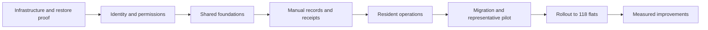

# Housing Society Execution Strategy

**Communication requirement, 7 October:** Staff compose, review, obtain separate approval and Send inside the portal. [Official provider preparation](docs/whatsapp-provider-baseline.md) is verified locally under the [saved contract](docs/portal-whatsapp-workflow.md), using numeric-loopback HTTP fixtures. Live delivery requires society-owned identities/credentials/templates, deployed HTTPS configuration and costed acceptance. The feature questions authorise independent preparation, not actual external messages or paid activation. Earlier manual-sharing proposals are historical; Messenger is not a required step in the requested workflow.

**Date:** 7 October 2026
**Status:** Locally accepted Go/React release **0.21/schema 20** adds reviewed service contacts and water/power/lift interruptions, explicit restoration and independently retriable current Overview attention. [Community acceptance](docs/community-services-baseline.md) records **215 Go declarations, 190 ordinary cases/28 suites, 52 actual native cases/eight suites and 45 actually inspected PNGs/104 native parts/26 sheets/eight originals**, matching schema-19/20 recovery, all 78 prior persistent tables preserved plus three additive tables, unchanged held keys and a pinned verified preview. Closed findings are **81 groups (79 product/UI, two operational)**; fixture/selector/outage/native-guard QA corrections add no findings. Personal public [application publication](https://github.com/flux-i/society-os/commit/a214084cae66739ddfcc563ba1d03dad5e668007) is verified against API main, personal account/author and a clean tree. Its immutable private archive retains 375 matching source files and 766 verified hashes; a separate six-document follow-up records publication metadata without changing tested application/runtime or archive evidence. Earlier [0.20 application](https://github.com/flux-i/society-os/commit/b52626e9f0c420cb647cee0a240f12ccb117dd34) and six-document main `e4cdaab574d3109c3a3c061fa2f3cdfac2608488` retain their verified immutable 354-source/753-hash archive. The whole plan stays active: meetings/acknowledgements/reminders, budget/move checklists, measured performance/PWA/migration and independent production preparation follow. Missing production inputs block only dependent activation/acceptance. See [current checkpoint state](docs/next-session.md).
**Applies to:** [Housing Society Digital Platform implementation plan](housing-society-digital-platform-plan.md), especially Sections 39, 40, 43, 52 and 54

**Current scope:** Tracking/monitoring, manually entered charges and already-paid records, derived balances and generated receipts are included. Payment initiation/gateways, bank automation, automated billing and Tally integration are conditional future work.

**Next development priorities, added 4 October:** The [society operations roadmap](docs/society-operations-roadmap.md) preserves the requested overview, maintenance, fund campaigns/external-payment verification, targeted messaging, private rule reports/approved fines and financial statement publication. Those local workflows through scoped finance exports and provider preparation have passed their recorded gates. Official-protocol provider preparation is verified locally; complete the researched community additions and measured performance/PWA/migration/pilot work. Prepare production configuration, private storage, encrypted off-site recovery, alerts and backup-age finance protection with synthetic checks while dependent real activation inputs remain unavailable.

Build the 118-flat Society OS through small, complete workflows whose correctness, recovery, performance and operating cost can be demonstrated. Use a coding assistant from the start to accelerate implementation and investigation. Keep the resident-facing AI assistant in the later phase already defined in the implementation plan.

The articles guide how the coding agent develops the product now: repeatable checks, measured changes and preserved regressions belong in every development milestone. Optional AI features inside the portal are a separate future product decision. The [execution backlog](execution-backlog.md) makes the coding loop and first build deliverable explicit.

The existing plan defines the product and its controls. This document defines the order of work, the evidence needed to move forward, and how to improve the system once a working baseline exists. Proposed targets and case counts below are planning choices, not measured results or commitments.

The first local milestone is runnable with `make run`. It established a fictional 118-flat registry, the user's requested visual direction, migrations, per-connection engine checks, local recovery and browser-tested registry interactions. See [README](README.md), [architecture decisions](docs/architecture-decisions.md) and the updated [execution backlog](execution-backlog.md). This completes the local part of Milestone A; production infrastructure acceptance remains pending.

The subsequent local slice adds password sessions, current-role/current-membership authorization, version-checked registry writes and immutable change history. Its overview separates homes from active owners/tenants, and residents see only their own homes. [Acceptance evidence](docs/registry-identity-baseline.md) records six browser journeys and the authenticated baseline. This advances Milestone B without claiming production identity/recovery completion.

The account-security slice adds invitation/assisted recovery, privileged authenticator verification, single-use recovery codes and fresh checks; its historical baseline records ten browser journeys and 31 backend declarations. Subsequent verified slices add records, reviews/notices, service requests, documents, overview and [account administration](docs/account-administration-baseline.md). Current evidence and next work are in the backlog; real identity/custody acceptance remains pending.

## 1 What we take from the articles

The performance article suggests an operating method: choose important user journeys, establish comparable measurements, investigate one bounded problem, and verify the change after release. Useful laboratory measurements need a demonstrated relationship to the experience users actually feel. Our application of that method is to measure resident and treasury workflows on the selected society computer. [How we made claude.ai faster](https://claude.dev/blog/how-we-made-claude-ai-faster/)

The evaluation article suggests how to trust the measurements: use representative cases, validate the grader, distinguish genuine gains from noise, and keep examples outside the optimization process to detect overfitting. Our application is deterministic checks for V1 and a separate evaluation process for any later language-model feature. [Automating eval design and hillclimbing](https://claude.dev/blog/automating-eval-design-and-hillclimbing/)

The phases, budgets, targets and examples that follow are recommendations for this society, informed by its existing plan. Neither article establishes our delivery time or expected improvement.

## 2 Delivery decisions

Retain the planned Go application, local SQLite, React/Vite PWA and private S3. Existing Tally continues independently; its integration is future work. A single deployable application remains appropriate to the stated scale. Introduce measurement through application events, test fixtures and reports stored with the project.

Put work in this order:

1. **Recoverable infrastructure:** prove the computer, public HTTPS, private storage, snapshots and custodian recovery.
2. **Identity and shared controls:** establish memberships, permission checks, privileged MFA, audit, operation identities and reliable jobs.
3. **Manual records and receipts:** authorized entry forms, given charges/opening balances, already-paid entries, exact amounts, derived balances, immutable receipt/PDF generation and auditable corrections.
4. **Complete resident workflows:** notices, complaints, permitted records/documents, authorized metadata search and mobile/PWA behavior.
5. **Migration and a representative pilot:** validate real operating practice before inviting every flat.
6. **Measured improvements and optional capabilities:** improve proven bottlenecks; add payment initiation, billing/accounting automation, OCR or read-only AI only when separately requested and justified.

Correct workflow state, access control and recoverability are independent release conditions. An excellent speed result cannot compensate for failure in any of them.

## 3 Owners and decisions that unblock work

Assign the technical maintainer, registry officer, authorized finance operator, committee sponsor, complaint/document handlers and two recovery custodians. People can cover several roles subject to the controls in the implementation plan. The sponsor resolves scope; the maintainer owns implementation and release evidence; domain owners approve the business outcomes. The finance owner reviews manual-entry expectations, receipt fields and corrections.

| Input to obtain | Accountable person | Work it unblocks |
|---|---|---|
| Selected machine, power draw, SSD health, ISP reachability and ingress quote | Maintainer | Infrastructure selection and measured performance |
| Society-controlled accounts and two custodians | Sponsor and custodians | Production credentials, real data and recovery |
| State and approved privacy/retention policy | Committee and records owner | Approved document/membership handling |
| Representative given charges, already-paid entries and approved receipt format | Finance owner and committee | Manual-entry fields, balances and receipt acceptance |
| Canonical 118-flat list, actual users, membership dates and historical access policy | Registry officer and committee | Invitations, authorization and migration |
| Initial document volumes, retention, alert channel and complete cost forecast | Maintainer and sponsor | Production cost and operating acceptance |

Record each decision with its evidence, owner, date and dependent milestone. Tally compatibility is a future integration input. Manual-entry/receipt examples and any given opening balances are reviewed before the finance workflow is accepted; they do not block the initial synthetic foundation.

## 4 Milestones and acceptance

Re-estimate the smaller scope after the local foundation is demonstrated. The earlier 9–18 person-week estimate included advanced billing, allocations and accounting integration and is no longer the active delivery estimate. AI-assisted execution will be forecast from completed tasks, actual review effort and the remaining backlog.

| Milestone | Original phases | Evidence required to finish |
|---|---|---|
| A Local and production infrastructure proof | 0 | Reproducible build; verified SQLite engine; synthetic registry; clean restore; stable external HTTPS on selected host; all-in cost forecast |
| B Identity and registry | 1 | Approved register and membership rules; invitations/recovery; privileged MFA; API permission cases; two-custodian recovery procedure |
| C Shared foundations | 2 | Transactional audit and operation identities; leased jobs; validated/version-pinned documents; resource limits and recoverable failures |
| D Manual records and receipts | Revised phase 3 | Approved given-entry examples; exact amounts and balances; idempotent entry/receipt posting; immutable PDF snapshots and correction/recovery checks |
| E Resident operations | 4–5 | Audience-scoped notices, complaints, private staff notes, document library, metadata search, mobile usability and account-switch/cache checks |
| F Migration and pilot | 6 | Approved registry/document/manual-entry migration, support/recovery runbooks, representative pilot outcomes and current-scope production gates |

The pilot exercises account activation/recovery, manual entries/receipts, notices, document access, complaint handling, role changes and operations/recovery. It is not tied to automated payment or Tally integration. Set its duration and the revised delivery forecast after measuring the first runnable milestone and reviewing user feedback.



## 5 Evaluation cases for V1

Start with **12 reviewable scenarios**, using synthetic records and approved permission/workflow expectations. Build their checks as the relevant workflow is implemented. A coding assistant's expected output remains a draft until checked against the requirements.

| Scenario | Result to check | Reviewer |
|---|---|---|
| Canonical register | 118 unique flats and valid person/membership relationships | Registry officer |
| Invitation and account recovery | Intended user can activate/recover; expired or reused tokens fail | Maintainer |
| Resident requesting another flat's records | Permission denial across detail, list, export and document-link paths | Registry officer |
| Tenant departure or role expiry | Current permissions revoked; historical access follows the approved policy | Registry officer |
| Notice audience and attachments | Only the intended audience sees the notice and its attachments | Committee sponsor |
| Complaint submission retry | One complaint under repeated submissions; changed payload rejected | Complaint handler |
| Upload validation and version substitution | Invalid/substituted content cannot become an approved document | Maintainer |
| Manual charge/paid entry | Exact given amounts, dates and source recorded; derived balance matches independent expected result | Finance owner |
| Receipt retry and S3 failure | One issued receipt/number; confirmed entry persists while PDF is pending and later recovers | Finance owner and maintainer |
| Entry correction | Original entry/receipt retained; authorized linked correction updates derived results with audit | Finance owner |
| Logout and account switching | Another user's cached records are not exposed | Maintainer |
| Restore from a snapshot | Registry, document versions, current-access review and paused external jobs verified | Custodians |

The original proposed **42-scenario baseline** organised 12 identity/registry/authorization, 10 documents/jobs/PWA, 8 notices/complaints, 6 manual entries/receipts and 6 recovery/operations cases. Actual coverage has grown beyond that planning count; required behaviors remain necessary regardless of inventory. Requested manual maintenance/allocation expectations are now in the maintenance brief. Automatic charge calculations and Tally integration remain conditional future work.

Store scenario setup, user/role, action sequence, expected outcome, assertions, source of the expectation and reviewer separately. For later AI cases, keep task inputs separate from expected answers and metadata. This separation is also described in [Langfuse's dataset guide](https://langfuse.com/academy/datasets); local files are sufficient for the initial strategy.

Use programmatic checks for exact manual amounts, balances, state transitions, numbering, schema and permissions. Use human review for printed language/font quality, usability and the operator workflow. Reserve model-based grading for optional open-ended AI answers.

Known V1 requirements should be visible to implementers. Add fresh acceptance scenarios and property-based input variations to catch accidental assumptions. Holdout discipline for model optimization is described in Section 11; mandatory state/security/recovery tests are not an optimization score to trade away.

## 6 Metrics and initial performance targets

Record correctness, reliability, latency, cost and support effort separately. Each measurement needs a defined start, end, environment, fixture and release version. Distinguish a saved complaint from attachment availability, and permission-checked link creation from the document transfer itself.

The following are **proposed starting targets to confirm after Phase 0**, not an SLA:

| Journey or control | Measurement | Proposed target or existing condition |
|---|---|---|
| Resident opens dashboard | Navigation to usable, authorized notice/complaint view | p75 within 2 seconds on an agreed representative phone/network |
| Ordinary authorized API reads | Server request to response, under the agreed workload | p95 within 400 ms; measure login/password hashing separately |
| Resident submits complaint | Submit to acknowledgment of saved complaint state | p95 within 1 second, with attachment processing separate |
| Authorized manual entry | Submit to acknowledgment of committed entry/receipt state | Proposed p95 within 1 second; PDF processing separate |
| Receipt PDF | Confirmed entry to available receipt document | Normally within 30 seconds with healthy workers/S3; pending/failure states explicit |
| Authorized document search | Query to permitted metadata/filter results | Proposed p95 within 1 second on the agreed fixture/network |
| Concurrent use | 20 active synthetic sessions with realistic read/write mix | No lost or duplicate records and no unhandled errors; record actual latency/resources |
| Access checks | Required allow/deny cases across all relevant endpoints | All mandatory cases pass |
| Backup protection | Age of latest usable off-site snapshot | Existing proposal: 30-minute schedule, warning at 45 minutes, financial-entry pause at 60; approve before launch |
| Recovery | Clean restore using custodian-held material | Existing conditional target: one working day once replacement hardware and access are available |
| Annual operation | Complete forecast including tax and contingency | Below ₹12,000 |

For speed tests, use fixed datasets, separate cold/warm runs, alternate baseline and candidate, and repeat until the result supports a decision. Record request counts, query counts and allocations where useful, but treat runtime timings as variable measurements. Only gate CI on a proxy after validating its stability and relevance.

At 118 flats, traffic may be too sparse for strong percentile claims. Show sample counts and inspect individual slow journeys; supplement field data with reproducible laboratory runs.

## 7 How we run development and improvement work

Give each task one workflow, a named owner, approved behavior and a concrete completion condition. A task such as complaint submission should include its API, transaction, audit, retries and visible states; completing only a screen does not complete that workflow.

The coding assistant can draft implementation, reproduce a defect, propose assertions, run authorized checks and prepare a reviewable change. The maintainer reviews transaction/security/release consequences; the registry officer and committee handlers validate the relevant business outcomes. Use synthetic or appropriately redacted examples in development.

For an implemented workflow, follow this sequence:

1. Reproduce the failing behavior or record the current performance baseline.
2. State the likely cause and the smallest change that addresses it.
3. Implement the bounded change and the relevant behavioral checks.
4. Run affected regressions, then compare the candidate against the baseline under the same conditions.
5. Review the code, user-visible behavior and evidence together.
6. Release through the agreed pilot or rollout process; inspect operational outcomes.
7. Preserve the validated check/budget and close the task with its measured result.

Do not make an improvement claim when the change is within measurement noise. After three inconclusive attempts, inspect the fixture, instrumentation and failure causes before spending more time. A simpler implementation with equal outcomes can be worthwhile even when speed is unchanged.

Keep an experiment record containing the task, baseline/candidate release, case version, environment, change, measurements, correctness results, resource/cost impact and keep/revert decision. A short Markdown record plus JSON results is enough initially.

Prioritize defects that threaten finance, privacy or recovery first. For remaining work, consider how many people encounter the delay, how often it occurs, and how much time it wastes. Build complexity and future support effort are part of the decision. Start with one active implementation task and one investigation; increase simultaneous work only when integration and review capacity support it.

## 8 Cost and operating evidence

Use the original plan's target of a base annual forecast at or below **₹9,000**, with at least **₹2,000 contingency** and the complete total below **₹12,000**. These are allocations, not supplier quotations.

The forecast must include measured incremental electricity, actual S3 originals/versions/snapshots/requests/transfer, any domain renewal or ingress fee, external alerts, incremental connectivity, taxes and currency conversion. Calculate backup storage from actual compressed snapshot size and retention; do not budget from live database size alone.

Keep development subscriptions, coding-agent usage, hardware purchases and labor visible as separate delivery/maintenance costs. Recurring production AI or other optional API usage must be included in the complete operating forecast if enabled, or have an explicitly approved change to the budget contract.

Begin with structured application logs, protected operations status, local experiment reports and an independently reachable uptime/backup alert route. Record timings and outcomes without resident names, bank references or document contents. V1 has no requirement for a new observability platform. Consider one only after its operational benefit and total cost are established.

Review storage growth, actual bills, backup freshness, pending uploads, failed jobs and support hours monthly. Respond to budget pressure by reducing optional work and investigating growth; preserve approved document retention and recovery protection.

## 9 Initial ten working days

This is the first delivery window. It starts the early phases and produces evidence for the next estimate; it does not promise completion of Phases 0–2 in ten days.

| Working days | Action | Concrete output | Owner |
|---|---|---|---|
| 1–2 | Establish owners, decision register, current data inventory and acceptance expectations | Named contacts; pending-input list; proposed 12 scenarios; confirmed registry/document questions | Sponsor, maintainer, registry officer |
| 2–4 | Inspect selected computer and test external access routes | Measured wall power/SSD/network notes; selected or narrowed ingress options with actual cost inputs | Maintainer |
| 3–5 | Start the minimal synthetic application and shared project checks | Reproducible Go/frontend build; actual SQLite engine/driver recorded; health endpoints; isolated synthetic fixture | Maintainer |
| 4–7 | Prove snapshot encryption, upload and clean restore | Restore evidence, elapsed time, key custody and initial storage/retention measurements | Maintainer and custodians |
| 5–8 | Build and review representative registry/document/complaint cases | Approved role/visibility expectations; document fixtures; complaint transitions and duplicate-submit cases | Registry officer and committee handlers |
| 7–9 | Implement the first identity/permission slice and its checks | Synthetic login/member access flow; one cross-flat denial; MFA/recovery design and remaining tasks | Maintainer and registry officer |
| 9–10 | Demonstrate the initial slice and review infrastructure/evaluation evidence | Initial benchmark report; cost worksheet; blocker decisions; revised milestone estimate and next backlog | Maintainer and sponsor |

Registry/workflow review and hardware inspection can progress independently of application coding. With one developer, these activities share that developer's capacity; the overlap is not an assumption of extra engineering staff. When a milestone needs more time, carry it forward explicitly.

The user will supply production hardware/state details later. Until then, continue the local synthetic foundation and independent identity/registry/workflow slices; hardware inspection and real receipt-policy acceptance remain pending for their dependent production gates.

The next ready implementation tasks are membership/access enforcement, privileged MFA/recovery, transactional audit and operation identities, leased jobs, validated S3 versions, manual entries/receipts, notices and complaint handling. Payment initiation, automated billing and Tally integration remain conditional future work.

## 10 Pilot and production decision

Follow the original proposal of **10–15 representative flats**. Include owner-occupied and rented flats, joint/multiple-flat relationships and users with different supported devices. Establish the actual account population during registry migration.

Approve registry, document and manual-entry sources, migration identities and historical-access rules before real data is imported. Existing formal accounting continues outside the current portal. The portal records already-paid entries from authorized users and does not initiate payment.

The pilot covers activation/recovery, given-charge and already-paid entries, receipt generation/corrections, audience-matched notices, permitted document access, complaint handling, role changes, safe uploads and operating/recovery exercises. Collect operator task duration, resident completion problems, entry/receipt discrepancies, upload/job failures, actual response times and support time.

Expand to all flats only when Section 52 of the implementation plan passes, including:

- No unresolved critical workflow-state, authorization or recovery defects.
- Approved registry, memberships, migrated documents and current/historical visibility policy.
- Approved manual-entry/receipt expectations; no unexplained differences in entered amounts, derived balances or issued receipt records.
- Privileged MFA, two custodians, tested snapshots/restore and stable external HTTPS.
- Supported mobile/PWA behavior and performance acceptance based on actual measurements.
- Full operating-cost forecast below ₹12,000 and demonstrated operating ownership.

The maintainer, registry officer, relevant committee handlers and sponsor record the evidence and launch decision. A material data-integrity or permission defect stops expansion and receives a bounded corrective task.

Application release rollback and database recovery require different procedures. Returning to an earlier binary is safe only when schema compatibility is proven. Restoring a database snapshot requires recent-change, manual-entry/receipt-number reconciliation, permissions, document-version and external-effect review before writes resume.

## 11 Optional AI evaluation and improvement

Open this work only after V1 is stable, permission-aware search is useful, and external-data handling and operating spend have been approved. The first candidate is read-only questions over approved society documents or typed application functions for current-scope data. Any future authoritative financial calculations remain in deterministic application code.

Begin with 10–12 expert-reviewed questions and expected facts, citations or denial behavior. Include answerable AGM/bylaw questions, insufficient evidence, outdated/conflicting documents, unauthorized requests, injected document instructions and exact amounts returned by permitted tools. Expand a proposed baseline to roughly 60 cases only once the categories and expected outcomes are trustworthy.

For example, use 30 development cases, 15 validation cases and 15 final cases, grouped by related document/question so near-duplicates cannot cross splits. Keep final cases and reference answers outside the optimizer's workspace. Use validation for candidate selection; reserve the final set for a release check. Refresh final cases after repeated release decisions. A small held-out set gives limited statistical confidence, so report uncertainty and add cases when necessary.

Measure authorized retrieval coverage, supported factual claims, citation validity, correct abstention, prohibited disclosure/tool attempts, end-to-end latency and total cost including grading/retries. Report security failures separately from answer quality. Require all mandatory access/tool restrictions to pass; a passing sample does not establish that every possible attack is prevented.

For open-ended answers, calibrate a judge against expert-labeled examples and check repeated scoring of identical output. Record disagreements rather than treating a judge score as ground truth. Change one permitted surface per experiment and retain a cheaper/faster candidate only when it meets the predefined quality and security conditions. Set a run budget and stopping condition before paid evaluation.

Local cases/results are adequate initially. Adoption of Langfuse or another external trace service is a separate cost, data-handling and implementation decision; no service installation is required by this strategy.

## 12 Installed skill and how to use it

The evaluation article links to the official [Anthropic claude-api skill](https://github.com/anthropics/skills/tree/main/skills/claude-api). Its installed project copy is [SKILL.md](.claude/skills/claude-api/SKILL.md), with the [build-eval guide](.claude/skills/claude-api/shared/evals/build-eval.md) and [hillclimb guide](.claude/skills/claude-api/shared/evals/eval-hillclimb.md).

All 81 upstream files were installed without modification from commit `8a1541c4a3ffa5a20a5a91de0dcf3f0bab1d1ef4`. The [installation record](claude-api-skill-installation.json) records provenance and scope. No model evaluation, paid API call or bundled script was run as part of installation.

Global installation is complete. Both `/Users/furqan/.claude/skills/claude-api` and `/Users/furqan/.agents/skills/claude-api` were verified against the same 81-file manifest on 4 October 2026, and `claude-api` now appears in this session's available skills. Claude Code's personal skill directory makes the package available across local projects. [Claude Code skill documentation](https://code.claude.com/docs/en/skills)

Invoke the workflows in Claude Code when their prerequisites exist:

```text
/claude-api build-eval
/claude-api hillclimb
```

These guides target Claude-powered applications and include review/budget checkpoints. Installing them does not create application tests or an evaluation baseline. Use the V1 approach in Sections 5–7 for the deterministic application; use the installed guides when the optional Claude application flow exists.

Codex discovers global user skills in `.agents/skills`, which now contains the verified package. [Codex skill documentation](https://learn.chatgpt.com/docs/build-skills)

The [global installer](install-claude-api-globally.py) remains available for verification with `--dry-run`. It checks every source file against the recorded SHA-256 manifest and refuses to overwrite an existing different version. The [execution backlog](execution-backlog.md) defines the first runnable local milestone and the outstanding production/accounting inputs.

The performance article supplies the development method used in this strategy; it does not link a standalone performance skill package equivalent to `claude-api`.
